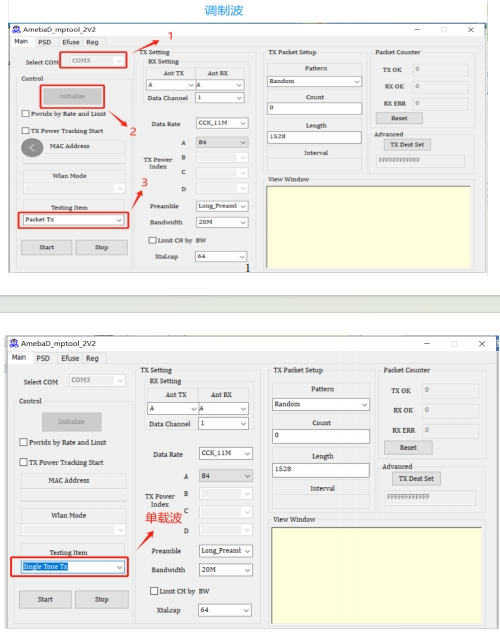
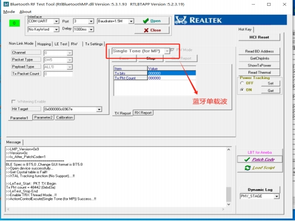
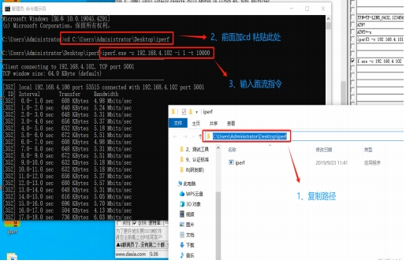

# Feiteng Cloud: 8720DF SRRC Certification

SRRC (State Radio Regulation of China) certification is a mandatory certification mark issued by China's National Radio Administration (NCA). <!-- more -->This certification applies to all radio equipment and telecommunications terminal equipment sold or used within China. The purpose of SRRC certification is to ensure that devices comply with China's radio spectrum management regulations and technical standards, reducing interference and ensuring device safety.

To obtain SRRC certification, a series of tests must be conducted to ensure compliance with relevant technical specifications and requirements. These tests may include Electromagnetic Compatibility (EMC), radio frequency performance, and safety performance tests. Applicants must conduct tests at SRRC accredited laboratories in China and submit relevant application documents and test reports to the NCA.

Prior to SRRC certification, applicants typically need to obtain relevant production licenses, and devices must comply with relevant Chinese technical standards. Sometimes, local agents or consulting companies are required to assist with document handling and testing matters. Only products that successfully pass SRRC certification can be legally sold and used in the Chinese market.

# Comprehensive Debugging Environment

Feiteng Cloud provides a comprehensive debugging environment to support SRRC certification for its clients. This includes the following services:

1. **Wi-Fi Testing:** Ensures that device performance on the Wi-Fi frequency band meets requirements to meet wireless communication needs in the Chinese market.

   

2. **Bluetooth Testing:** Tests the device's Bluetooth communication to ensure compatibility and performance under Bluetooth technical standards.

   

3. **Adaptive Testing:** Provides diverse testing plans and services tailored to different data requirements, ensuring devices can adapt to various usage environments and demands.

   

Feiteng Cloud's professional team offers full support for SRRC certification to ensure products successfully pass certification and can be legally sold and used in the Chinese market.
