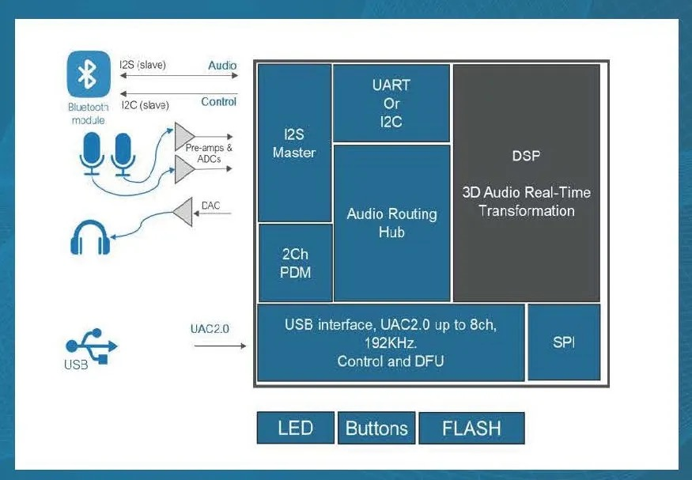

# XMOS EW 25 Showcase Series Review - Spatial Audio

In March 2025, the world's largest embedded industry event - the Nuremberg International Embedded Exhibition (Embedded World 2025, EW 25) successfully concluded. At this technology feast that gathered 950 exhibitors and over 30,000 professional visitors, XMOS's booth was bustling with activity, attracting customers to stop and discuss with its multiple cutting-edge products and innovative technologies.

<!-- more -->

As the most commonly used interactive communication medium between humans and between humans and machines, voice will become a powerful tool for convenience and efficiency in the era of large models and edge intelligence. Smart voice processing technology will also become one of the key technologies supporting large models and edge intelligence. Meanwhile, people's continuous pursuit of better music and auditory experiences drives the ongoing innovation and development of audio technology.

At EW 25, XMOS showcased several heavyweight innovative audio technology solutions driven by AI, including spatial audio, real-time streaming sound cards, and AI noise reduction, among other live demonstrations. These solutions can provide top-tier digital audio experiences or support large models and edge intelligence, not only featuring powerful functions and extremely high performance but also further reducing costs and power consumption, thereby accelerating the development of intelligent edge devices and the popularization of large models, providing global customers and partners with a complete suite for quickly implementing the latest audio system designs.

For this reason, we will present XMOS's key showcases at EW 25 in a serial format. If you wish to collaborate with XMOS China team to develop products for the global market based on these solutions, please email: ThomasMu@xmos.com.

## Spatial Audio - This Solution Provides 3D Immersive Spatial Audio on Any Device with Safer Listening
Provides plug-and-play, bit-perfect, rich 3D immersive audio experience on any device, supporting device-to-device transmission while reducing eardrum pressure by half and achieving ultra-low latency. This technology seamlessly compatible with all operating systems and headphones while meeting gaming's ultra-low latency requirements.

### XMOS Solution Features
- Rich 3D audio spatial sound effect processing
- Safer listening experience
- Reduced perceptual load

### XMOS Solution Advantages
- Provides 3D audio experience on any device
- Reduces eardrum pressure by half
- Sound effects can reduce neural load by 15%
- Provides 5.3x spatial audio @ 2/3 rds chip power
- USB plug-and-play - OS independent (compatible with iOS, Android, and Windows)

### Why Choose XMOS?
- Low latency audio protocol stack
- Provides abundant optimized DSP resources, integrated IO, and flexible clock options
- USB plug-and-play, OS independent
- Low power consumption, pJ/MACC efficiency

### Immediate Application Devices
- Gaming headsets
- Conference headsets
- Headphones
- Spatial audio DAC adapters for in-ear headphones/earphones

### System Block Diagram

XMOS's 3D audio solution has been long validated by the market, with customers having developed multiple globally bestselling products based on it. Welcome to contact XMOS Shenzhen office to discuss innovation in next-generation products.

Currently, XMOS's smart audio technology and solutions have been widely applied in smart consumer electronics, smart homes, smart cars, and office applications, not only providing high-quality audio and sound effects for various terminals and systems but also serving as ubiquitous human-machine interfaces and emerging productivity tools helping these applications connect to various networks.

"From CES 2025 to EW 25, we showcased XMOS's multiple innovations in edge intelligence and advanced audio, such as spatial audio, real-time streaming sound cards, and AI noise reduction. These demonstrations have generated great interest and cooperation desire among our partners, and we believe they will bring tremendous success to our customers and ourselves this year and beyond," said Tao Mu, Head of Asia Pacific Marketing and Sales at XMOS. "XMOS will quickly introduce these technologies and solutions to China to help customers create world-class audio products."

To learn about XMOS's globally leading audio solutions, software-defined SoC, and their applications in other vertical industries, please email: ThomasMu@xmos.com 