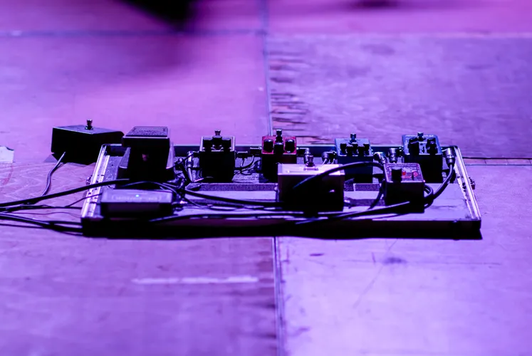

# ESP-AT Firmware: The IoT Smart "Engine"

Today, the tide of technology is sweeping across the globe like the Qiantang River, and the Internet of Things (IoT) has become an invisible web, deeply embedded in every corner of our lives and work, reshaping the everyday.

<!-- more -->
In the morning, smart curtains open on time, letting sunlight pour into the bedroom; in factories, automated production lines work efficiently in harmony, playing an "industrial symphony"; on the streets, smart streetlights adjust brightness based on the environment; remote medical devices monitor health in real time. All of this relies on key technological support, and the ESP-AT firmware is the "shining star" on the IoT stage.

Developed by the innovative company Espressif Systems, the ESP-AT firmware is specifically designed for chips like the ESP32 and ESP8266, giving them an "intelligent armor." The core of this technology is the magical "AT command." Developers can simply type understandable commands like "AT + CWMODE = 1" via serial communication to easily set up device networking, avoiding the cumbersome "maze" of traditional embedded development and communication protocols. Even beginners can quickly get started with the manual, opening a convenient path to IoT development.

Focusing on the technical architecture, it’s like a "smart castle." The network protocol stack is highly refined, seamlessly supporting Wi-Fi standards (802.11 b/g/n, 802.11ac) and Bluetooth (classic and low-energy), smoothly navigating the "digital highway." Multi-tasking is like a highly efficient "production line," with CPU time slices allocated according to priority, avoiding "crashes." Security is as solid as a rock, with WPA/WPA2/WPA3 encryption, strict identity authentication, and real-time intrusion detection, ensuring robust information security.

What we've shared here is just a "glimpse." In future articles, we’ll explore the intricate designs in greater detail. So, how can you embed this amazing firmware into products and create practical modules? The answer holds many secrets. Stay tuned for the next chapter, where we will delve into various application scenarios and witness how it works its "magic," injecting vitality into life and industries.

If you are looking for a reliable ESP-AT firmware module OEM manufacturer and wish to inject a high-quality "core" into your IoT project, much like replacing a top-tier engine in a race car, allowing your project to speed ahead and stand out in the market, feel free to contact us. We sincerely look forward to working with you to create an intelligent future and carve our glorious chapter in the vast world of IoT.
