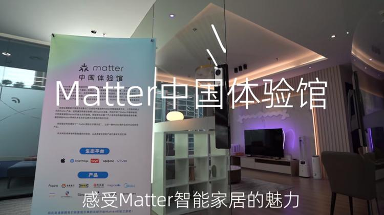
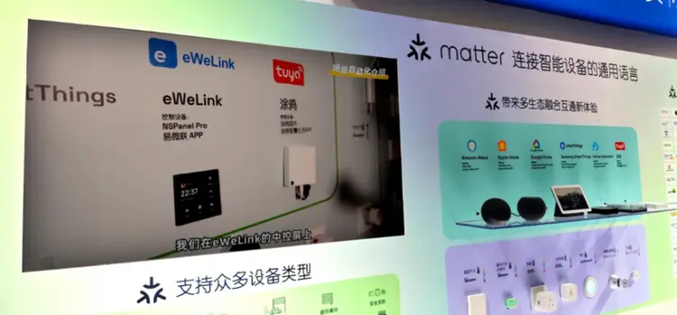

# Matter China Experience Center Completed, Opening a New Era of Smart Home Interconnectivity

In September 2024, with the strong promotion of the CSA China member group, the Matter China Experience Center was officially completed, marking an important milestone in the smart home industry.
<!-- more -->
The experience center comprehensively showcases how smart home devices based on the Matter standard achieve remarkable "cross-ecosystem" and "cross-brand" interconnectivity, painting a new picture of smart home scenarios for users. Many well-known brands and companies actively participated, working together to inject strong momentum into the innovation and development of the smart home industry.

As a key participant in the Matter standard, eWeLink's outstanding solution products were highly regarded in the experience center. eWeLink's Matter solutions excel in assisting smart home brands to launch certified products. For example, the SONOFF smart switch shone brightly in the center, successfully integrating into the ecosystems of major international brands like Apple and Samsung, while also closely collaborating with various smart devices from different brands to create a seamless and natural smart home scene and automation experience.

The completion of the Matter China Experience Center undoubtedly marks a significant step forward in the "interconnectivity" process of the smart home industry. From now on, devices from different brands and ecosystems can achieve seamless integration through the Matter protocol, completely breaking down the barriers that previously isolated devices from various brands. This allows users to freely choose and combine a wide variety of smart devices, thereby creating a personalized smart living experience.

eWeLink's Matter solutions stand out for their excellent stability and high performance. With its profound technical foundation, eWeLink helps manufacturers and brands quickly and efficiently develop Matter products, successfully completing a series of processes such as Matter certification, WWA certification, WWAH certification, and WWGH certification, enabling clients to rapidly seize market opportunities and earning high praise and recognition from consumers.

Since its establishment in 2015, eWeLink has focused on providing one-stop smart hardware solutions, and its advanced IoT platform technology has garnered widespread and successful ecological cooperation globally. eWeLink has not only been recognized as an authorized solution provider for Amazon Alexa and Google Home in the smart home sector due to its outstanding technical strength and strong international influence, but also won the "Matter Excellent Enabler Award" and "Matter Annual Outstanding Certification Award" at the 2023 Matter China Developer Conference.

To date, Cool Home Technology (eWeLink) has successfully assisted over 2,000 manufacturers and hardware brands in completing smart upgrades, with its ecological products exported to 176 countries and regions, winning the trust and support of over 40 million users worldwide.

It is worth mentioning that our company, as a module manufacturer, has also made significant contributions to the smart home field. We are committed to developing high-quality module products, providing stable and reliable core components for smart home devices. Our modules possess advanced technical performance, perfectly compatible with the Matter standard and other related protocols, ensuring efficient communication and collaboration between smart home devices. We have established close cooperative relationships with many well-known enterprises to jointly promote the development of the smart home industry. We will continue to uphold the spirit of innovation, continuously improve product quality and technical levels, and contribute more to the prosperity of the smart home industry.