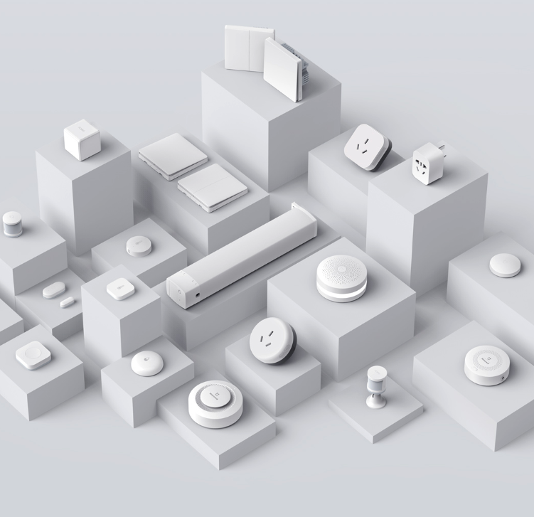

# FAQ for Smart Hardware Products: Addressing User Concerns and Enhancing User Experience

<!-- more -->

Smart hardware products are increasingly prevalent in our daily lives, but users often encounter various concerns and challenges during their usage. To help you better understand and utilize smart hardware products, we have compiled some frequently asked questions and their answers, aimed at improving your overall user experience.

## 1. How to Set Up and Connect Smart Hardware Products?

Setting up and connecting smart hardware products typically involves the following steps:

- **Download and Install the App**: Ensure that the corresponding app for your smart hardware product is downloaded and installed on your smartphone or tablet.
- **Create an Account**: Upon first use, you may need to register an account and log in.
- **Connect the Device**: Follow the app instructions, usually involving Wi-Fi connection or scanning a QR code on the device for pairing.

## 2. How to Ensure the Security of Smart Hardware Products?

Security is paramount for smart hardware products, and here are some methods to ensure safety:

- **Firmware Updates**: Regularly update device firmware to obtain the latest security patches and feature improvements.
- **Strong Passwords**: Set strong passwords to protect your devices and apps.
- **Network Security**: Ensure your home Wi-Fi network is secure to prevent unauthorized access.

## 3. How to Effectively Manage and Control Smart Hardware Products?

Effective management and control can enhance your user experience:

- **Scene Settings**: Use the app to configure automation scenes, such as scheduling lights or temperature control.
- **Remote Control**: Ensure you can control devices remotely via the app, regardless of your location.
- **Voice Control**: If supported, use voice assistants like Alexa or Google Assistant for hands-free control.

## 4. How to Troubleshoot Common Issues with Smart Hardware Products?

When facing issues, try the following solutions:

- **Restart the Device**: Sometimes a simple restart can resolve connection or responsiveness issues.
- **Check Connections**: Ensure the device is connected to the correct Wi-Fi network.
- **Inspect Power Supply**: Verify the device's power supply is functioning correctly.
- **Consult User Manual or Online Help**: Refer to the product manual or online documentation for troubleshooting tips.

## 5. How to Optimize the User Experience of Smart Hardware Products?

Enhance your user experience with these tips:

- **Regular Maintenance**: Periodically clean devices and check their operational status.
- **Integration with Other Devices**: If possible, integrate with other smart devices to create a more interconnected home environment.
- **Feedback and Suggestions**: Provide feedback to product manufacturers to help improve product functionality and user experience.

By addressing these frequently asked questions, we aim to help you better understand and utilize smart hardware products, enabling you to enjoy the convenience and comfort brought by smart technology. If you have more questions or need further assistance, please feel free to contact our customer service team. We are here to assist you!

