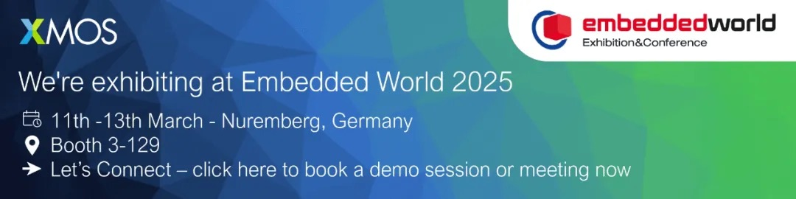

# Join XMOS at Embedded World 2025 to Explore the Future of Smart IoT and Win a VR Headset!

The global annual feast of embedded and edge intelligence, Embedded World 2025, is set to take place from March 11-13 at the Nuremberg Exhibition Center in Germany. This year's event comes at a crucial time when edge AI and next-generation intelligent terminals are on the brink of explosive growth, driven by AI large models like DeepSeek. As the most commonly used interactive communication medium between humans and machines, voice will become a powerful tool for convenience and efficiency in the era of large models and edge intelligence. Smart voice processing technology will also become one of the key technologies supporting large models and edge intelligence. XMOS is your ideal partner to seize this era of opportunity.

<!-- more -->

## Exhibition Information

1. **Name**: International Embedded Exhibition 2025 (embedded world 2025)
2. **Date**: March 11-13, 2025
3. **Location**: Nuremberg Exhibition Center, Germany
4. **XMOS Booth**: Hall 3, Booth 129

As a leader in smart IoT technology and a unique software-defined SoC semiconductor technology company, XMOS will showcase several heavyweight AI-driven audio technologies, including new spatial audio effects, voice capture and noise reduction, and audio-visual multimodal AI processing. These innovative smart audio technologies and application solution demos will bring a feast of technology and innovation to global customers and partners.

1. **3D Immersive Spatial Audio on Any Device with Safer Listening**: Provides plug-and-play, bit-perfect, rich 3D immersive audio experience on any device, supporting device-to-device transmission while reducing eardrum pressure by half and achieving ultra-low latency. This technology seamlessly compatible with all operating systems and headphones while meeting gaming's ultra-low latency requirements.
2. **Ultra-low Latency, High-bandwidth, Bit-perfect DSP Processing for Various Audio Applications**: Through launching a new DSP audio processing library and sample applications, XMOS is expanding support for high-performance audio.
3. **AI-driven Voice Capture with DNN-based Noise Reduction in Challenging Environments**: XMOS's AI acceleration technology provides noise reduction through advanced algorithms, intelligently removing background noise in real-time to ensure clear audio capture in challenging environments. Suitable for professional and industrial applications.
4. **Always-on AI Local Command Voice Capture with Privacy-protected ASR Technology**: XMOS's voice processor portfolio provides far-field voice capture capabilities and supports offline AI local commands for always-on experience while effectively protecting user privacy.
5. **Multimodal AI Processing for Audio and Vision**: XMOS's multimodal AI model processing supports audio and computer vision applications, suitable for the most challenging real-time, always-on applications while protecting personal data and privacy.
6. **Ethernet Audio Technology**: Demonstrates high-performance, low-latency audio streaming using XMOS processors, showcasing precise synchronization and scalability for professional audio applications.

Good news! XMOS and its distributor Astute are offering an exciting VR Headset giveaway! You just need to collect game cards at Astute's booth (3A - 418) and XMOS's booth (3 - 129) and complete the technical demonstration tasks to have a chance to win this great prize. Welcome to participate actively, prizes are limited, first come first served.

XMOS cordially invites global partners to visit Booth 129 in Hall 3 to discuss embedded technology innovation trends and seize global smart industry development opportunities. Additionally, we have professional engineers available for Q&A and business negotiation areas on site. We look forward to working with you to build a new smart IoT ecosystem and create a better future together!

## Book a Meeting

Click "Read More" or copy the following link to your browser to book a meeting with us to discuss topics of interest: https://outlook.office365.com/book/MeetwiththeXMOSteamatEmbeddedWorld@xmos1.onmicrosoft.com/

If you cannot open the link, please email: ThomasMu@xmos.com 