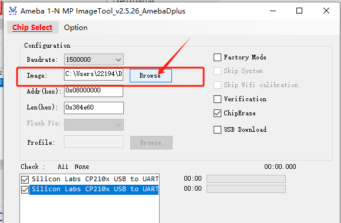
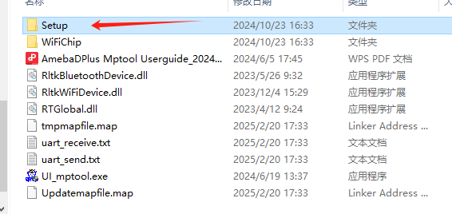
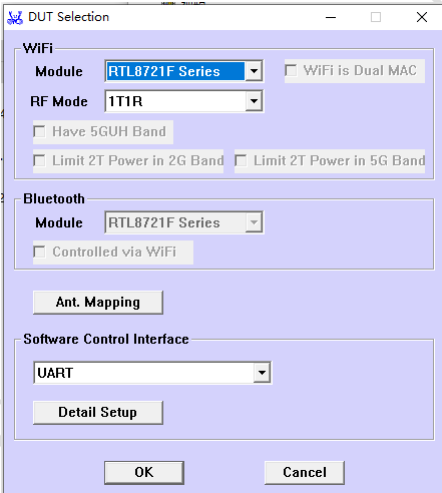
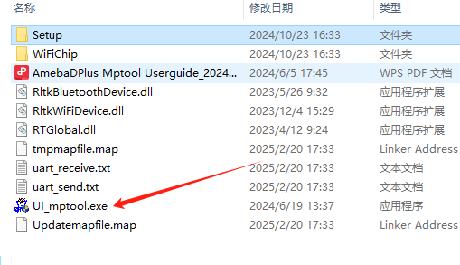
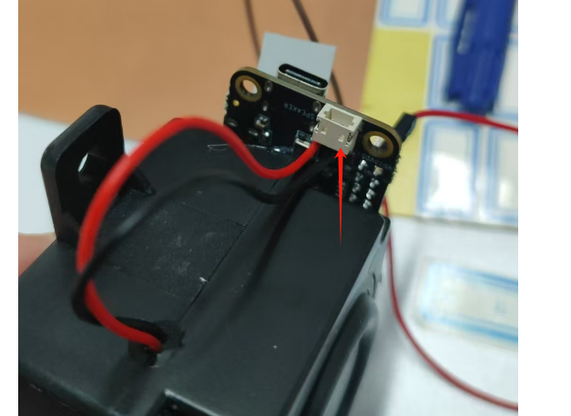

# A316-8711-5.1 Wireless Audio Decoder Kit Production Guide
## 1. Equipment Preparation

### 1.1 Items Required

1. One A316 demo board (finished product)
2. Seven 8711 development boards (finished products), with one used as TX to connect to the A316 base board, and six used as RX to connect to speakers
3. 7 to 8 USB data cables (for power and data transmission)
4. USB power supply (6-port hub)
5. Pre-burned firmware [Click to Download](../../../assets/download/a316-8711-5.1make/Image_a316-8711.bin)
6. Programming tool [Click to Download MP_ImageTool_1_N-Production Programming Tool](../../../assets/download/a316-8711-5.1make/MP_ImageTool_1_N-生产烧录工具.7z)
7. MAC address modification tool [Click to Download AmebaDPlus_MP_tool_1V6(164576)](../../../assets/download/a316-8711-5.1make/AmebaDPlus_MP_tool_1V6(164576).7z)
8. MAC address reference file [Click to Download](../../../assets/download/a316-8711-5.1make/rx-mac.txt.zip): Use this for modifying MAC addresses
9. Several Dupont wires

{width=400}

## 2. Programming the 8711 Development Boards (TX and RX)

### 2.1 Programming the 8711 DCM using the provided programming tool MP_ImageTool_1_N

To enter programming mode: Press and hold the "download" button, then press and hold the "chip" button, and release both.

{width=300}

Choose the last option for "Chip Select".

{width=300}

Select the firmware (ensure it is the 8711 firmware).

{width=300}

Other parameters should remain at their default values, as shown in the image. Multi-port programming is supported, but select only one when programming individually.

{width=300}

After confirming, click "Download".

{width=300}

---

## 3. Modify the RX Device MAC

### 3.1 Manual Modification of the 8711 Module's MAC Address

Modify the MAC addresses for the RX 8711 module (connected to the speaker); both WiFi and Bluetooth MAC addresses need to be changed.

### 3.2 Prerequisites

Ensure the firmware has been burned, and reset the device (press the CHIP button). It will automatically enter MP mode.

{width=300}

### 3.3 Using the MAC Modification Tool

Download the MAC modification tool [Click to Download AmebaDPlus_MP_tool_1V6(164576)](../../../assets/download/a316-8711-5.1make/AmebaDPlus_MP_tool_1V6(164576).7z)

Download the MAC address reference file [Click to Download](../../../assets/download/a316-8711-5.1make/rx-mac.txt.zip): Use this file to retrieve the necessary MAC addresses. Make sure to modify the MAC address according to the channel for the respective device. Do not use duplicate MAC addresses.

Note: The tool can only modify one RX at a time. Ensure the device is connected and the firmware is loaded before opening the tool.

1. Configure the file and verify that it is correct.

{width=300} {width=300}

2. Open the exe file and ensure the options match the image below.

{width=300}

3. Open the ini file using Notepad and ensure the parameters are aligned as shown in the image.

{width=300}

4. Once the steps are confirmed, connect the serial port to the device, ensuring the device is in the MP mode, then open the tool.

{width=300}

5. After opening the tool, the serial port number should be automatically recognized. Click "Refresh".

{width=300}

6. Go to "Efuse" and click the "Read" button.

{width=300}

7. Retrieve the required MAC address and input it into the "MAC Address" field.

The address corresponds to row "11".

{width=300}

8. Modify the Bluetooth MAC in row "1B", where the value is the MAC address from step 7 incremented by 1.

{width=300}

9. After modification, click "Update", "Program", and "Save mapfile".

{width=300}

10. After saving, reset the device (press the CHIP button or power cycle it), then click "Read" again to verify that the MAC has been successfully modified.

It is recommended to label the devices to distinguish between different channel types.

---

## 4. Wiring and Connecting Devices

### 4.1 Wiring Instructions

#### 4.1.1 Wiring of the 8711 (TX) to the A316 Base Board

[//]: # (##### Physical Demonstration)

[//]: # ()
[//]: # (![TX to A316 Wiring]&#40;../../../assets/images/a316-8711-5.1make/01.jpg&#41;{width=300})

##### Modifying the 8711 (TX) Development Board Hardware

1. Remove the resistor indicated by the red arrow.
2. Add a 2.2k resistor between the points indicated by the green arrow.

{width=300}

**A316 to 8711 (TX) Audio Signal Wiring Table**

| A316 Demo Board (Back) | 8711 (TX) |
| ---------------------- |-----------|
| SCLK | DOUT      |
| DTAT,0 | WS        |
| LRCLK | DIN       |
| X0D37 | PB22      |
| I2C-SCL | PB3       |
| I2C-SDA | MCLK      |
| GND | GND       |
| 5.5V | 5.5V      |

##### A316 to 8711 (TX) Audio Signal Wiring Diagram

After completing the wiring according to the table, connect the 5.5V power supply. If there is insufficient power, the TX can be powered separately.

{width=300}

#### 4.1.2 Wiring of the 8711 (RX) to the Speaker

##### Speaker Power Wiring (No polarity, as shown)

{width=300}

##### Short-circuiting the 8711 (RX) Board as shown

Use two Dupont wires to short the indicated points.

{width=300}

##### After Connecting, Use Hot Glue to Secure the Setup

{width=300}

---

## 4.2 Connecting Devices

After burning the firmware, connect each 8711 development board to the serial port, send the AT+OTACLEAR command, and reset the device. This will put it into Normal mode.

Once both TX and RX are powered on, they will automatically pair with each other. For the first pairing, only the current devices should be nearby.

Each 8711 (RX) should print the following log to indicate successful connection:

{width=300}
