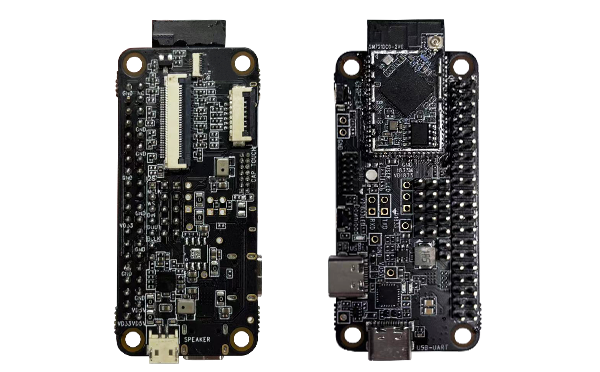

Feiteng Cloud is deeply engaged in the field of | Wi-Fi IOT Module | Wi-Fi IOT Solution | Wi-Fi Matter Solution, etc., and provides a wide range of products in all three application areas.

-   

    **WB30D-1711DCMV1 Development Board**

    Development Board features a rich set of functions and outstanding performance, making it suitable for various Internet of Things (IoT) applications. The module integrates a high-performance MCU, dual-band Wi-Fi, and Bluetooth functionality to meet the communication needs of different devices.

    [Click to view product details](../products/dev_board/RTL8711.md)

-  

    **WB30D-1711DCMV1**

    Provides a set of configurable GPIO pins for controlling different peripheral devices, and integrates internal memory to support simple application development. It supports full Wi-Fi and BT 5.0 protocol functionality.

    [Click to view product details](../products/model/RTL8711.md)

-  

    **A316_1926v1**

    A USB multi-channel high-definition audio decoder module. The module uses the XMOS XU316-1024-QF60BC24 chip, integrates a high-precision DC-DC chip, and outputs 1.8V and 0.9V voltages to the XU316. The module integrates 48.152 MHz and 49.152 MHz active crystals, meeting the requirements for different high-definition audio adoption rates.

    [Click to view product details](https://phaten-audio.com/zh/products/hifi_audio/a316_1926v1/)

-   

    W5B03A-1720DFV1

    Provides a set of configurable GPIO ports for controlling various peripheral devices, and integrates internal memory for simple application development. It supports full Wi-Fi and BT 5.0 protocol functions.

    [Click to view product details](../products/8720df/W5B03A-1720DFV1.md)

-   

    WBR3DU-C

    WBR3DU-C is an RTOS platform that integrates all Wi-Fi MAC and TCP/IP protocol libraries. Users can develop embedded Wi-Fi products based on these to meet their needs.

    [Click to view product details](../products/8720cf/WBR3DU-C.md)

-   

    ---
    WB02A-8684H2V1

    Ultra-low-power system-on-chip. Suitable for sockets, switches, or other smart home devices.

    [Click to view product details](../products/matter/socket1_5.md)

-   

    WB03A-8684H2V1
    
    Ultra-low-power system-on-chip. Suitable for lighting, electrical work, consumer electronics, and Mesh networking.

    [Click to view product details](../products/matter/WB03A-8684H2V1.md)
    
-   

    WB02B-8684H2V1

    Ultra-low-power system-on-chip. Suitable for light sources or other smart home devices.

    [Click to view product details](../products/matter/WB02B-8684H2V1.md)
   
-   

    WB02A-8685H4V1

    Ultra-low-power system-on-chip. Suitable for sockets, switches, or other smart home devices.

    [Click to view product details](../products/tasmota/tasmota-matter.md)
   
-   

    NodeMcu-8720DFV1 Development Board

    Rich peripherals and high performance make it an ideal choice for smart home, industrial automation, and consumer electronics.

    [Click to view product details](../products/8720df/dev_board.md)
   
-   

    Serial Board

    Used for daily debugging, it connects products to a computer via serial port for control. The baud rate is downward compatible (1.5M/2M).

    [Click to view product details](../products/serial_board.md)
   

