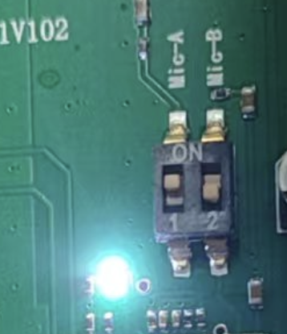
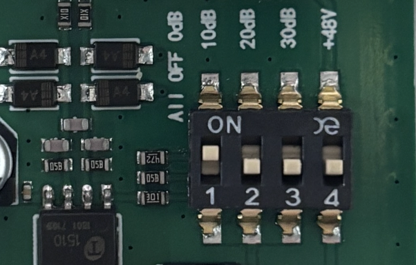
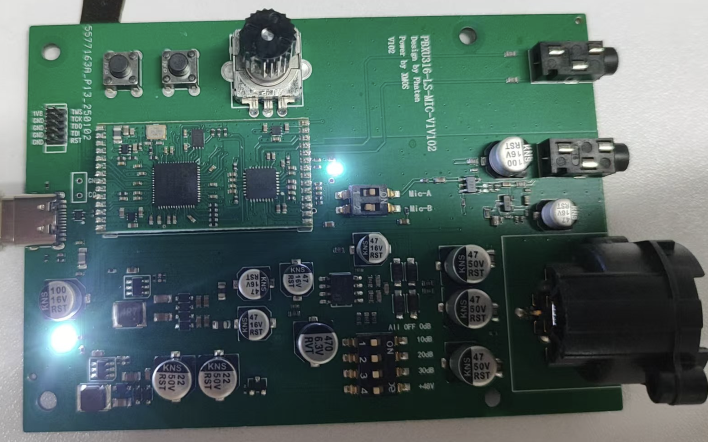
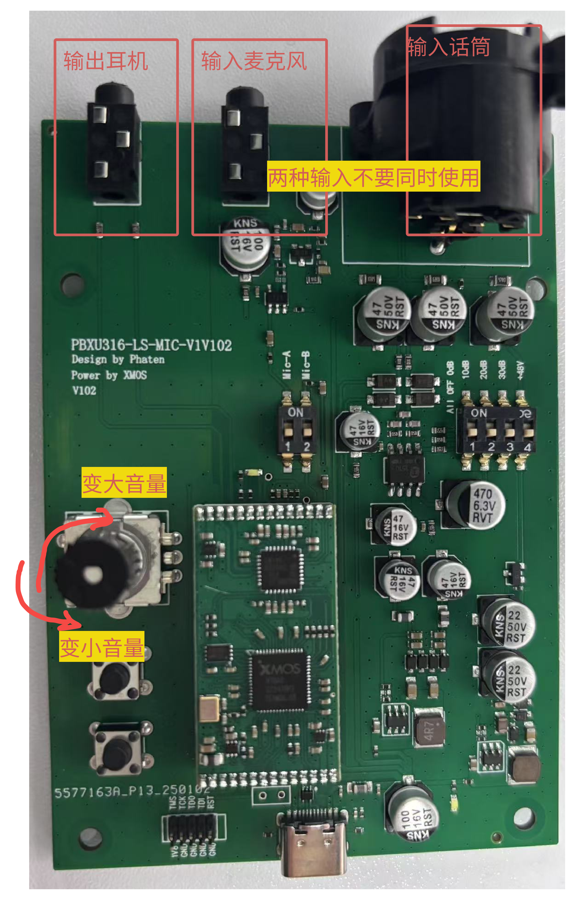
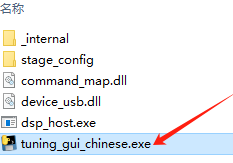
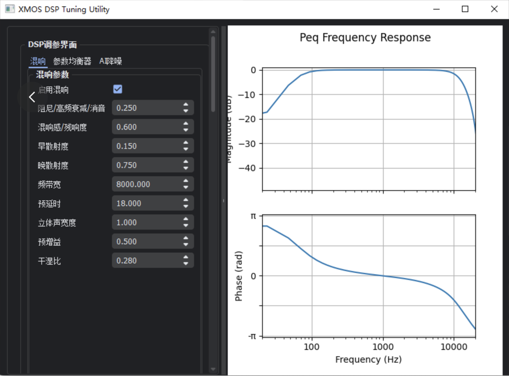
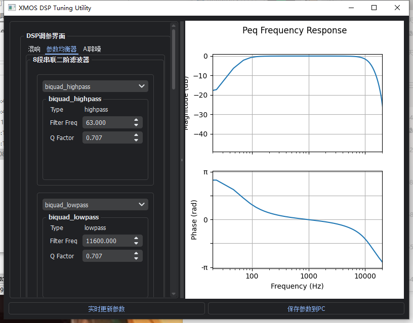
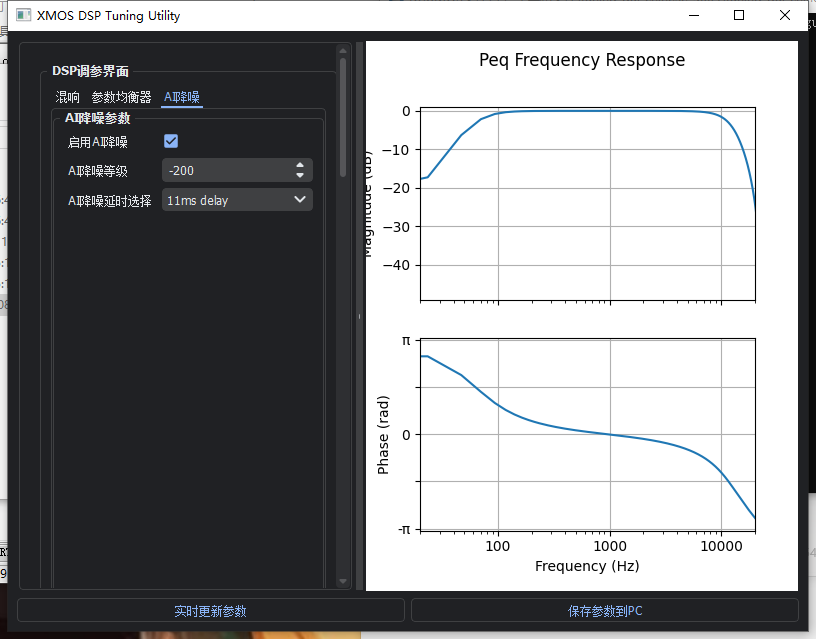
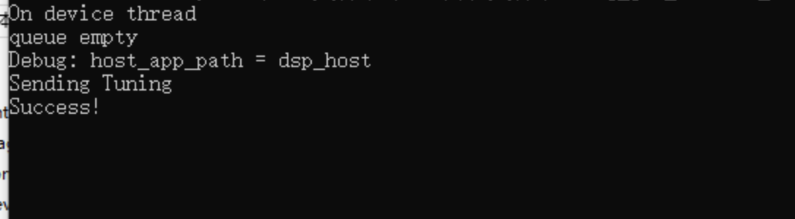

# AI降噪麦克风
## 一、**控制注意项**
1.新板通电前需要接电流表看看整机电流是不是正常，电流大以免烧芯片。

2.测试通道话筒音频MIC-A MIC-B开关只能交替开关测试，两个同时开启会导致声音变小。

{width="200" }

**3.XLR通道接动圈话筒需要关闭+48V开关以免烧毁话筒**。

4.10dB 20dB 30dB开关交替开启对应标识增益值。一种情况只能开启一个标识开关，另外两个需要关闭。如开启10dB，其他两个需要关闭。

{width="400" }

5.USB旁边的白色电源指示灯太亮了刺眼，可以把电阻改为1.2-1.5K。

{width="400"}

[//]: # ({width="400"  style="transform: rotate&#40;90deg&#41;;margin-left:150px;"})
## 二、按键说明

{width="500" }

## 三、PC端控制软件使用方法
可以在获取软件上设置需要的场景，打开后会有一个操作界面和一个日志显示cmd

- {width="400" }

- {width="400" }

- {width="400" }

调整好后，点击左下方“实时更新参数” 才能在设备上生效，若设置正常，会有log打印

设置好后，如果需要保存，就点击“保存参数到PC”