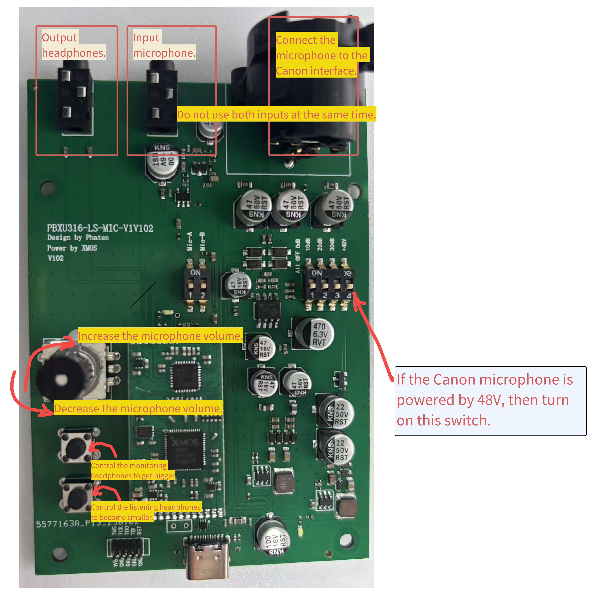

<!-- # AI降噪麦克风
## 一、**控制注意项**
1、新板通电前需要接电流表看看整机电流是不是正常，电流大以免烧芯片。

2、测试通道话筒音频MIC-A MIC-B开关只能交替开关测试，两个同时开启会导致声音变小。

{width="200" }

!!! warning "3、注意"

    XLR通道接动圈话筒需要关闭+48V开关以免烧毁话筒。

4、10dB 20dB 30dB开关交替开启对应标识增益值。一种情况只能开启一个标识开关，另外两个需要关闭。如开启10dB，其他两个需要关闭。

{width="400" }

5、USB旁边的白色电源指示灯太亮了刺眼，可以把电阻改为1.2-1.5K。

{width="400"}

[//]: # ({width="400"  style="transform: rotate&#40;90deg&#41;;margin-left:150px;"})
## 二、按键说明

{width="500" }

## 三、PC端控制软件使用方法
可以在获取软件上设置需要的场景，打开后会有一个操作界面和一个日志显示cmd

- {width="400" }

- {width="400" }

- {width="400" }

调整好后，点击左下方“实时更新参数” 才能在设备上生效，若设置正常，会有log打印

设置好后，如果需要保存，就点击“保存参数到PC” -->

# AI Noise-Canceling Microphone

## I. **Important Points to Note**

1. Before powering up the new board, use an ammeter to check if the overall current is normal. If the current is too high, it may burn the chip.

2. The microphone audio channel switches, MIC-A and MIC-B, should be toggled alternately during testing. Turning both on simultaneously will cause the sound to become quieter.

{width="200"}

!!! warning "3. Attention"

    When connecting dynamic microphones to the XLR channel, make sure to turn off the +48V switch to avoid damaging the microphone.

4. The 10dB, 20dB, and 30dB switches correspond to the indicated gain values and should not be turned on simultaneously. Only one switch should be turned on at a time, and the other two should be off. For example, if 10dB is turned on, the other two must be off.

{width="400"}

5. The white power indicator light next to the USB is too bright and may be blinding. You can replace the resistor with a 1.2-1.5K value.

{width="400"}

[//]: # ({width="400"  style="transform: rotate&#40;90deg&#41;;margin-left:150px;"})

## II. Button Description

{width="500"}

## III. PC Control Software Usage

You can set the required scene in the software. After opening it, there will be an operation interface and a log display in cmd.

- {width="400"}

- {width="400"}

- {width="400"}

Once adjustments are made, click "Real-Time Update Parameters" in the lower left corner to apply the changes to the device. If the settings are correct, logs will be displayed.

After setting, if you wish to save the configuration, click "Save Parameters to PC."