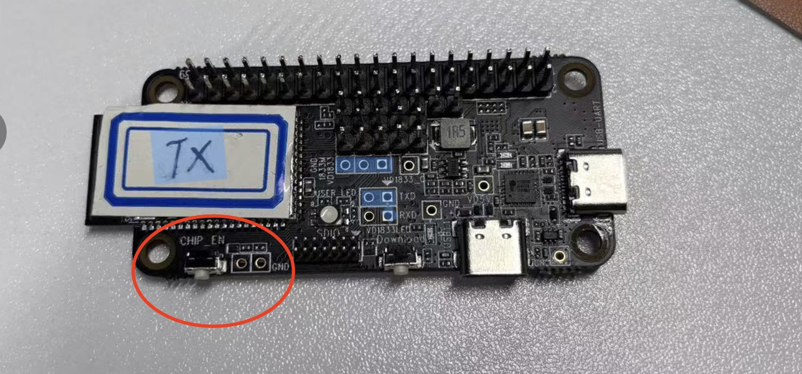

## 1. Wireless 5.1 Audio Control Introduction
### (1) Wireless 5.1 Audio Control Schematic Diagram

### (2) Wireless 5.1 Audio Control Wiring Diagram
#### 1) RTL8711DCM PCB Schematic Diagram

#### 2) RTL8711DCM Control Pin Schematic Diagram

#### 3) RTL8711DCM Module PIN Diagram

#### 4) RTL8711DCM Wireless Audio 5.1 TX Slave Wiring Schematic

#### 5) RTL8711DCM Wireless Audio 5.1 TX Master Wiring Schematic

#### 6) RTL8711DCM Wireless Audio 5.1 RX Master Wiring Schematic

<!--
### (3) User Instructions
#### 1) After connecting the wires, connect the other RX end to the audio device, and connect the TX end's dome board to the computer or mobile phone.

Normally, when powered on, the TX end will automatically pair with the RX end.

If it's a computer, some configuration may be needed. Open Run (Win+R), enter the command [control], and press [OK or Enter]. In the control panel, select [Sound] to enter.

#### 2) Configure Output Sampling Rate and Bit Depth

#### 3) Configure Speakers

#### 4) Select the desired channel: 5.1 Surround

#### 5) After all power connections are successful, press the reset button on the RTL8711DCM PCB once.
 -->