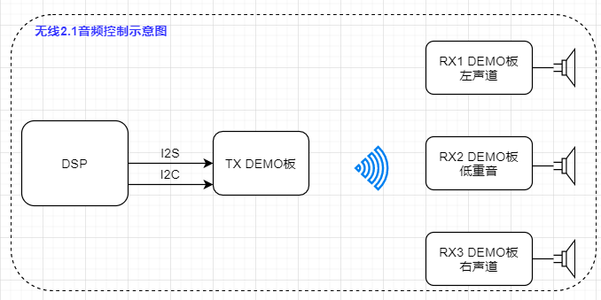
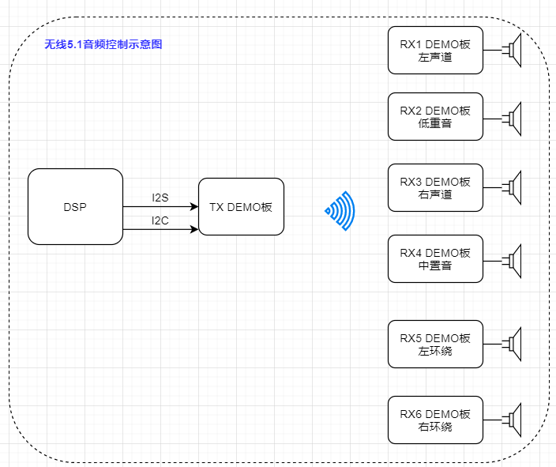
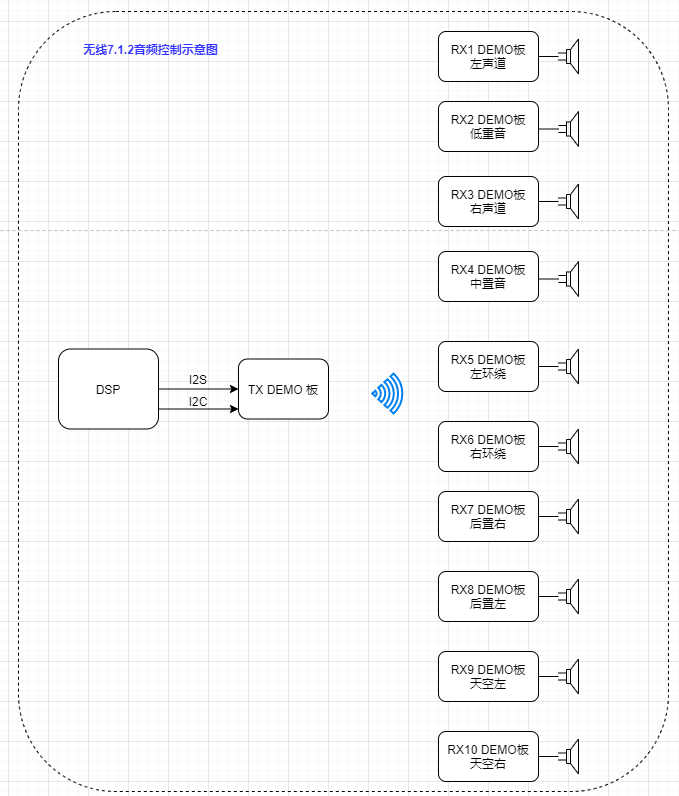
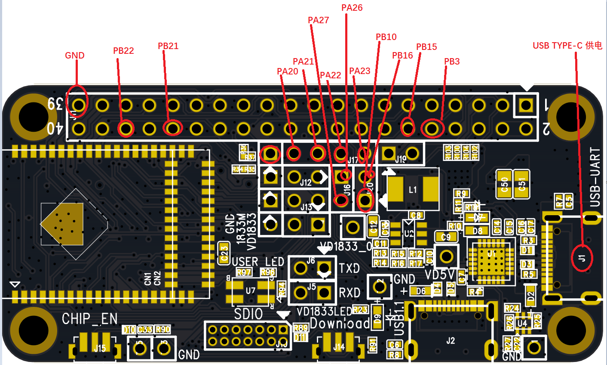
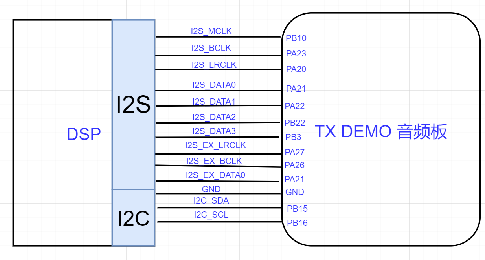
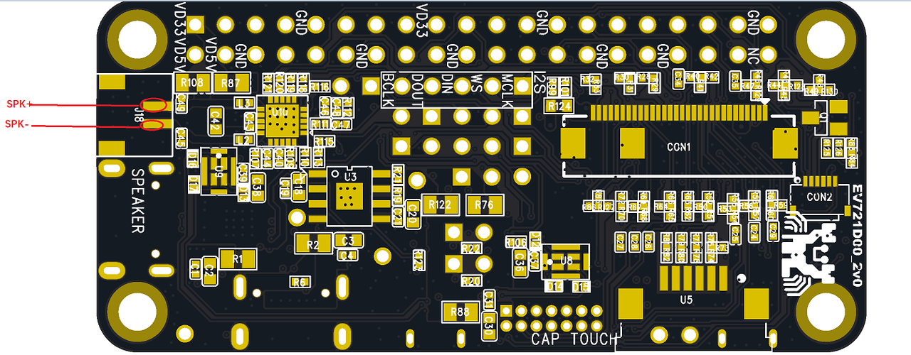
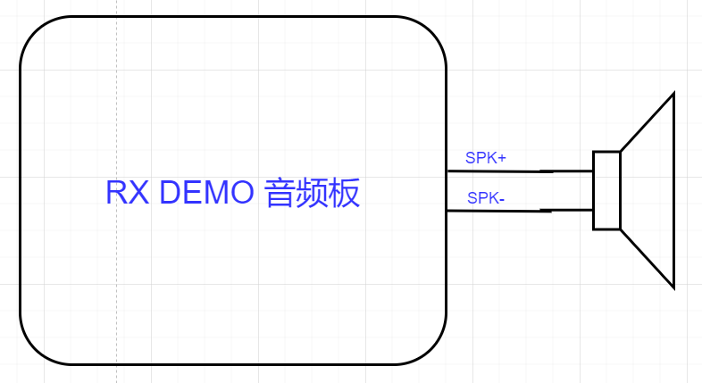

# RTL8711DCM 演示板接线说明

### 1.无线音频演板控制介绍
(1)  无线2.1音频演示板控制示意图

（2）无线5.1音频演示板控制示意图

（3）无线7.1.2音频演示板控制示意图    

### 2. 无线音频演板接线介绍
#### （1)   无线音频TX 演示板 I2S、I2C 控制引脚示意图 

#### （2)   DSP 与 无线音频TX 演示板 I2S、I2C 接线示意图

1）DSP 与 无线音频TX 演示板 2.1 声道 I2S 接线说明

    DSP 作为 Slave 时需要的I2S 信号线: I2S_BCLK 、 I2S_LRCLK、 I2S_DATA0、 I2S_DATA1、 GND 
    
    DSP 作为 Master 时需要的I2S 信号线: 
    I2S_MCLK、  I2S_BCLK 、 I2S_LRCLK 、I2S_DATA0、 I2S_DATA1 、GND 

2）DSP 与 无线音频TX 演示板 5.1 声道 I2S 接线说明

    DSP 作为 Slave 时需要的I2S 信号线: 
    I2S_BCLK 、 I2S_LRCLK、 I2S_DATA0、 I2S_DATA1、I2S_DATA2、 GND 
    
    DSP 作为 Master 时需要的I2S 信号线: 
    I2S_MCLK、  I2S_BCLK 、 I2S_LRCLK 、I2S_DATA0、 I2S_DATA1 、I2S_DATA2、GND

3）DSP 与 无线音频TX 演示板 7.1.2 声道 I2S 接线说明

    DSP 作为 Slave 时需要的I2S 信号线: 
    I2S_BCLK 、 I2S_LRCLK、 I2S_DATA0、 I2S_DATA1、I2S_DATA2、I2S_DATA3、
    I2S_EX_LRCLK、I2S_EX_BCLK、I2S_EX_DATA0、 GND 
    
    DSP 作为 Master 时需要的I2S 信号线: 
    I2S_MCLK、  I2S_BCLK 、 I2S_LRCLK 、I2S_DATA0、 I2S_DATA1 、I2S_DATA2、I2S_DATA3、
    I2S_EX_LRCLK、I2S_EX_BCLK、I2S_EX_DATA0、 GND

#### (3) 无线音频RX 演示板 接线示意图 

