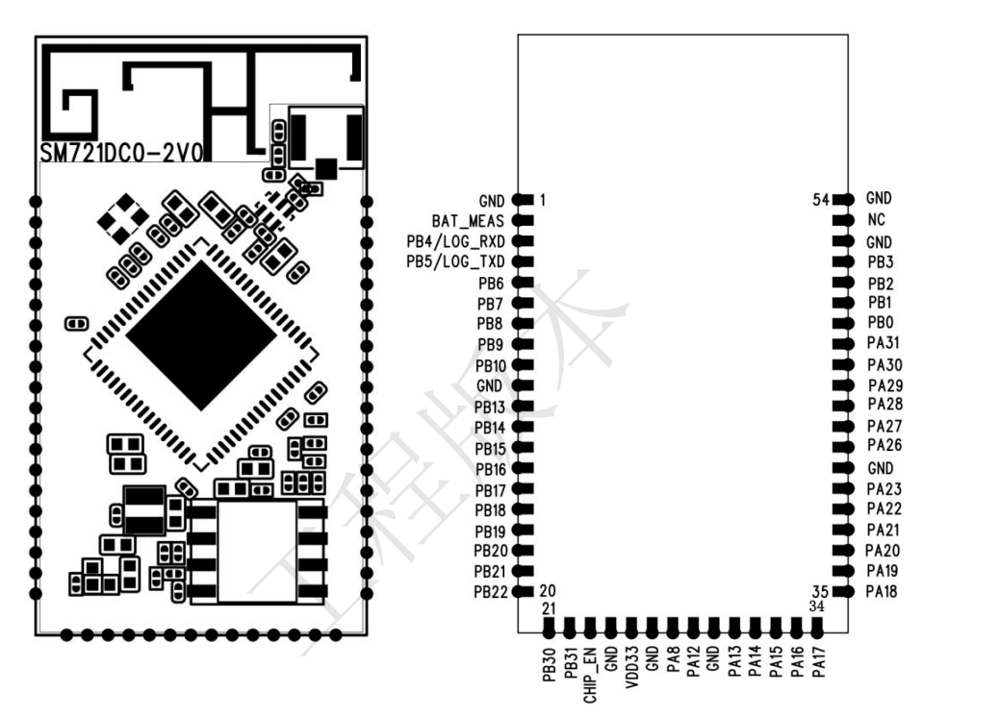

# RTL8711DCM Module Design Overview

### 1. Wireless Audio Module Control Overview
(1) Wireless 2.1 Audio Module Control Diagram

(2) Wireless 5.1 Audio Module Control Diagram

(3) Wireless 7.1.2 Audio Module Control Diagram

### 2. RTL8711DCM Module PIN Diagram

### 3. RTL8711DCM Module Hardware Wiring Control Diagram
#### (1) RTL8711DCM Module (TX) Hardware Control Diagram

1) DSP and RTL8711DCM Module (TX) Channel I2S Wiring Instructions

- **When DSP is Slave**, the required I2S signal lines are:
I2S_BCLK, I2S_LRCLK, I2S_DATA0, I2S_DATA1, GND

- **When DSP is Master**, the required I2S signal lines are:
I2S_MCLK, I2S_BCLK, I2S_LRCLK, I2S_DATA0, I2S_DATA1, GND

2) DSP and RTL8711DCM Module (TX) 5.1 Channel I2S Wiring Instructions

- **When DSP is Slave**, the required I2S signal lines are:
I2S_BCLK, I2S_LRCLK, I2S_DATA0, I2S_DATA1, I2S_DATA2, GND

- **When DSP is Master**, the required I2S signal lines are:
I2S_MCLK, I2S_BCLK, I2S_LRCLK, I2S_DATA0, I2S_DATA1, I2S_DATA2, GND

3) DSP and Wireless Audio RTL8711DCM Module (TX) 7.1.2 Channel I2S Wiring Instructions

- **When DSP is Slave**, the required I2S signal lines are:
I2S_BCLK, I2S_LRCLK, I2S_DATA0, I2S_DATA1, I2S_DATA2, I2S_DATA3,
I2S_EX_LRCLK, I2S_EX_BCLK, I2S_EX_DATA0, GND

- **When DSP is Master**, the required I2S signal lines are:
I2S_MCLK, I2S_BCLK, I2S_LRCLK, I2S_DATA0, I2S_DATA1, I2S_DATA2, I2S_DATA3,
I2S_EX_LRCLK, I2S_EX_BCLK, I2S_EX_DATA0, GND

#### (2) RTL8711DCM Module (RX) Hardware Control Diagram

