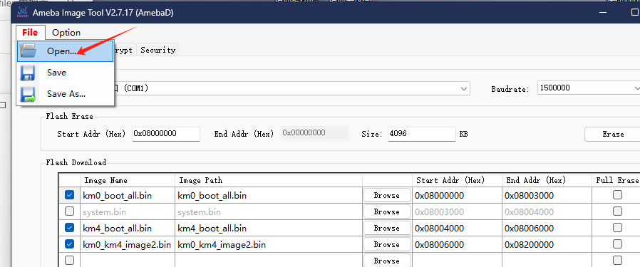

# 8711 Module Programming Tool Guide

### Preparation:

- **Programming Tool**: [Download Link](../../assets/download/A316/ImageTool.zip)

To enter programming mode:

And here is the 8711 module image:

---

### 1. Start Using the Tool
After downloading the tool, locate the file shown in the image and double-click to open.

---

### 2. Open the Software
Once the software is open, click **File**, then click **Open** to select the firmware file.

---

### 3. Select Firmware File
Choose the **"AmebaDplus FreeRTOS NOR.rdev"** (third file) to burn the 8711 firmware.
For burning the 8730 firmware, select the sixth file, as per your needs.

---

### 4. Choose Configuration and Firmware
Ensure the firmware name matches and select the correct configuration file.

---

### 5. Configure Port and Baud Rate
Select the serial port, baud rate, and other settings as shown in the image (normally, it will auto-select).
After verification, click the "Download" button to start the burning process.

---

### 6. After Burning
Once the burning process is completed without errors, check the serial port logs.
If the logs are printed correctly, the burning is successful.

---
