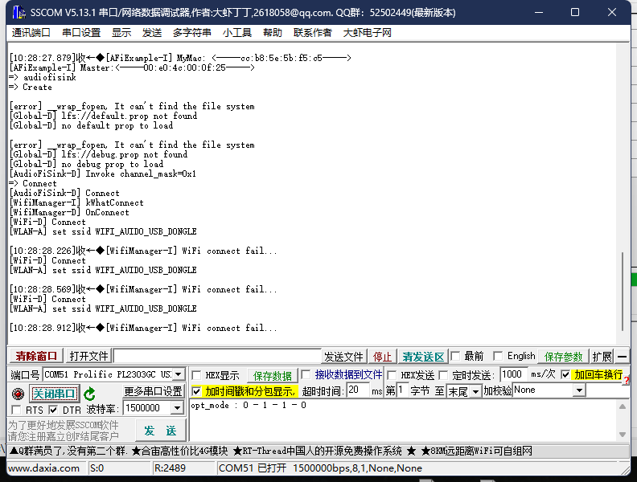

# 8711 Series Programming Tool Guide

### Preparation:

**Programming Tool**: [Download Link](../../assets/download/A316/ImageTool.zip)

To enter programming mode: First, press and hold the "download" button, then press and hold the "chip" button. The serial port will print `\0`. Release both buttons simultaneously.

To enter print mode: Press the "chip" button once.

---

### 1. Starting the Tool
After downloading the tool, locate the file shown in the image and double-click to open.

---

### 2. Opening the Software
Once the software is open, click "File," then click "Open" to select the firmware file.

---

### 3. Selecting the Firmware
Choose the file **“AmebaDplus FreeRTOS NOR.rdev”** (third file), which is used for burning the 8711 firmware.
The sixth file is for burning the 8730 firmware, choose according to your needs.

---

### 4. Configuration
Select the configuration file, then choose the firmware to be burned. Ensure that the names match.

---

### 5. Configuring Port and Baud Rate
Select the serial port, baud rate, and other settings as shown in the image (the settings should be auto-selected by default). After verification, click the "Download" button at the bottom to start the burning process.

---

### 6. Burning Completion
Once the burning process completes without any errors, check the serial port logs. If the logs print normally, the burning process was successful.

