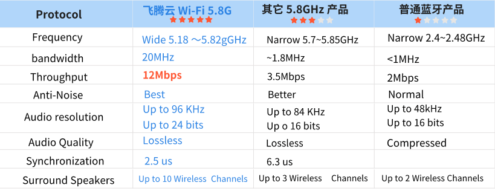

# Wi-Fi 7.1.2 Home Theater Wireless Connection Solution

Video Introduction:
[Wi-Fi 5.8G 7.1.2 Wireless Audio Solution](../../assets/images/speaker/XU316-英文.mp4)

1. Solution Overview
2. 
With the continuous advancement of technology and consumers' increasing pursuit of audio-visual experiences, traditional audio equipment has become insufficient to meet the needs of modern households. As flat-screen TVs gradually become the center of home entertainment, bulky amplifiers and complex sound systems seem increasingly outdated. Consumers wish to enjoy a cinema-like audio-visual effect at home but do not want to endure the hassle of complicated audio wiring and equipment installation.

<!-- more -->
Driven by this market demand, lightweight and convenient audio solutions such as soundbars, standalone subwoofers, and surround sound speakers have emerged. These devices not only have a stylish appearance but are also easy to operate, effectively enhancing the sound quality of TVs and other audio sources, providing users with a stunning immersive experience. Especially during family gatherings, movie watching, or gaming, a high-quality audio experience can greatly enhance the entertainment effect and create a more engaging atmosphere.

To meet consumers' pursuit of high-quality audio, we have launched the 7.1.2 Home Theater Wireless Connection Solution. This solution fully utilizes the latest Wi-Fi 5G signal technology, featuring low latency, high sound quality, and strong anti-interference capabilities, supporting multi-channel wireless transmission. Users need not worry about wiring issues; with simple setup, they can enjoy cinema-level immersive audio-visual effects in every corner of their home. Our aim is to provide every user with a convenient and high-quality audio experience, allowing them to feel the shock and enjoyment brought by professional audio systems at home.

## II. Features and Advantages

This Wi-Fi 5.8G wireless 7.1.2 audio solution has the following significant advantages:

1. **High Frequency, Less Interference**: The 5.8GHz frequency band has less interference compared to the traditional 2.4GHz band. This characteristic makes audio transmission clearer and more stable, allowing users to fully enjoy high-quality audio effects.

2. **High-Speed Data Transmission**: The 5.8GHz band can provide higher data transmission rates, especially suitable for high-resolution audio streaming. This advantage ensures the clarity of sound quality, meeting the high demands of audio enthusiasts for audio quality.

3. **Support for High-Resolution Audio**: This solution supports high-resolution audio transmission and can handle 192KHz/24bit audio files. This provides a significant competitive advantage for users pursuing high-fidelity sound quality, ensuring that every detail of the music is perfectly presented.

4. **Strong Anti-Interference Capability**: The 5.8GHz system, using direct sequence spread spectrum technology, has more channels and higher frequencies, enhancing its anti-interference capability. This ensures that audio transmission remains stable even in complex environments.

5. **Easy to Install and Use**: The wireless 7.1.2 audio system greatly reduces the need for wiring, making the installation process simpler and enhancing overall aesthetics. Users can easily set up the audio system and enjoy high-quality audio experiences.

6. **Applicable in Various Environments**: The 5.8GHz wireless technology is suitable for both urban and suburban areas, capable of stable operation in various environments such as homes, offices, and public places. Whether for home theaters, conference rooms, or entertainment venues, this solution can meet users' needs.

This Wi-Fi 5.8G wireless 7.1.2 audio application solution, with its outstanding performance and flexible application scenarios, is sure to bring users an unprecedented audio experience. Whether for music lovers or audio enthusiasts, this solution offers an ideal choice.

<video width="640" height="480" controls>
  <source src="../../assets/images/speaker/XU316-英文.mp4" type="video/mp4">
  Your browser does not support the video tag.
</video>