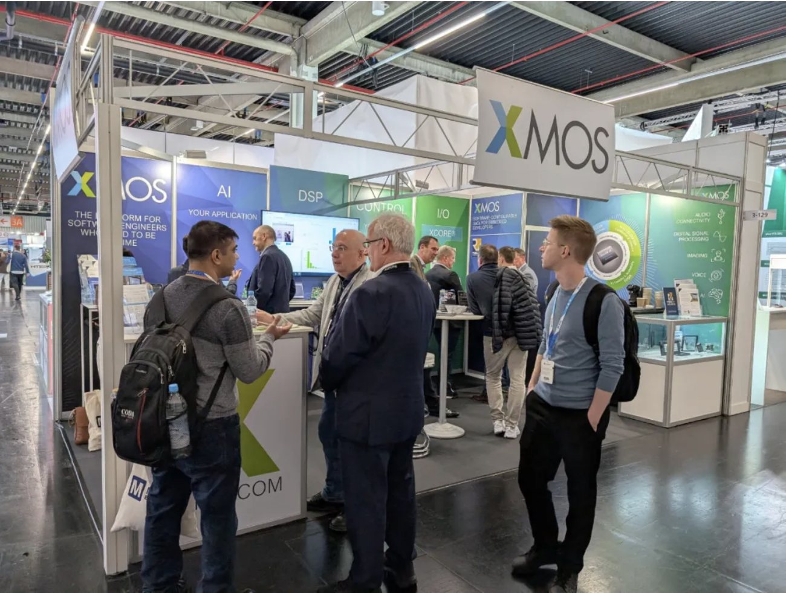

# XMOS在EW 25上精彩展示系列回顾——空间音频

2025年3月，全球规模最大的嵌入式行业盛会——德国纽伦堡国际嵌入式展（Embedded World 2025，EW 25）圆满落幕。在这场汇聚全球950家展商、3万余专业观众的科技盛宴中，XMOS展位人头攒动，多款尖端产品和多项创新技术吸引了客户驻足交谈。

<!-- more -->

作为人类之间、以及人类与机器之间最常用的互动沟通媒体，语音将在大模型和边缘智能并蒂爆发的时代成为可带来巨大便利和效率的媒体，智能语音处理技术也将成为支撑大模型和边缘智能的关键技术之一；同时，人们总是还在追求更加美好的音乐和听觉体验，推动了音频技术的持续创新发展。

XMOS在EW 25上展示了其多项重量级的、包括AI技术驱动的创新音频技术解决方案，如空间音频、实时流媒体声卡、人工智能降噪等多个现场演示。这些方案可以提供顶级数字音频体验，或者支撑大模型和边缘智能，不仅具有强大的功能和极高的性能，而且还进一步降低了成本和功耗，从而可以加速智能端侧设备的开发，以及大模型的普及，为全球客户和伙伴提供可以快速实现最新音频系统设计的完整套件。

为此，我们将采取连载的方式介绍XMOS在EW 25上重点展示的内容，如希望与XMOS中国团队合作，在这些方案上开发面向全球市场的产品，请发邮件到：ThomasMu@xmos.com。

## 空间音频——本解决方案在任何设备上都能提供3D沉浸式空间音频，而且可以实现更安全地聆听
在任何设备上都能提供即插即用、每个比特都精确、丰富的3D沉浸式音频体验，不仅可以支持设备间的传输，而且减少了一半的耳鼓压力并实现所有延迟超低。该技术与所有的操作系统和耳机都可无缝兼容，同时满足游戏对超低延迟的要求。

### XMOS解决方案的特性
- 丰富的3D音频空间音效体验处理
- 更安全地聆听
- 降低感知负荷

### XMOS解决方案的优势
- 在任何设备上都能提供3D音频体验
- 减少一半的耳鼓压力
- 提供的音效可以降低15%的神经负荷
- 提供5.3x空间音频 @ 2/3 rds芯片功率
- USB即插即用——与操作系统无关（可适用于iOS，Android和Windows）

### 为什么选择XMOS？
- 低延迟音频协议栈
- 提供大量优化的DSP资源、集成IO和灵活的时钟选项
- USB即插即用，与操作系统无关
- 低功耗，pJ/MACC效率

### 该方案立即可应用的设备
- 头戴式游戏耳机
- 头戴式会议耳机
- 耳机
- 用于入耳式耳机/耳机的空间音频数模转换（DAC）适配器

### 系统框图

XMOS的3D音频解决方案已得到市场的长期验证，客户已据此开发出多款畅销全球的产品，欢迎联络XMOS深圳办公室共商新一代产品的创新。

目前，XMOS的智能音频技术和方案已经被广泛应用于智能消费电子、智能家居、智能汽车和办公应用，不仅为各种终端和系统提供了高质量的音频和音效，而且作为无所不在的人机接口和新兴生产力工具帮助这些应用连入各种网络。

“从CES 2025到EW 25，我们展示了XMOS在边缘智能和先进音频等领域的多项创新，例如空间音频、实时流媒体声卡和人工智能降噪等，这些演示引起了伙伴们极大的兴趣和合作愿望，相信它们在今年及以后能够给我们的客户及自己带来巨大成功。”XMOS亚太区市场和销售负责人牟涛表示。“XMOS将快速把这些技术和方案介绍到中国，帮助客户打造世界一流的音频产品。”

如希望了解XMOS全球领先的音频解决方案、软件定义SoC及其在其他垂直行业的应用，请发邮件到：ThomasMu@xmos.com 