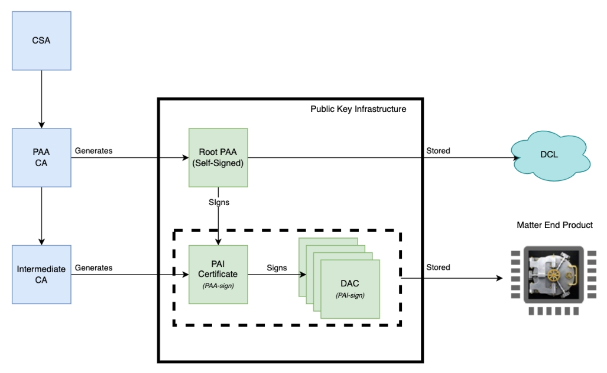
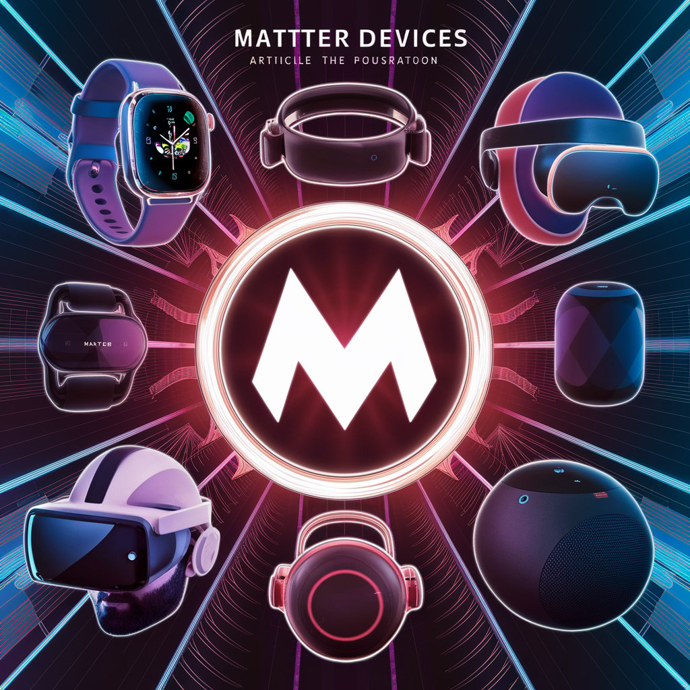

# matter DAC 与 CD 有啥关系？

<!-- more -->
## DAC的逻辑是什么？

在Matter（前身为CHIP）生态系统中，DAC通常指的是“Device Access Control”，即设备访问控制。这并不是一个单独的逻辑或技术，而是涵盖多种安全和访问管理机制的总称，用于确保智能家居设备之间的安全互操作性。

具体来说，Matter DAC的逻辑可以概括为以下几个方面：

1.身份验证和认证：

- 设备之间的通信和互操作必须经过身份验证，确保每个设备的身份是合法的。这可能涉及使用安全密钥、数字证书或其他安全机制来验证设备的身份。

2.访问控制和权限管理：

- 一旦设备的身份得到验证，Matter DAC定义了如何控制设备之间的访问和操作。这包括确定哪些设备有权访问其他设备，以及访问权限的具体范围。

3.安全通信和数据保护：

- DAC确保设备之间的通信是安全的，通常通过加密通道和数据完整性检查来实现。这防止了数据泄露、篡改或未经授权的访问。

4.事件和权限审计：

- DAC可能包括事件记录和权限审计功能，用于跟踪和监视设备之间的交互。这有助于检测异常活动和保持系统的安全性。

5.安全管理和更新：

- 最后，DAC可能涉及安全管理实践，如密钥管理、安全升级策略和远程设备管理，以确保系统在整个生命周期内保持安全。

Matter DAC的逻辑是通过多种安全机制和管理实践来确保智能家居设备之间的安全互操作。这些措施不仅提高了设备的安全性，还为用户提供了可信赖的智能家居体验。

## DAC与CD之间的联系

通常，设备DAC中的VID和PID将与设备CD中包含的vendor_id和product_id_array中至少一个值相匹配。这些值还必须与PAI和PAA证书中包含的任何VID和PID值匹配。VID和PID必须与BasicInformation Cluster中包含的值匹配。因此，配网节点和使用配网节点的用户可以确信该设备是其所声称的设备，并且已通过CSA认证。

然而，有一个例外。如果CD包含可选的 “ 原厂 ” 字段（dac_origin_vendor_id和dac_origin_product_id字段），则这些字段必须与DAC、PAI和PAA中的VID和PID值匹配。

此可选功能允许一家公司为另一家公司生产的产品重新命名。

设备上的DAC可以在设备制造时安装，而不知道产品将拥有哪个品牌。之后，可以在设备上安装正确品牌的CD，这可能是设备固件升级的一部分。配网节点将核实产品符合上述以及规范中明确定义的所有规则。然后，家庭中的所有设备都可以确信该设备具有基本信息功能集中包含的VID和PID，并在与消费者通信时使用这些值。

<!-- ## 飞腾云能为您提供完整的DAC服务

 -->

