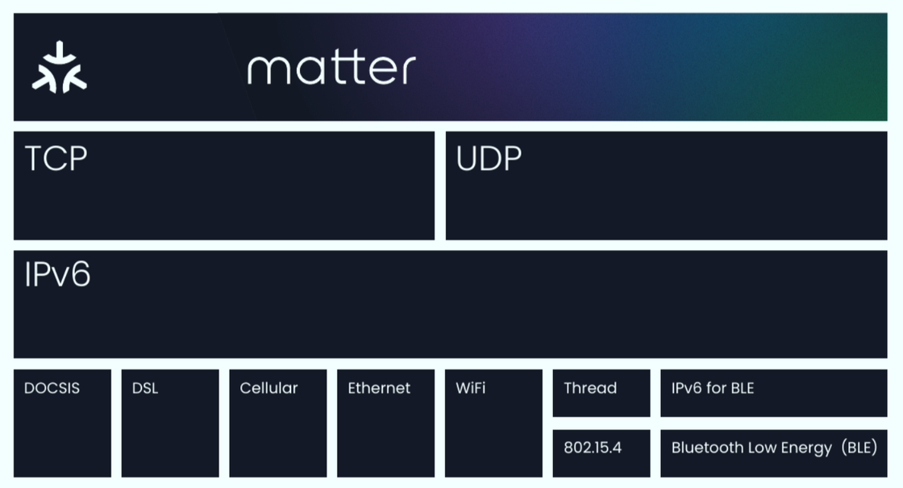

# 为什么科技巨头都如此热衷于 matter

为什么科技巨头都如此热衷于 matter，我们要从 matter 能够改变什么来说起<!-- more -->，如果你购买到一个 matter 认证的产品，那么：

- 这个产品可以加入任何支持 matter 的生态中，比如 HomeKit、Google Home、Alexa 或是其他支持 matter 的第三方生态，并且在各个生态中可以使用本生态的所有基础以及进阶功能。
- 不需要购买对应生态的网关，不同的生态的网关可以管理其他生态的产品。HomePod、Apple TV、Nest 音箱甚至 eero 路由器均可以作为 matter 网关支持其他所有的 matter 设备。
- 可以和你家中任何其他品牌的 matter 产品直接交换数据、执行操作或是作为自动化中的一部分，不同的通讯协议也不需要再经由「网关」的翻译，大大节约数据交换上的延迟开销。
- 安全的本地运行机制，可以不需要接入任何厂商的云服务，在家中就可以完成控制、自动化与固件升级。
- 使用 Wi-Fi 以太网以及 Thread 协议，其中 Thread 是最先进的 IoT 通讯协议，响应延迟极低。
- 安全的认证入网过程，对于多生态，多管理员的家庭极其友好。

这些实现的具体技术细节，我们在后面的文章中会详细向你解释，可以说，matter 从诞生之初就想要统一 IoT 市场并且解决过去所有智能家居用户的痛点，matter 也会让厂商从生态构筑这一垄断的恶性竞争转变为专注产品力与产品深度的良性竞争

## matter 的结构
对 matter 能够做到什么有了一个基础认识之后，我们来看看 matter 的构成：

matter 在最上面代表了应用层，下方则是网络层以及物理层的各项通讯协议。可能对于不熟悉的朋友可能会比较迷惑，我们来逐一解释一下这些代表了什么。

在最上层的 matter 可以被想象成一种语言：也就是智能家居互相的交流方式，只要使用 matter 这种语言的智能家居就可以顺畅的互相交流，而无需一个翻译官——「网关」的介入。TCP/UDP 则可以想象成不同形式的邮件和包裹，他们被不同的邮递方式，也就是最底层的各种传输技术，寄送给各个智能家居的门牌号 —— IPv6。更底层的各种网络技术则可以看作各种快递方式，快递方式可能有速度上的区别，但殊途同归的是把邮件投递到对应的门牌号。