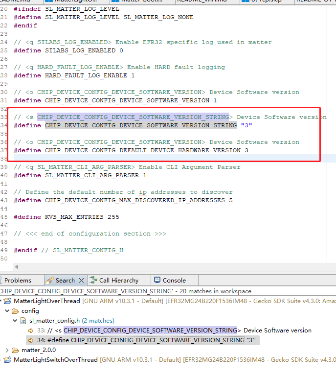
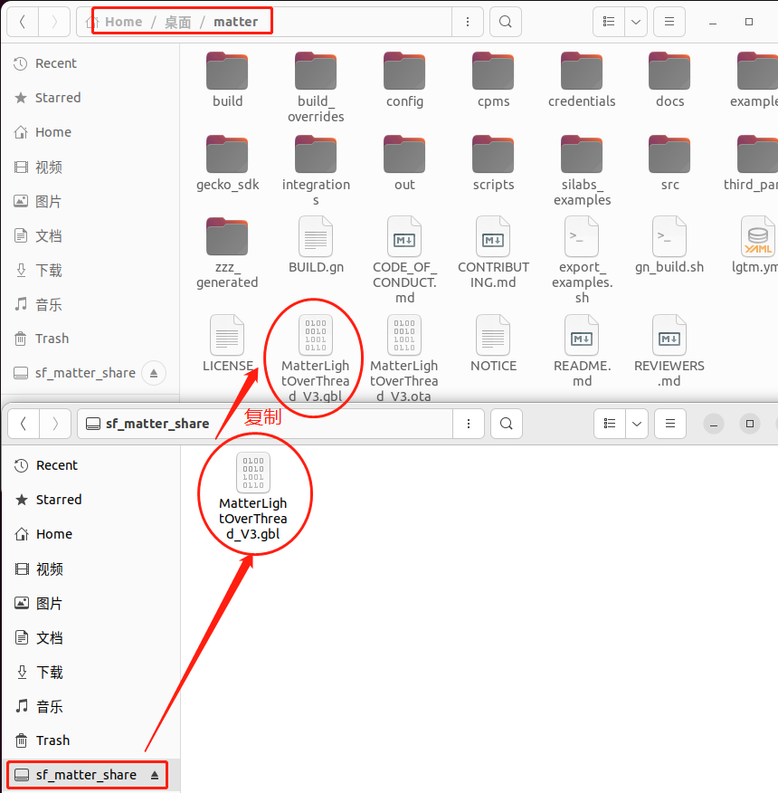
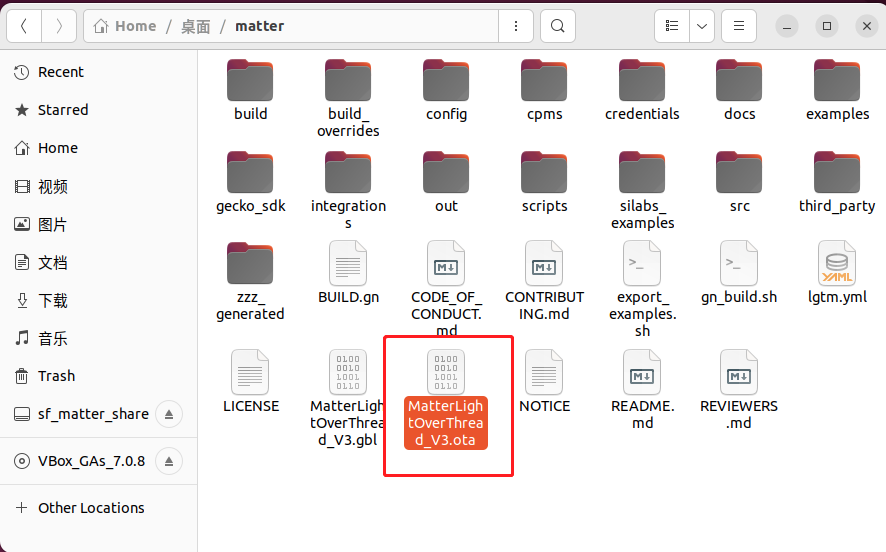
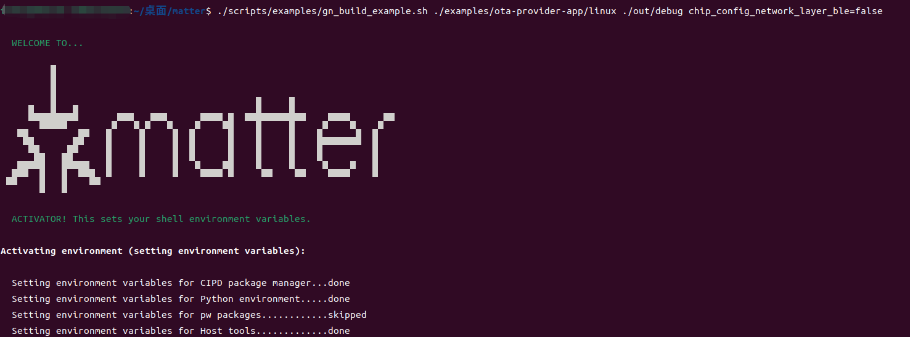
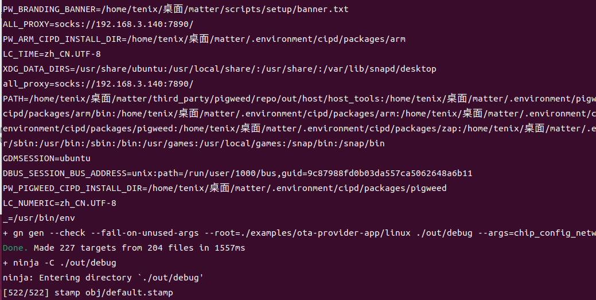
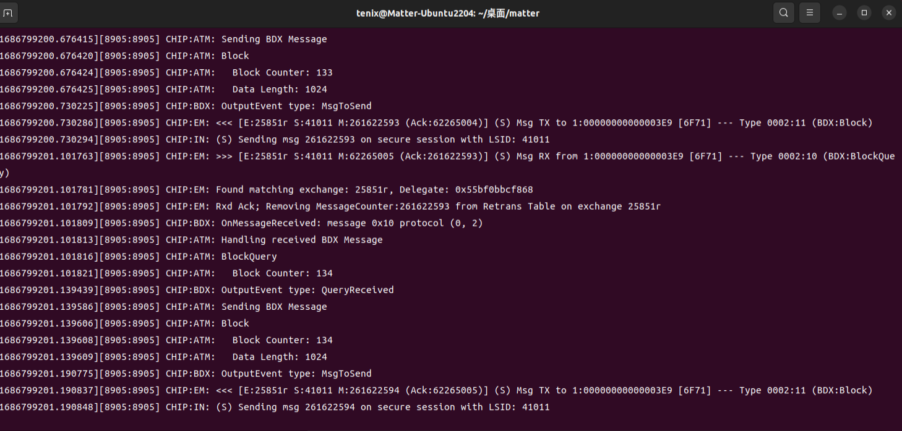

# matter 如何OTA升级？
<!-- more -->
## 一、生成OTA固件升级压缩包

### 1.1 修改OTA固件版本号为3



### 1.2 编译生成 MatterLightOverThread_V3.ota

将编译得到的MatterLightOverThread.s37固件名称改成MatterLightOverThread_V3.s37，复制到以下Windows文件夹

```
C:\SiliconLabs\SimplicityStudio\v5\developer\adapter_packs\commander
```

转换成.gbl文件

```
commander gbl create ./MatterLightOverThread_V3.gbl --app ./MatterLightOverThread_V3.s37 --compress lzma
```

复制MatterLightOverThread_V3.gbl到VM VirtualBox共享文件夹，将.gbl文件导入Ubuntu环境，然后复制到matter文件夹



将.gbl文件转换成.ota 文件

```
./src/app/ota_image_tool.py create -v 0xFFF1 -p 0x8005 -vn 3 -vs "0.3" -da sha256 MatterLightOverThread_V3.gbl MatterLightOverThread_V3.ota
```



## 二、ubuntu环境下升级matter固件

### 2.1 编译OTA升级程序

```
./scripts/examples/gn_build_example.sh ./examples/ota-provider-app/linux ./out/debug chip_config_network_layer_ble=false
```




### 2.2 matter设备配网

 ```
    # 清除 chip tool 的缓存。清除缓存后，OTA Provider 和 Matter 设备需要重新入网。
    sudo rm -r /tmp/chip_*
    
    # 创建 Thread 网络
    sudo ot-ctl dataset init new
    sudo ot-ctl dataset networkkey 00112233445566778899aabbccddeeff
    sudo ot-ctl dataset extpanid 1111111122222222
    sudo ot-ctl dataset panid 0x1234
    sudo ot-ctl dataset channel 15
    # 将以上配置提交为活动配置
    sudo ot-ctl dataset commit active
    # 打开 ipv6 接口
    sudo ot-ctl ifconfig up
    # 启动 Thread 协议
    sudo ot-ctl thread start
    # 查看 Thread 网络配置
    sudo ot-ctl dataset active -x
    # 为设备分配节点 ID 为 1001
    sudo ./chip-tool pairing ble-thread 1001 hex:0e08000000000001000035060004001fffe00708fdd0a609c458d59b030f4f70656e5468726561642d3763393004100191ed136516065cfa503db5ed6439320c0402a0f7f8051000112233445566778899aabbccddeeff0208111111112222222201021234000300000f 20202021 3840
 ```

在一个新的终端窗口启动 OTA 服务。指向 ota 文件
```
sudo ./out/debug/chip-ota-provider-app -f MatterLightOverThread_V3.ota
```

在一个新的终端窗口，为 OTA-Provider 分配一个节点 ID：5678

```
sudo ./chip-tool pairing onnetwork 5678 20202021
```

授予网络中所有设备操作 OTA Provider cluster (0x0029)的权限。5678 为 OTA Provider 的 node id，后面的 0 为 endpoint。

```
sudo ./chip-tool accesscontrol write acl '[{"fabricIndex": 1, "privilege": 5, "authMode": 2, "subjects": [112233], "targets": null}, {"fabricIndex": 1, "privilege": 3, "authMode": 2, "subjects": null, "targets": null}]' 5678 0
```

通知 Matter 设备升级。5678 为 OTA Provider 的 node id，1001 为 Matter Lighting 的 node id

```
sudo ./chip-tool otasoftwareupdaterequestor announce-otaprovider 5678 0 0 0 1001 0
```

可以在其他窗口看到，已经开始OTA升级传输固件包了




 Matter 设备收到 announce-otaprovider 命令后向 OTA Provider 请求并更新固件。

固件升级过程大约要几分钟时间……


```

版权声明：本文为博主张弛有度2016原创文章                     
原文链接：https://blog.csdn.net/zl374216459/article/details/131223300 