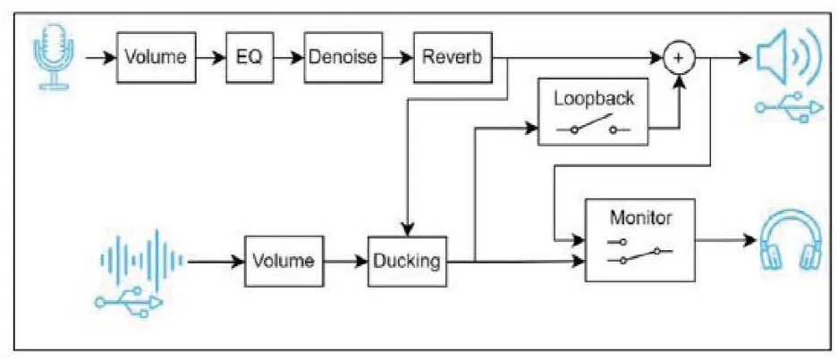

# XMOS 在 EW 25 上精彩展示系列回顾 —— 可支持实时音频 DSP 处理的低延迟直播声卡方案

本篇介绍直播声卡 —— 具有实时音频 DSP 处理的低延迟音频设备。

对于游戏玩家和短视频直播工作者来说，声卡不可或缺。它除了能将计算设备的数字信号转换为声音信号，还能够提供各种逼真的或者定制的 3D 音效，提升游戏的沉浸感，特别是在大型开放联网游戏或射击游戏中，声音细节直接影响玩家的游戏体验。同时随着各种自媒体在全球兴起，新一代直播和播客系统等设备给直播声卡等产品又开辟了新的空间。
<!-- more -->

因此，为消费者打造一款高性能、高品质的声卡，不仅能够让消费者的音频体验更上一层楼，而且还是一种给人带来享受的创新产品。XMOS 所提供的具有 DSP 处理功能的直播声卡解决方案凭借卓越的音质和超低延迟，非常适合用于诸如直播、播客广播、唱播（K 歌）和游戏等实时应用。

我们一起来看看 ——

## 直播声卡 —— 可提供实时 DSP 音频处理的低延迟音频方案

XMOS 提供的 DSP 处理技术可以带来高性能、高品质的音频体验。凭借可提供卓越的音质和超低延迟，非常适合用于诸如直播、播客广播、唱播（K 歌）和游戏等实时应用。该解决方案可提供灵活的输入和输出，包括对模拟和 USB 连接的支持，从而为内容创作者和通用耳机用户提供专业级音频。

### XMOS 解决方案的特性

- 高品质的 DSP 效果：具有混响、避闪和 EQ 等功能，允许用户完全定制音效。
- 高度定制化的 AI 降噪功能：专门为游戏、K 歌、录播等应用场景开发的 AI 降噪模型，具有强降噪，低延时的业内领先性能，并且多个 AI 降噪模型间可灵活切换。
- 卓越的音频性能：提供高保真音频，配合外围高性能 Codec 等器件可以实现超高硬件指标 (THD+N、DNR 等）的产品方案。
- 低延迟：延迟低至 0.125ms 的 6 采样（不包括 ADC/DAC 滤波器），可实现实时音频处理。延迟低至 1.15ms 的 56 采样（包括滤波器），即使在复杂的 DSP 处理流水线中仍可保持高响应性。
- 灵活的输入和输出选项：实现无缝集成和实时监测。

### XMOS 解决方案的优势

- 增强的音频质量
- 实时处理
- 易于使用和集成
- 专业且可靠的性能
- 不过时的设计
- 灵活的接口配置以及扩展性
- 数字端可提供接近理论值的性能指标（SNR＞140dB，24bit)
- 可通过 DFU 升级持续为用户添加新功能

### 该方案立即可应用的设备

- 耳机类
- 直播声卡
- USB 麦克风
- 游戏配件（外置声卡功能）

### 系统框图

目前，XMOS 的智能音频技术和方案已经被广泛应用于消费电子、智能家居、智能汽车和办公应用，不仅为各种终端和系统提供了高质量的音频和音效，而且作为无所不在的人机接口和新兴生产力工具帮助这些应用连入各种网络和云生态。

如希望了解 XMOS 全球领先的音频解决方案、软件定义 SoC 及其在其他垂直行业的应用，或与我们合作共同开发面向全球的创新性产品，请发邮件到：ThomasMu@xmos.com