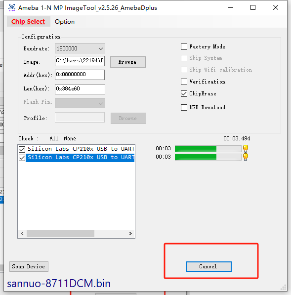
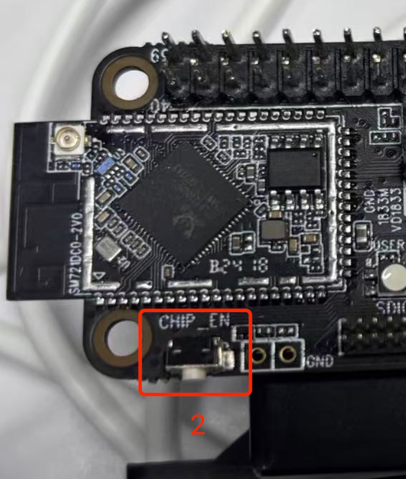
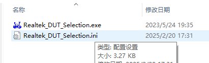
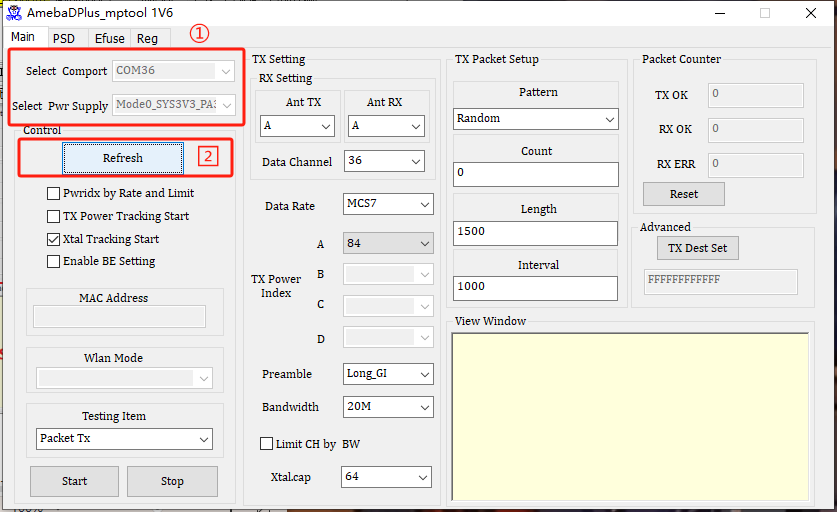
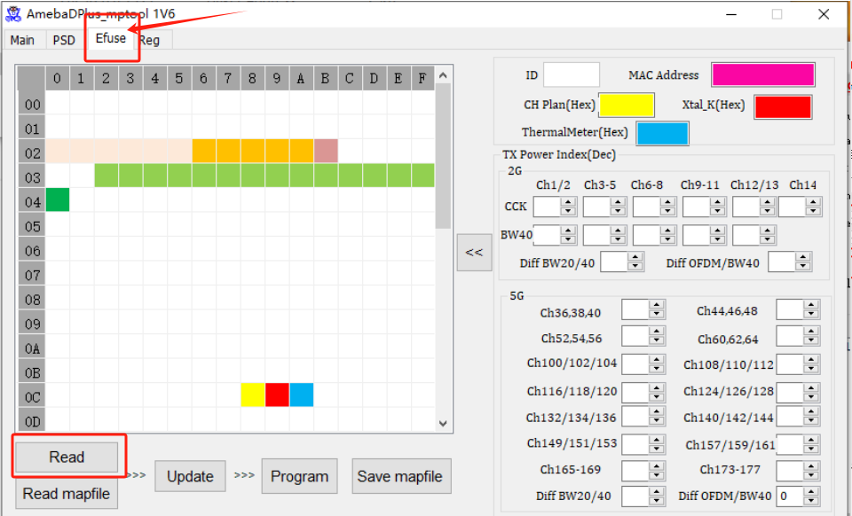
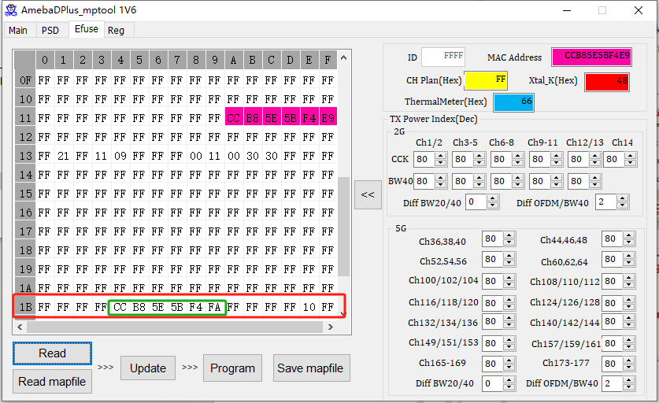
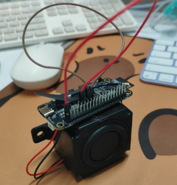
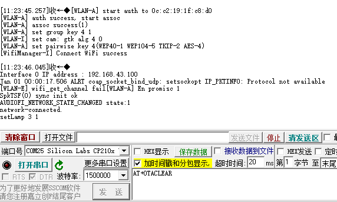

# A316-8711-5.1解码无线音频套装制作说明
# 一、设备准备

## 1.1、准备物件

1. A316demo板（成品）1个
2. 8711开发板（成品）7个，1个用作TX连接A316底板，6个用作RX连接音响
3. USB数据线（可供电、传输数据）7到8根
4. 供电USB（6孔hub）
5. 烧录的固件[点击获取](../../../assets/download/a316-8711-5.1make/Image_a316-8711.bin)
6. 烧录工具[点击获取MP_ImageTool_1_N-生产烧录工具](../../../assets/download/a316-8711-5.1make/MP_ImageTool_1_N-生产烧录工具.7z)
7. 修改MAC工具[点击获取AmebaDPlus_MP_tool_1V6(164576)](../../../assets/download/a316-8711-5.1make/AmebaDPlus_MP_tool_1V6(164576).7z)
8. MAC对照文件[点击获取](../../../assets/download/a316-8711-5.1make/rx-mac.txt.zip)：获取用于修改MAC地址的值
9. 杜邦线若干

{width=400}

# 二、烧录8711开发板（所有TX与RX）

烧录的固件[点击获取](../../../assets/download/a316-8711-5.1make/Image_a316-8711.bin)

烧录工具[点击获取MP_ImageTool_1_N-生产烧录工具](../../../assets/download/a316-8711-5.1make/MP_ImageTool_1_N-生产烧录工具.7z)

## 2.1 烧录8711DCM，使用提供的烧录工具MP_ImageTool_1_N

进入烧录模式： 先按住 download 按键，再按住 chip 按键，一起松手。

<!-- 打印模式：按一下 chip 按键 -->

{width=300}

选择"Chip Select" 重的最后一个

{width=300}

选择固件, 固件保证是8711的就可以

{width=300}

其他的参数基本默认,保持与图片上一致。支持多串口烧录 单独烧录时, 勾选一个即可

{width=300}

确定好后, 点击"Download"

{width=300}

# 三、修改RX设备MAC

## 3.1、手动修改8711模组MAC说明

修改的作为RX的8711（连接在音响上的）的MAC；修改时WiFi MAC与蓝牙MAC都要修改

## 3.2、前提

先烧录好固件，复位一下（按CHIP键），（自动）在MP模式下

{width=300}

## 3.3、使用修改工具

修改MAC工具[点击获取AmebaDPlus_MP_tool_1V6(164576)](../../../assets/download/a316-8711-5.1make/AmebaDPlus_MP_tool_1V6(164576).7z)

MAC对照文件[点击获取](../../../assets/download/a316-8711-5.1make/rx-mac.txt.zip)：获取用于修改MAC地址的值。修改时，按照声道修改对应的MAC到设备中。不要修改为重复的。

说明：该工具一次只能修改一个RX，先连接设备，保证设备烧录好在MP模式再打开。

修改操作完成后，不能重复检查到设备，可以再重新连接设备再打开工具

1、先配置文件，确保文件正确

{width=300}{width=300}

2、进入exe文件 保证下图选项一致

{width=300}

3、进入ini文件，用记事本打开查看，如图位置参数要修改一致

{width=300}

4、确认以上步骤后，连接串口和设备，确保有设备串口，再打开下方工具

{width=300}

5、打开工具后会有串口号自动识别，点击“Refresh”

{width=300}

6、进入“Efuse”，点击“Read”这个按钮

{width=300}

7、获取需要的mac号，输入在“MAC Address”的输入框中

在“11”这一行中对应

{width=300}

8、再修改“1B”这一行中的蓝牙MAC，值是第7步骤中的MAC号加1

{width=300}

9、修改之后，依次点击“Update”、“Program”、“Save mapfile”

{width=300}

10、保存之后，让设备复位(打印模式：按一下 chip 按键)或断电一次，再次点击“Read”

保证MAC修改成功，建议贴上对应的标签区别声道类型

# 四、接线与连接设备

## 4.1、接线方式

### 4.1.1 8711（作为TX）连接A316底板接线说明

[//]: # (#### 实物展示)

[//]: # ()
[//]: # (![img]&#40;../../../assets/images/a316-8711-5.1make/01.jpg&#41;{width=300})

#### 修改8711（TX）开发板的硬件

1. 去掉红色箭头所指的电阻
2. 在绿色箭头所指点位之间加上2.2k的电阻

{width=300}

A316连接8711（TX）音频信号连接对照表格

| demo板背面 | 8711（TX） |
| ---------- |----------|
| SCLK       | DOUT     |
| DTAT,0     | WS       |
| LRCLK      | DIN      |
| X0D37      | PB22     |
| 12C-SCL    | PB3      |
| 12C-SDA    | MCLK     |
| GND        | GND      |
| 5.5V       | 5.5V     |

A316连接8711（TX）音频信号接线图示意

以上解码器底板是反过来的，这里按照当前展示画面示意
按照表格所示完成接线后, 最后的5.5V也接上，可以同时供电。 如果供电不足，TX单独供电也可以。

{width=300}

### 4.1.2 8711（作为RX）连接音响接线说明

#### 音响电源接线没有正反，如同所示

{width=300}

#### 8711（RX）板子上短接方式如图，用两根杜邦线分别短接，如图所示

{width=300}

#### 连接好后用热熔胶固定

{width=300}

## 4.2、连接设备

烧录好之后，让所有8711开发板，逐个连接串口，发送AT+OTACLEAR命令，再复位一次。让设备进入Normal（普通模式）

同时，让TX与RX通电后，它们会自动配对。 第一次配对周围只能有当前这一套设备

每个8711（RX）都打印下方log 表示连接成

{width=300}