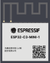

# 具体模组

|     系列模组 |   图片    |     规格书     |
| :---------- | :---------: | ------------: |
| 
ESP8685-MINI-1
 |  | [点击查看](https://www.espressif.com/sites/default/files/documentation/esp32-c3-mini-1_datasheet_cn.pdf) |
| 
ESP8685-WROOM-01
 |            | [点击查看](https://www.espressif.com/sites/default/files/documentation/esp8685-wroom-01_datasheet_cn.pdf) |
| 
ESP8685-WROOM-02
 |            | [点击查看](https://www.espressif.com/sites/default/files/documentation/esp32-c3-wroom-02_datasheet_cn.pdf) |
| 
ESP8685-WROOM-03
 |             | [点击查看](https://www.espressif.com/sites/default/files/documentation/esp8685-wroom-03_datasheet_cn.pdf) |
| 
ESP8685-WROOM-04
 |             | [点击查看](https://www.espressif.com/sites/default/files/documentation/esp8685-wroom-04_datasheet_cn.pdf) |
| 
ESP8685-WROOM-05
 |              | [点击查看](https://www.espressif.com/sites/default/files/documentation/esp8685-wroom-05_datasheet_cn.pdf) |
| 
ESP8685-WROOM-06
 |              | [点击查看](https://www.espressif.com/sites/default/files/documentation/esp8685-wroom-06_datasheet_cn.pdf) |
| 
ESP8685-WROOM-07
 |              | [点击查看](https://www.espressif.com/sites/default/files/documentation/esp8685-wroom-07_datasheet_cn.pdf) |

