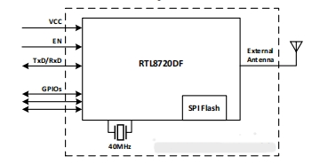

# NodeMcu-8720DFV1开发板介绍

## 1 产品概述

W5B03A-1720DF开发板 是基于 PKE8720DF-A00-F10开发板由Pankore为PKM8720DF-A00-F10模块设计。

所有模块的图形图形都很精确，以便开发人员可以方便地开发和调试模块。
当使用面包板进行开发和调试时，两侧的标准针头也可以使操作更容易。PKM8720DF-A00-F10是一个多无线电单片机模块。通过开放的CPU架构，客户可以开发运行在双核32位单片机上的高级应用程序。
该无线电在2.4 GHz/5GHz频段和BLE 5.0通信中提供了对Wi-Fi 802.11 a/b/g/n的支持。

丰富的外设和高性能使其成为智能家居、工业自动化、消费电子产品等的理想选择。PKM8720DF-A00-F10模块的方框图如图1所示。

## 2 特性

- 支持802.11a/b/g/n1x1,2.4 GHz&5 GHz
- 支持20MHz/40MHz带宽，MCS7
- 支持低功率信标听模式，低功率Rx模式，低功率悬挂模式（DLPS）
- 内置AES/DES/SHA硬件引擎
- 支持手臂信任区-M和安全引导
- 支持SWD调试端口访问保护和禁止模式
- 支持BLE 5.0，中央和外围模式
- 支持蓝牙高功率模式（最大10dBm）
- 内部共存机制Wi-Fi和BT共享同一天线
- KM4和KM0都有一个GDMA控制器，每个都有6个通道

## 3 应用方向

- 智能家居
- 健康和健身
- 便携式设备
- 医疗
- 工业

## 4 主要参数

| Parameter | Description |
| --- | --- |
| 模块型号 | NodeMcu-8720DFV1 |
| 封装 | SMD-22 |
| 尺寸 | 24 ± 0.2mm (L) x 16 ± 0.2mm (W) x 2.3 ± 0.1mm (H) |
| 天线 | On-board PCB antenna |
| Wi-Fi频率范围 | 2412MHz ~ 2484MHz (2.4GHz ISM Band), 5180MHz ~ 5825MHz (5GHz) |
| 蓝牙 | BLE 5.0 |
| 蓝牙频率范围 | 2402MHz ~ 2480MHz |
| 运行温度 | -40°C to 105°C |
| 存储环境 | -40°C to 125°C, < 90% RH |
| 电源范围 | (3.3 ± 10%)V, current > 450mA |
| 接口 | UART/GPIO/ADC/PWM/I2C/SPI/SWD/USB 2.0 HS/SDIO/DMIC/IR/I2S |
| 模块认证 | FCC/CE/SRRC |

## 5 电气参数

<!-- | Parameter condition | Min. | Typ. | Max. | Unit |
| --- | --- | --- | --- | --- |
| DC 3.3V Supply Voltage | 3.0 | 3.3 | 3.6 | V |
| Digital I/O Supply Voltage | 1.76 | 1.8~3.3 | 3.6 | V |
| DC 3.3 Rating Current (with internal regulator and integrated CMOS PA) | - | - | 450 | mA |
| 3.3V I/O Rating Current | - | - | 50 | mA |
| Electrostatic protection | - | - | 2000 | V | -->

| 条件参数 | 最小值 | 典型值 | 最大值 | 单位 |
| --- | --- | --- | --- | --- |
| DC 3.3V电源电压 | 3.0 | 3.3 | 3.6 | V |
| 数字输入输出电源电压 | 1.76 | 1.8~3.3 | 3.6 | V |
| DC 3.3额定电流（带内部调节器和集成CMOS PA） | - | - | 450 | mA |
| 3.3V输入输出额定电流 | - | - | 50 | mA |
| 静电保护 | - | - | 2000 | V |

## 6 射频性能

### Wi-Fi2.4 GHz波段射频规范

#### 6.1 Wi-Fi2.4 GHz发射器性能规范

| 条件参数 | 最小值 | 典型值 | 最大值 | 单位 |
| --- | --- | --- | --- | --- |
| 频段 | - | 2412 | 2484 | MHz |

Tx功率为最高功率水平（25°C）

| 条件参数 | 最小值 | 典型值 | 最大值 | 单位 |
| --- | --- | --- | --- | --- |
| 1 Mbps DSSS | - | 20 | - | dBm |
| 11 Mbps DSSS | - | 18 | - | dBm |
| 6 Mbps OFDM | - | 19 | - | dBm |
| 54 Mbps OFDM | - | 17 | - | dBm |
| HT20 MCS0 | - | 18 | - | dBm |
| HT20 MCS7 | - | 16 | - | dBm |
| HT40 MCS0 | - | 18 | - | dBm |
| HT40 MCS7 | - | 16 | - | dBm |

Tx EVM 

| 条件参数 | 最小值 | 典型值 | 最大值 | 单位 |
| --- | --- | --- | --- | --- |
| 1 Mbps DSSS | - | 8 | - | % |
| 11 Mbps DSSS | - | 8 | - | % |
| 6 Mbps OFDM | - | -5 | - | dB |
| 54 Mbps OFDM | - | -25 | - | dB |
| HT20 MCS0 | - | -5 | - | dB |
| HT20 MCS7 | - | -28 | - | dB |
| HT40 MCS0 | - | -5 | - | dB |
| HT40 MCS7 | - | -28 | - | dB |

Wi-Fi2.4 GHz接收性能规范

| 条件参数 | 环境  |  最小值 | 典型值 | 最大值 | 单位 |
|-----------|-----------|------|------|------|------|
| Frequency Range | - | 2412 | - | 2484 | MHz 802.11b |
| 802.11b Rx Sensitivity (8% PER) | 1 Mbps DSSS | - | -96 | - | dBm |
| 802.11b Rx Sensitivity (8% PER) | 11 Mbps DSSS | - | -89 | - | dBm |
| 802.11g Rx Sensitivity (10% PER) | 6 Mbps OFDM | - | -93 | - | dBm |
| 802.11g Rx Sensitivity (10% PER) | 54 Mbps OFDM | - | -75 | - | dBm |
| 802.11n Rx Sensitivity (10% PER) | HT20 MCS0 | - | -93 | - | dBm |
| 802.11n Rx Sensitivity (10% PER) | HT20 MCS7 | - | -73 | - | dBm |
| 802.11n Rx Sensitivity (10% PER) | HT40 MCS0 | - | -91 | - | dBm |
| 802.11n Rx Sensitivity (10% PER) | HT40 MCS7 | - | -70 | - | dBm |

### Wi-Fi5 GHz频段射频规范

#### Wi-Fi5 GHz发射器性能规范

| 条件参数 | 最小值 | 典型值 | 最大值 | 单位 |
|-----------|-----------|------|------|------|
| Frequency Range | - | 5180 | - | 5825 | MHz |

Tx功率为最高功率水平（25°C）

| 条件参数  | 最小值 | 典型值 | 最大值 | 单位 |
|-----------|-----------|------|------|------|
| 6 Mbps OFDM | - | 17 | - | - | dBm |
| 54 Mbps OFDM | - | 13 | - | - | dBm |
| HT20 MCS0 | - | 15 | - | - | dBm |
| HT20 MCS7 | - | 12 | - | - | dBm |
| HT40 MCS0 | - | 15 | - | - | dBm |
| HT40 MCS7 | - | 12 | - | - | dBm |

Tx EVM

| 条件参数 | 最小值 | 典型值 | 最大值 | 单位 |
|-----------|-----------|------|------|------|
| 6 Mbps OFDM | - | -5 | - | - | dB |
| 54 Mbps OFDM | - | -25 | - | - | dB |
| HT20 MCS0 | - | -5 | - | - | dB |
| HT20 MCS7 | - | -28 | - | - | dB |
| HT40 MCS0 | - | -5 | - | - | dB |
| HT40 MCS7 | - | -28 | - | - | dB |

#### Wi-Fi5 GHz接收机性能规范

| 条件参数  | 环境  |  最小值 | 典型值 | 最大值 | 单位 |
|-----------|-----------|------|------|------|------|
| Frequency Range | - | 5180 | - | 5825 | MHz |
| 802.11g Rx Sensitivity (10% PER) | 6 Mbps OFDM | - | -91 | - |  dBm |
| 802.11g Rx Sensitivity (10% PER) | 54 Mbps OFDM | - | -74 | - | dBm |
| 802.11n Rx Sensitivity (10% PER) | HT20 MCS0 | - | -91 |  - | dBm |
| 802.11n Rx Sensitivity (10% PER) | HT20 MCS7 | - | -72 | - | dBm |
| 802.11n Rx Sensitivity (10% PER) | HT40 MCS0 | - | -89 | - | dBm |
| 802.11n Rx Sensitivity (10% PER) | HT40 MCS7 | - | -69 | - | dBm |

### 蓝牙LE RF规范

#### 蓝牙LE发射器性能规范

| 条件参数 | 环境 | 最小值 | 典型值 | 最大值 | 单位 |
|-----------|-----------|------|------|------|------|
| 频段 | - | 2402 | - | 2480 | MHz |
| Tx输出功率 | LE1M | -10 | 4.5 | 10 |  dBm |
| Tx输出功率 | LE2M | -10 | 4.5 | 10 |  dBm |

#### 蓝牙LE接收器性能规范

| 条件参数 | 环境 |  最小值 | 典型值 | 最大值 | 单位 |
|-----------|-----------|------|------|------|------|
| 频段 | - | 2402 | - | 2480 | MHz |
| Tx输出功率 | LE1M | - | -99 | - | dBm |
| Tx输出功率 | LE2M | - | -96 | - | dBm |

## 7 外观尺寸

### 产品图片

.png)

### 产品尺寸

## 8 管脚定义

| 编号 | Pin名称 | 描述 |
|--------|---------|-------------|
| 0 | PA15 | LP_UART_CTS/SPI1_CS |
| 1 | PA14 | LP_UART_RTS/SPI1_CLK/I2S_SD_TX2 |
| 2 | PA13 | LP_UART_RXD/SPI1MISO/PWM1/I2S_SD_TX1 |
| 3 | PA12 | LP_UART_TXD/SPI1_MOSI/PWM0/I2S_MCLK |
| 4 | - | - |
| 5 | PA28 | RREF/PWM6 |
| 6 | PA26 | HSDP/LP_I2C_SDA/PWM5/IR_RX |
| 7 | PA25 | HSDM/LP_I2C_SCL/PWM4/IR_TX |
| 8 | PA27 | SWD_DATA |
| 9 | PB3 | SWD_CLK/ADC_CH6 |
| 10 | PB2 | DMIC_DATA/ADC_CH5 |
| 11 | PB1 | DMIC_CLK/ADC_CH4 |
| 12 | LOG_TX/PA7 | UART_LOG_TXD |
| 13 | LOG_RX/PA8 | UART_LOG_RXD |
| 14 | PB23 | IR_TX/PWM15/SD_D1/I2S_MCLK |
| 15 | PB22 | ID_OTG/IR_RX/ PWM14/S_D0/I2S_SD_RX |
| 16 | PB19 | HS_UART0_TXD/SPI0_MISO/PWM11/SD_D3/I2S_SD_TX0 |
| 17 | PB18 | HS_UART0_RXD/SPI0_MOSI/PWM10/SD_D2 |
| 18 | PB21 | HS_UART0_RTS/SPI0_CS/PWM13/SD_CLK/I2S_WS |
| 19 | PB20 | HS_UART0_CTS/SPI0_CLK/PWM12/SD_CDM/I2S_CLK |

## 9 原理图

<!--  -->

## 10 购买链接
[点击购买 W5B03A-1720DF开发板](../../buy_sample/8720df.md)