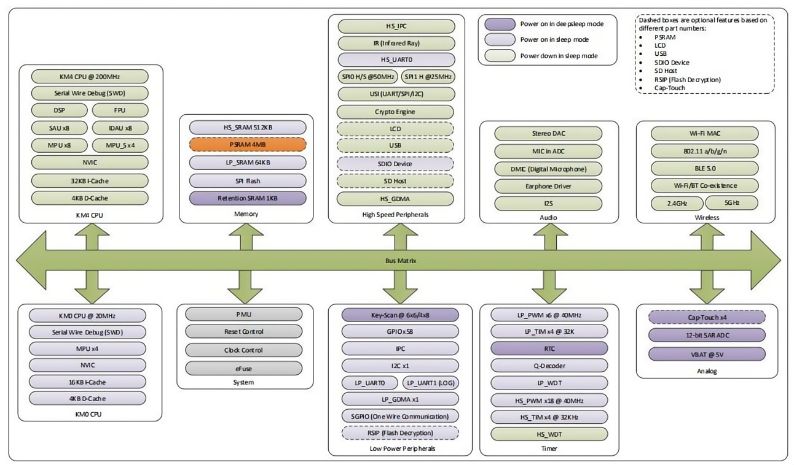

# W5B03A-1720DFV1模组 

##  产品概述
### 1 一般说明

RTL872xD是一款高度集成的单片机低功耗双频带（2.4 GHz和5 GHz）无线局域网（WLAN）和蓝牙低能耗（BLE 5.0）通信控制器。它由一个被称为Real-M300（Armv8-M，或KM4的高性能MCU，兼容Rortex-M33指令集）组成之后和一个低功率单片机（ortex-M23指令集兼容），称为RealM200（或KM0之后）、WLAN（802.11 a/b/g/n）MAC、一个具有1T1R能力的WLAN基带、RF、蓝牙和外设。

同时还提供了高速连接接口、SDIO接口和USB接口。还有音频编解码器，键扫描和触摸键集成到这个IC。此外，灵活的设计还可以将GPIO根据应用程序配置为不同的功能。

RTL872xD还为物联网（物联网）Wi-Fi协议功能和应用程序集成了存储器（ROM/SRAM/PSRAM）。客户支持用户友好型开发套件（SDK和HDK）来开发物联网应用程序。

KM4 MCU是一个32位的核心，提供了系统增强，如低功耗、增强的调试特性、浮点计算、DSP指令和高水平的支持块集成。KM4单片机包含了一个3级管道。

KM0协处理器是一种节能、易于使用的32位核心，它与KM4核心的代码和工具兼容。KM0协处理器提供了高达20MHz的性能，带有一个简单的指令集和减少的代码大小。

###  2 系统架构

在RTL872xD中，主系统由32位多层AXI总线矩阵组成，它互连所有的主线和从线。总线矩阵提供从主到从属的访问，即使多个高速外设同时工作，也能实现并行访问和高效操作。

多层AXI总线矩阵以一种灵活的方式将CPU总线和其他总线主线连接到外围设备，通过允许不同的总线主线同时访问矩阵的不同从线端口上的外围设备来优化性能。

APB外设通过来自多层AXI总线矩阵的AXI总线端口的APB总线连接到AXI总线矩阵。这可以减少CPU和DMA控制器之间的冲突，也允许异步桥上的外设具有不跟踪系统时钟的固定时钟。

###  3 产品文档
[点击进入W5B03A-1720DFV1模组资料](../../download/8720df/8720df_datasheet.md)

<!-- 换行使用  -->
###  4 购买链接
| 产品型号                   | 功能描述                |状态               |购买             |                    
| :------------------------ | :------------------------| :---------------: | :----------------: |
| W5B03A-1720DFV1模组        |   |     未上架      | [W5B03A-1720DFV1模组]() |