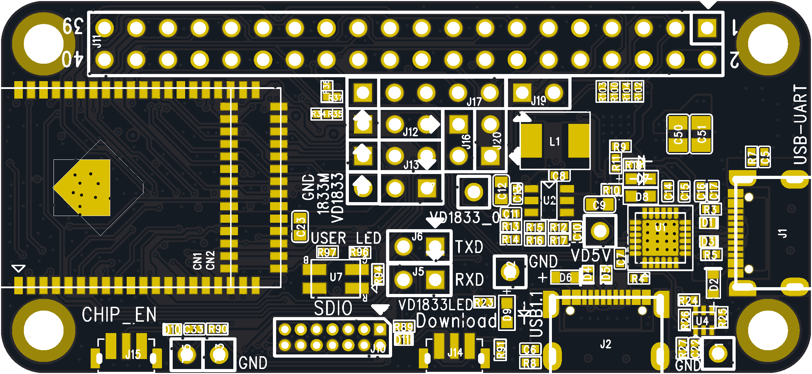

## 1 产品介绍

WB30D - 1711DCMV1 具有丰富的功能和出色的性能，适用于多种物联网应用场景。该模组集成了高性能的 MCU、双频 WiFi 和蓝牙功能，可满足不同设备的通信需求。其内部结构设计合理，通过嵌入式调节器为各模块提供稳定的电源供应，同时具备多种电源管理模式以降低功耗。丰富的接口资源使其能够方便地与外部设备进行连接和通信，如传感器、显示屏等。在射频性能方面，无论是 WiFi 还是蓝牙，都能提供可靠的无线连接，确保数据传输的稳定性和高效性。该模组在智能家居、工业物联网、智能穿戴设备等领域具有广泛的应用前景，能够为各类智能设备提供强大的无线通信能力和数据处理能力，助力实现智能化控制和数据交互。

## 2 性能特点

- **支持双频 WiFi 和蓝牙**：支持 WLAN 双频（2.4GHz 和 5GHz）以及低功耗蓝牙 5.0，集成了 Real - M300 高性能 MCU、WLAN MAC、基带、射频和蓝牙等功能，可实现完整的 Wi - Fi 和 BLE 5.0 协议功能。
- **多种工作模式与节能机制**：工作电压范围为 3.0V - 3.6V，支持多种低功耗模式，如睡眠模式和深度睡眠模式，在不同模式下各功能模块可灵活配置电源和时钟以降低功耗。例如，在睡眠模式下，多数功能模块可进行电源门控或时钟门控；在深度睡眠模式下，除 AON 功能外所有功能关闭，以实现超低功耗。
- **丰富的接口资源**：提供可配置的 GPIO 口，便于控制外围设备；集成内部存储器，支持简单应用程序开发；具备多种通信接口，如 UART、SPI、QSPI/OSPI、I2C 等，还提供高速连接接口 SDIO 和 USB，以及音频功能（包括数字麦克风接口和 I2S）。
- **高性能处理器**：内置低功耗 KM4 MCU（基于 Armv8.1 - M 架构，兼容 Cortex - M55 指令集），主频最高可达 345MHz，具有增强的调试功能、浮点计算、数字信号处理扩展指令等特性；同时还有低功耗 KM0 MCU（基于 Armv8 - M 基线架构，兼容 Cortex - M23 指令集），主频最高可达 115MHz，指令集简单、代码尺寸小，与 KM4 处理器代码和工具兼容，适用于对功耗敏感的快速响应操作，如电源管理和网络协议处理。
- 可**靠的射频性能**

    - **WiFi 射频特性**：在 2.4GHz 频段，遵循 IEEE 802.11b/g/n 标准，支持多种调制方式和传输速率，发射功率和接收灵敏度表现良好；在 5GHz 频段，遵循 IEEE 802.11a/n 标准，同样具备出色的发射和接收性能，且天线具备多样性功能，可通过外部 RF 开关选择最佳天线以减少信道衰落影响，同时采用实时校准机制确保无线电系统稳定运行。
    - **蓝牙射频特性**：符合蓝牙 5.0 规格，在 2.4GHz 频段工作，发射功率和接收灵敏度满足相关标准，支持多种蓝牙功能，如快速 AGC 控制、多种功率等级、增强型功率控制以及低功耗模式（如 BLE）。

## 3 尺寸大小

**_长：65mm ；宽：30mm_**

## 4 引脚定义
引脚类型缩写如下：

- I/O：输入/输出引脚
- I：仅输入引脚
- A：模拟信号引脚
- RST：复位引脚
- P：电源引脚
- G：接地引脚

| 引脚编号 | RTL8711DCM-VA2/VA3 | 引脚名称 | 引脚类型       | 默认功能                                                                          | 描述 |
|------|--------------------|------|------------|-------------------------------------------------------------------------------|----|
| 1    | VAH_LDOM           | P    |            | 功率输入到LDOM                                                                     |
| 2    | LDOM_OUT           | P    |            | LDOM的功率输出                                                                     |
|      | PA8                | I/O  | GPIO       | 默认功能为通用输入/输出，并且可以配置为其他功能                                                      |
| 3    | PA12               | I/O  | GPIO       | 默认功能为通用输入/输出，并且可以配置为其他功能                                                      |
| 4    | VDL_CORE           | P    |            | 数字核心域的电源输入。默认功能为通用输入/输出，并且可以配置为其他功能                                           |
| 5    | PA13               | I/O  | GPIO       | 默认功能为通用输入/输出，并且可以配置为其他功能                                                      |
| 6    | PA14               | I/O  | GPIO       | 默认功能为通用输入/输出，并且可以配置为其他功能                                                      |
| 7    | PA15               | I/O  | GPIO       | 默认功能为通用输入/输出，并且可以配置为其他功能                                                      |
| 8    | PA16               | I/O  | GPIO       | 默认功能为通用输入/输出，并且可以配置为其他功能                                                      |
| 9    | PA17               | I/O  | GPIO       | 默认功能为通用输入/输出，并且可以配置为其他功能                                                      |
| 10   | PA18               | I/O  | GPIO       | 功率输入到数字I/O电源域。默认功能为通用输入/输出，并且可以配置为其他功能                                        |
| 11   | VDH_IO1            | P    |            |                                                                               |
| 12   | PA19               | I/O  | GPIO       | 默认功能为通用输入/输出，并且可以配置为其他功能                                                      |
| 13   | PA20               | I/O  | GPIO       | 默认功能为通用输入/输出，并且可以配置为其他功能                                                      |
| 14   | PA21               | I/O  | GPIO       | 功率输入到数字I/O电源域。默认功能为通用输入/输出，并且可以配置为其他功能                                        |
| 15   | PA22               | I/O  | GPIO       | 默认功能为通用输入/输出，并且可以配置为其他功能                                                      |
| 16   | PA23               | I/O  | GPIO       |
| 17   | VDH_IO2            | P    |            |                                                                               |
| 18   | PA26               | I/O  | GPIO       | 默认功能为通用输入/输出，并且可以配置为其他功能                                                      |
| 19   | PA27               | I/O  | GPIO       | 默认功能为通用输入/输出，并且可以配置为其他功能                                                      |
| 20   | PA28               | I/O  | GPIO       | 默认功能为通用输入/输出，并且可以配置为其他功能                                                      |
| 21   | PA29               | I/O  | GPIO       | 默认功能为通用输入/输出，并且可以配置为其他功能                                                      |
| 22   | PA30               | I/O  | SWD CLK    | 默认功能为SWD CLK，在IC启动后可以配置为其他功能                                                  |
| 23   | PA31               | I/O  | SWD DATA   | 默认功能为SWD DATA，在IC启动后可以配置为其他功能                                                 |
| 24   | PBO                | I/O  | GPIO       | 默认功能为通用输入/输出，并且可以配置为其他功能                                                      |
| 25   | PB1                | I/O  | GPIO       | 默认功能为通用输入/输出，并且可以配置为其他功能                                                      |
| 26   | PB2                | I/O  | GPIO       | 默认功能为通用输入/输出，并且可以配置为其他功能                                                      |
| 27   | PB3                | I/O  | GPIO       | 默认功能为通用输入/输出，并且可以配置为其他功能                                                      |
| 28   | VRH_PAD_A          | P    |            | RF电路的电源输入                                                                     |
| 29   | VRH_PA_A           | P    |            | RF电路的电源输入                                                                     |
| 30   | RFIO_A             | A    |            | 无线电发射器输出和接收器输入                                                                |
| 31   | GND                | G    |            | 接地                                                                            |
| 32   | GND                | G    |            | 接地                                                                            |
| 33   | RFIO_G             | A    |            | 无线电发射器输出和接收器输入                                                                |
| 34   | VRH_PA_G           | P    |            | RF电路的电源输入                                                                     |
| 35   | VRM_RF             | P    |            | RF电路的电源输入                                                                     |
| 36   | VRH_SYN            | P    |            | RF电路的电源输入                                                                     |
| 37   | VRM_SYN            | P    |            | RF电路的电源输入                                                                     |
| 38   | XI                 | A    |            | 40MHz晶体时钟参考输入                                                                 |
| 39   | XO                 | A    |            | 40MHz晶体时钟参考输出                                                                 |
| 40   | VAH_XTAL           | P    |            | XTAL电路的电源输入                                                                   |
| 41   | VAM_AFE            | P    |            | RF AFE电路的电源输入                                                                 |
| 42   | VAH_ADC            | P    |            | ADC电路的电源输入                                                                    |
| 43   | BAT_MEAS           | A    |            | 电池电压测量引脚                                                                      |
| 44   | PB4                | I/O  | LOGUART Rx | 默认功能为LOGUART Rx，在IC启动后可以配置为其他功能。如果配置为GPIO功能，则LOGUART功能无效                      |
| 45   | PB5/UD_DIS         | I/O  | LOGUART Tx | 默认功能为LOGUART Tx，在IC启动后可以配置为其他功能。如果配置为GPIO功能，则LOGUART功能无效                      |
| 46   | PB6                | I/O  | GPIO       | 默认功能为通用输入/输出，并且可以配置为其他功能                                                      |
| 47   | PB7                | I/O  | GPIO       | 功率输入到数字I/O电源域                                                                 |
| 48   | PB8                | I/O  | GPIO       | 功率输入到数字I/O电源域                                                                 |
| 49   | PB9                | I/O  | GPIO       | 默认功能为通用输入/输出，并且可以配置为其他功能                                                      |
| 50   | PB10               | I/O  | GPIO       | 默认功能为通用输入/输出，并且可以配置为其他功能                                                      |
| 51   | VDH_IO3            | P    |            |                                                                               |
| 52   | PB13               | I/O  | GPIO       | 默认功能为通用输入/输出，并且可以配置为其他功能                                                      |
| 53   | PB14               | I/O  | GPIO       | 默认功能为通用输入/输出，并且可以配置为其他功能                                                      |
| 54   | PB15               | I/O  | GPIO       | 默认功能为通用输入/输出，并且可以配置为其他功能                                                      |
| 55   | PB16               | I/O  | GPIO       | 默认功能为通用输入/输出，并且可以配置为其他功能                                                      |
| 56   | PB17               | I/O  | GPIO       | 默认功能为通用输入/输出，并且可以配置为其他功能                                                      |
| 57   | PB18               | I/O  | GPIO       | 默认功能为通用输入/输出，并且可以配置为其他功能                                                      |
| 58   | PB19               | I/O  | GPIO       | 默认功能为通用输入/输出，并且可以配置为其他功能                                                      |
| 59   | PB20               | I/O  | GPIO       | 默认功能为通用输入/输出，并且可以配置为其他功能                                                      |
| 60   | PB21               | I/O  | GPIO       | 默认功能为通用输入/输出，并且可以配置为其他功能                                                      |
| 61   | PB22               | I/O  | GPIO       | 默认功能为通用输入/输出，并且可以配置为其他功能                                                      |
| 62   | PB30               | I/O  | GPIO       | 唤醒引脚。此引脚在复位期间应保持上拉。默认功能为通用输入/输出，并且可以配置为其他功能                                   |
| 63   | PB31/TM_DIS        | I/O  | GPIO       | 唤醒引脚。IC的工作模式由电源开启过程中陷阱引脚PB31/TM_DIS的电平决定。1：正常模式0：测试模式默认功能为通用输入/输出，并且可以配置为其他功能 |
| 64   | CHIP_EN            | RST  |            | 芯片使能或关闭选择引脚。1：使能芯片0：关闭芯片                                                      |
| 65   | LDOC_OUT           | P    |            | LDOC的功率输出和数字核心域的电源输入                                                          |
| 66   | VAM_LDOC           | P    |            | LDOC的电源输入                                                                     |
| 67   | LX                 | P    |            | DCDC输出                                                                        |
| 68   | VAH_DCDC           | P    |            | DCDC的电源输入                                                                     |
| 69   | GND                | G    |            | 暴露的焊盘必须接地                                                                     |

## 5 [购买链接](../../buy_sample/8720df.md#rtl8711dcm)