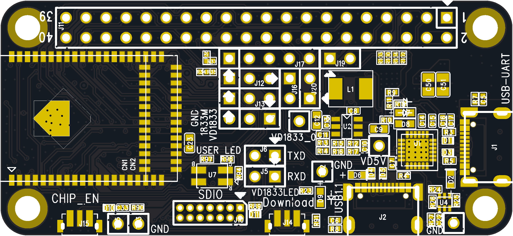
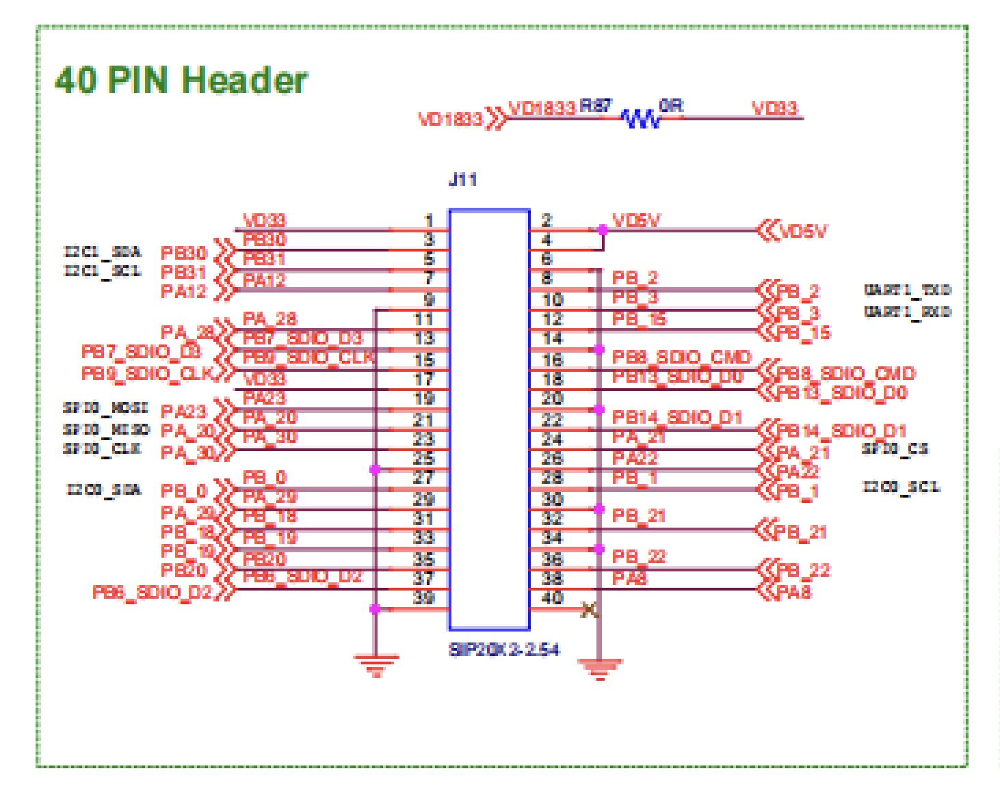

# WB30D-1711DCMV1开发板介绍

## 1 产品概述

WB30D-1711DCMV1 具有丰富的功能和出色的性能，适用于多种物联网应用场景。该模组集成了高性能的 MCU、双频 WiFi 和蓝牙功能，可满足不同设备的通信需求。其内部结构设计合理，通过嵌入式调节器为各模块提供稳定的电源供应，同时具备多种电源管理模式以降低功耗。丰富的接口资源使其能够方便地与外部设备进行连接和通信，如传感器、显示屏等。在射频性能方面，无论是 WiFi 还是蓝牙，都能提供可靠的无线连接，确保数据传输的稳定性和高效性。该模组在智能家居、工业物联网、智能穿戴设备等领域具有广泛的应用前景，能够为各类智能设备提供强大的无线通信能力和数据处理能力，助力实现智能化控制和数据交互。

## 2 外观尺寸

### 产品图片
**正面**

**背面**

### 产品尺寸

**_长：65mm ；宽：30mm_**

## 3 特性

- **支持双频 WiFi 和蓝牙**：支持 WLAN 双频（2.4GHz 和 5GHz）以及低功耗蓝牙 5.0，集成了 Real - M300 高性能 MCU、WLAN MAC、基带、射频和蓝牙等功能，可实现完整的 Wi - Fi 和 BLE 5.0 协议功能。
- **多种工作模式与节能机制**：工作电压范围为 3.0V - 3.6V，支持多种低功耗模式，如睡眠模式和深度睡眠模式，在不同模式下各功能模块可灵活配置电源和时钟以降低功耗。例如，在睡眠模式下，多数功能模块可进行电源门控或时钟门控；在深度睡眠模式下，除 AON 功能外所有功能关闭，以实现超低功耗。
- **丰富的接口资源**：提供可配置的 GPIO 口，便于控制外围设备；集成内部存储器，支持简单应用程序开发；具备多种通信接口，如 UART、SPI、QSPI/OSPI、I2C 等，还提供高速连接接口 SDIO 和 USB，以及音频功能（包括数字麦克风接口和 I2S）。
- **高性能处理器**：内置低功耗 KM4 MCU（基于 Armv8.1 - M 架构，兼容 Cortex - M55 指令集），主频最高可达 345MHz，具有增强的调试功能、浮点计算、数字信号处理扩展指令等特性；同时还有低功耗 KM0 MCU（基于 Armv8 - M 基线架构，兼容 Cortex - M23 指令集），主频最高可达 115MHz，指令集简单、代码尺寸小，与 KM4 处理器代码和工具兼容，适用于对功耗敏感的快速响应操作，如电源管理和网络协议处理。
- **可靠的射频性能**

    - **WiFi 射频特性**：在 2.4GHz 频段，遵循 IEEE 802.11b/g/n 标准，支持多种调制方式和传输速率，发射功率和接收灵敏度表现良好；在 5GHz 频段，遵循 IEEE 802.11a/n 标准，同样具备出色的发射和接收性能，且天线具备多样性功能，可通过外部 RF 开关选择最佳天线以减少信道衰落影响，同时采用实时校准机制确保无线电系统稳定运行。
    - **蓝牙射频特性**：符合蓝牙 5.0 规格，在 2.4GHz 频段工作，发射功率和接收灵敏度满足相关标准，支持多种蓝牙功能，如快速 AGC 控制、多种功率等级、增强型功率控制以及低功耗模式（如 BLE）。

## 4 应用方向

* 智能家居（照明控制、开关和插头、家电等）
* 工业 4.0
* 低功耗物联网设备（低功耗 Wi-Fi 摄像头、智能门锁等）
* 智能穿戴设备
* 便携式设备
* 游戏配件
* 无线音频设备
* 智能交互玩具等

## 5 主要参数

**电气参数**

* 工作电压：3.0V - 3.6V。
* 工作温度：-30℃ to 85℃。
* 存储温度：-40℃ to 125℃。

**射频参数**

WiFi（2.4GHz）

* 发射功率：802.11b@11Mbps 可达 18dBm；802.11g@54Mbps 可达 17dBm；802.11n@N20 MCS7 可达 16dBm；802.11n@N40_MCS7 可达 16dBm。
* 接收灵敏度：802.11b@11Mbps 可达 - 85dBm；802.11g@54Mbps 可达 - 73dBm；802.11n@N20 MCS7 可达 - 68dBm；802.11n@N40 MCS7 可达 - 65dBm。

WiFi（5GHz）

* 发射功率：802.11a@54Mbps 可达 13dBm；802.11n@N20_MCS7 可达 12dBm；802.11n@N40_MCS7 可达 12dBm。
* 接收灵敏度：802.11a@54Mbps、802.11n@N20 MCS7、802.11n@N40 MCS7 相关参数未详细给出（参考文档后续部分或实际产品详细规格）。
* 
**蓝牙**

* 发射功率：0 - 10dBm（BLE，GPSK/1Mbps 和 GPSK/2Mbps）。
* 接收灵敏度：≤ - 95dB（灵敏度 LE1M@PER<30.8%）；≤ - 93dB（灵敏度 LE2M@PER<30.8%）。

## 6 管脚定义

| 引脚编号 | 名称    | 功能描述                                                                          |
|------|-------|-------------------------------------------------------------------------------|
| 1    | VD33  | 3.3v供电                                                                        |
| 2    | VD5V  | 5v供电                                                                          |
| 3    | PB30  | 唤醒引脚。此引脚在复位期间应保持上拉。默认功能为通用输入/输出，并且可以配置为其他功能                                   |
| 4    | VD5V  | 5v供电                                                                          |
| 5    | PB31  | 唤醒引脚。IC的工作模式由电源开启过程中陷阱引脚PB31/TM_DIS的电平决定。1：正常模式0：测试模式默认功能为通用输入/输出，并且可以配置为其他功能 |
| 6    | PB_2  | 默认功能为通用输入/输出，并且可以配置为其他功能                                                      |
| 7    | PA12  | 默认功能为通用输入/输出，并且可以配置为其他功能                                                      |
| 8    | PB_2  | 默认功能为通用输入/输出，并且可以配置为其他功能                                                      |
| 9    | PA_28 | 默认功能为通用输入/输出，并且可以配置为其他功能                                                      |
| 10   | PB_3  | 默认功能为通用输入/输出，并且可以配置为其他功能                                                      |
| 11   | PA_28 | 默认功能为通用输入/输出，并且可以配置为其他功能                                                      |
| 12   | PB_15 | 默认功能为通用输入/输出，并且可以配置为其他功能                                                      |
| 13   | PB7   | 功率输入到数字I/O电源域                                                                 |
| 14   | PB_15 | 默认功能为通用输入/输出，并且可以配置为其他功能                                                      |
| 15   | PB9   | 默认功能为通用输入/输出，并且可以配置为其他功能                                                      |
| 16   | PB8   | 功率输入到数字I/O电源域                                                                 |
| 17   | VD33  | 3.3v供电                                                                        |
| 18   | PB13  | 默认功能为通用输入/输出，并且可以配置为其他功能                                                      |
| 19   | PA23  | 默认功能为通用输入/输出，并且可以配置为其他功能                                                      |
| 20   | PB14  | 默认功能为通用输入/输出，并且可以配置为其他功能                                                      |
| 21   | PA_20 | 默认功能为通用输入/输出，并且可以配置为其他功能                                                      |
| 22   | PB14  | 默认功能为通用输入/输出，并且可以配置为其他功能                                                      |
| 23   | PA_30 | 默认功能为SWD CLK，在IC启动后可以配置为其他功能                                                  |
| 24   | PA_21 | 功率输入到数字I/O电源域。默认功能为通用输入/输出，并且可以配置为其他功能                                        |
| 25   | PB_0  | 默认功能为通用输入/输出，并且可以配置为其他功能                                                      |
| 26   | PA22  | 默认功能为通用输入/输出，并且可以配置为其他功能                                                      |
| 27   | PB0   | 默认功能为通用输入/输出，并且可以配置为其他功能                                                      |
| 28   | PB_15 | 默认功能为通用输入/输出，并且可以配置为其他功能                                                      |
| 29   | PA_29 | 默认功能为通用输入/输出，并且可以配置为其他功能                                                      |
| 30   | PB_21 | 默认功能为通用输入/输出，并且可以配置为其他功能                                                      |
| 31   | PB_18 | 默认功能为通用输入/输出，并且可以配置为其他功能                                                      |
| 32   | PB_21 | 默认功能为通用输入/输出，并且可以配置为其他功能                                                      |
| 33   | PB_19 | 默认功能为通用输入/输出，并且可以配置为其他功能                                                      |
| 34   | PB_22 | 默认功能为通用输入/输出，并且可以配置为其他功能                                                      |
| 35   | PB20  | 默认功能为通用输入/输出，并且可以配置为其他功能                                                      |
| 36   | PB_22 | 默认功能为通用输入/输出，并且可以配置为其他功能                                                      |
| 37   | PB6   | 默认功能为通用输入/输出，并且可以配置为其他功能                                                      |
| 38   | PB_22 | 默认功能为通用输入/输出，并且可以配置为其他功能                                                      |
| 39   | GND   | 接地                                                                            |
| 40   | GND   | 接地                                                                            |

## 7 原理图

## 8 [购买链接](../../buy_sample/8720df.md#rtl8711dcm)

