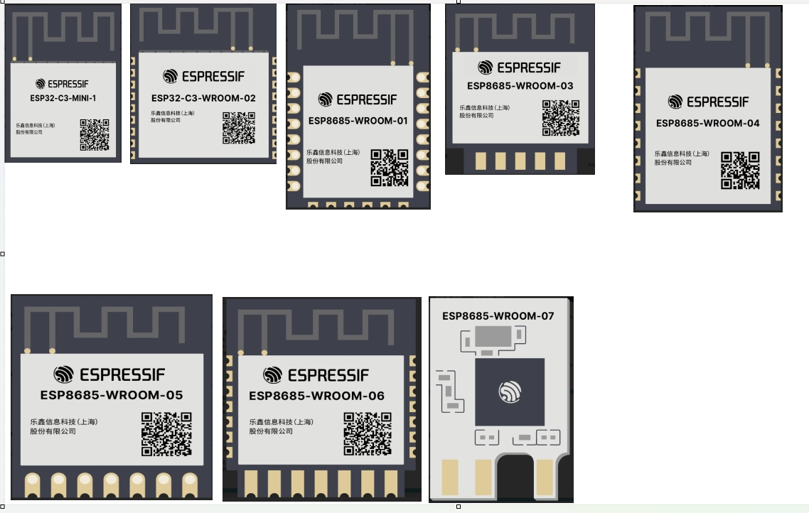

# tasmota 电量计量插座 产品介绍

## 一、产品介绍

### 1 产品描述

相比于传统插座，Tasmota 电量计量插座更加智能、更加便捷、更加省心！

该产品，拥有电量计量功能，支持多语言版本，和AOT远程和本地升级。在家庭网络中链接使用，可以更轻便的控制插座设备，手指轻轻一划即可控制全屋用电设备。

模组图片：

| 适用模组 |  |
| -------  | --------- |
| ESP32C3系列 | [规格书下载](../../assets/download/esp/ESP32C3.zip) |

### 2 规格参数
✨工作电压：120V AC
✨额定电流：10A
✨最大功率：1200W
✨WiFi频率：2.4GHz 工作
✨温度：-10~50°C

### 3 产品特性

-【语音控制】：仅使用语音即可使用 Alexa 或 Google Home 轻松管理设备。无需抬起手指。
-【定时器功能】：设置自动操作的时间表。醒来后，您可以享用现煮咖啡或光线充足的房间。
-【无缝集成】：无缝融入您的智能家居。适用于各种设备。
-【安全与效率】：安全电涌保护。安排设备以节省能源并减少浪费。

### 4 拓展
不久，我们将会更新Tasmota-Matter版本，即使外出，依然可以随心控制家中设备！通过智能生活应用程序从任何地方充电。随时随地打开或关闭设备电源。

## 二、相关资源
[Tasmota官方网站](https://templates.blakadder.com)