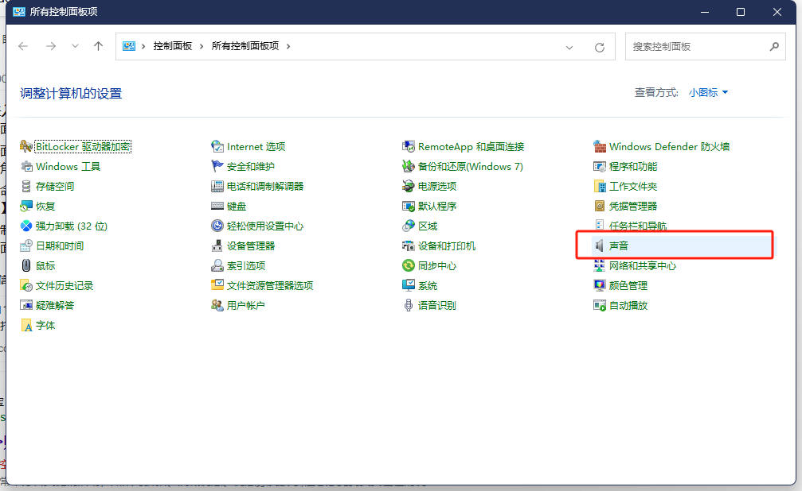

## 1. 无线7.1.2 音频控制介绍
### (1)  无线7.1.2音频控制示意图

### (2) 无线7.1.2音频控接线图
#### 1）RTL8711DCM PCB 示意图

####    2）RTL8711DCM 控制引脚原理图

####   3）RTL8711DCM 模组PIN 脚图

####   4）RTL8711DCM 无线音频7.1.2 TX Slave 接线示意图

####   5）RTL8711DCM 无线音频7.1.2 TX Master 接线示意图

####   6）RTL8711DCM 无线音频7.1.2 RX Master接线示意图

<!-- ### (3) 使用说明
#### 1）当接好线之后，把其它 rx 端接入音响设备，把 tx 端的 dome 板接入电脑或手机

正常来说通电时，tx端会和 rx 端自动配对

是电脑的话，可能需要有所配置 打开运行（Win+R），输入【control】命令，按【确定或回车】，在控制面板中选择【声音】点击进入

#### 2）配置输出采样率与位深度

#### 3）配置扬声器

#### 4）选择需要的声道：7.1环绕

#### 5）所有线材电源连接成功后，可将RTL8711DCM PCB 上的复位键，全部按一次
 -->

