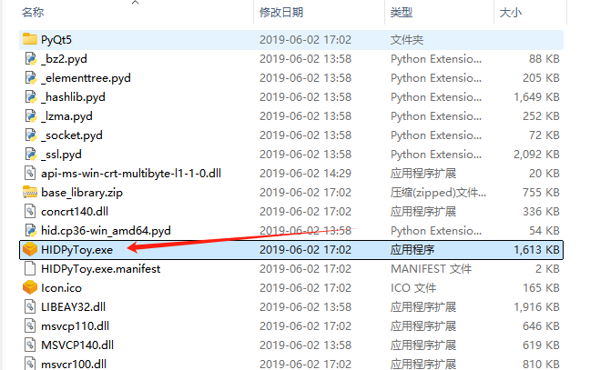
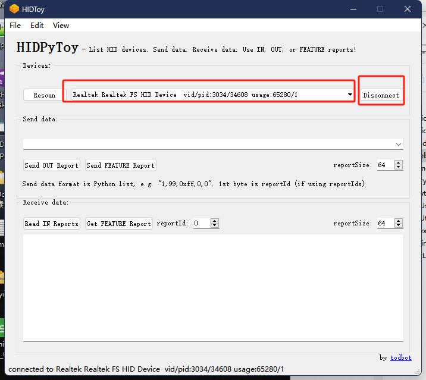
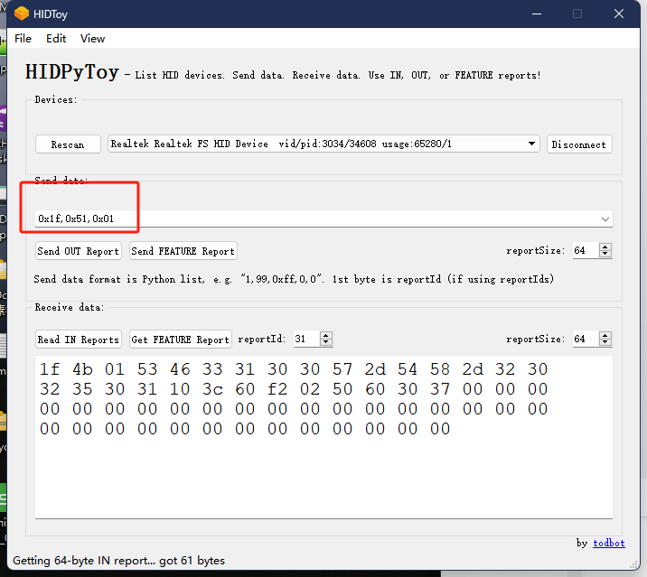
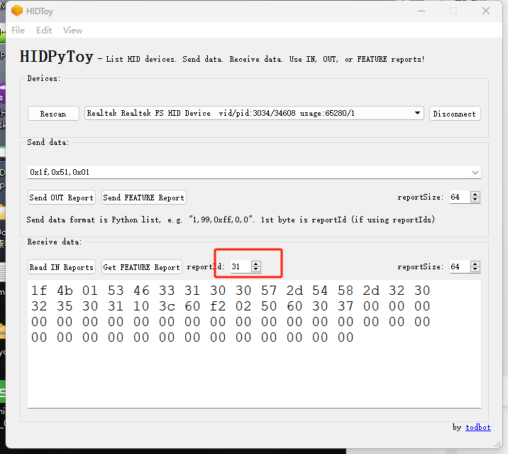
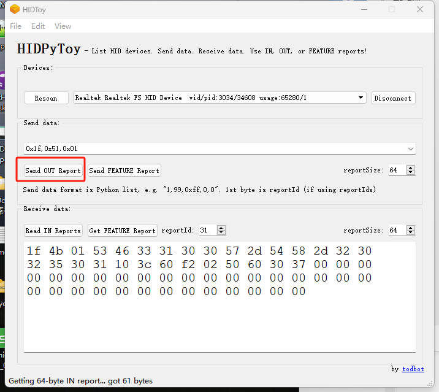
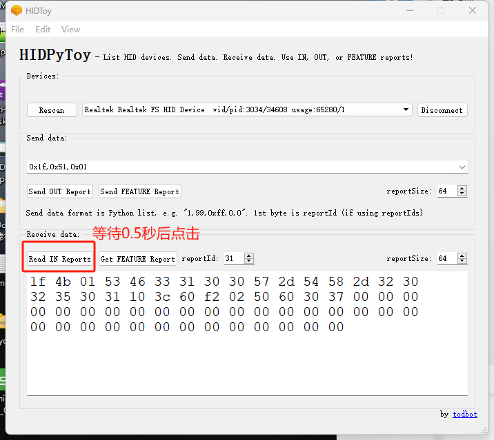

# HIDYoy使用说明

## 1.打开新的HID工具
{width="500" }

## 2.需要烧录好使用的固件和安装驱动才能识别到下图中的设备
点击一下“Rescan”选择红框中的名称
点击“Disconnect”连接设备
{width="500" }

## 3.如下图的方式发送命令。
在之前提供的命令前，按照图中示例填写0x1f 开头
{width="500" }

## 4.点击“Send OUT Report” 发送命令
发送前请先设置好第一个图中的数据31

{width="300" }
{width="300" }

## 5.等待0.5秒后点击“Read IN Reports”
{width="500" }