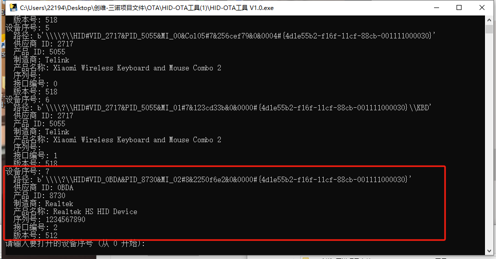
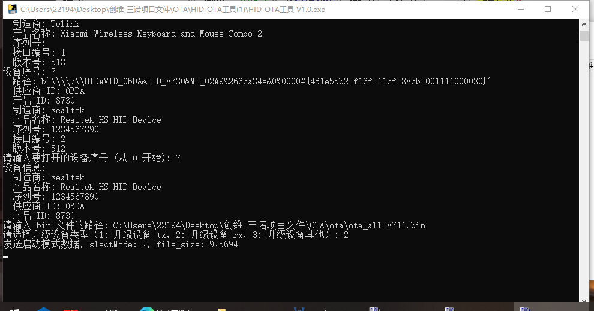
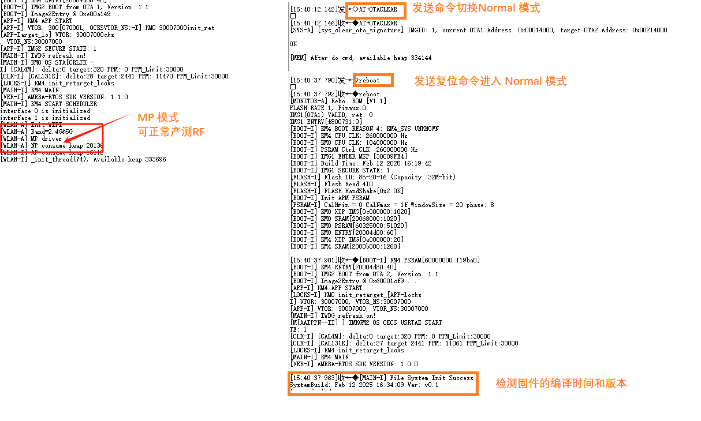

# OTA-升级8730-8711

## 插上dangle和8711,保证它们连接成功; OTA 升级rx 时,会升级所有连接上的rx
{width="500" }

{width="500" }

1. 选择正确的 Realtek HID 设备 - 序号
2. 输入OTA 升级bin文件的路径 - D:HID\ota_all.bin(示例)
3. 选择设备升级类型 - 序号

!!! note "提示"

    1.先将dongle 和 rx配对成功
    2.再升级RX（音响）
    3.最后升级TX（dongle）

    若无法升级，请先准备[8730E的驱动程序](../../assets/download/a316-8711-5.1make/RtkUsbTestTool-V0.1.0.zip)，再升级。

## 升级时可以打开串口查看进度. Rx 大约需要30秒;
## 升级完成后,在log查看窗口中输入命令(会自动复位, 可不输入下面的两个命令)
1. AT+OTACLEAR（切换为Normal模式）
2. reboot（复位）

!!! note "提示"

    AT+OTARECOVER（切换为MP模式-产测模式）

## 检查升级固件版本和时间与ota固件的分钟时间相同,与生成的系统和时间有关
{width="500" }