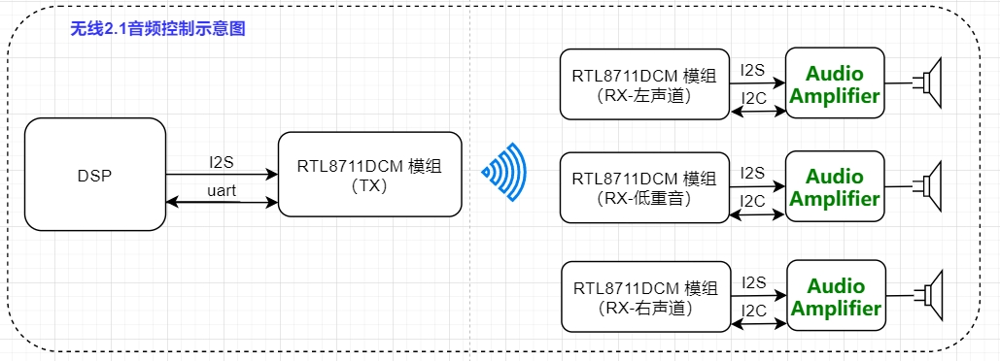
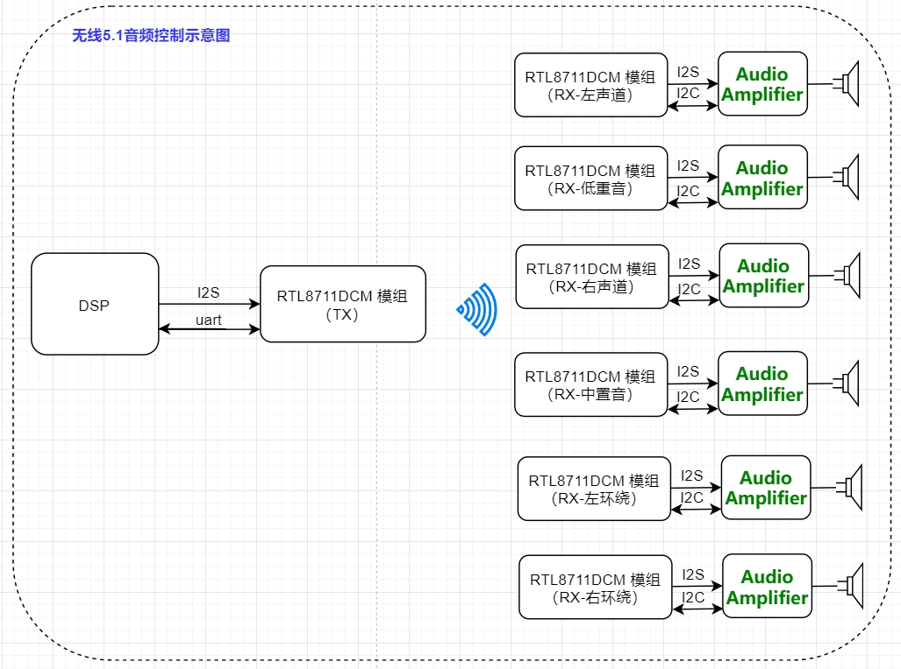
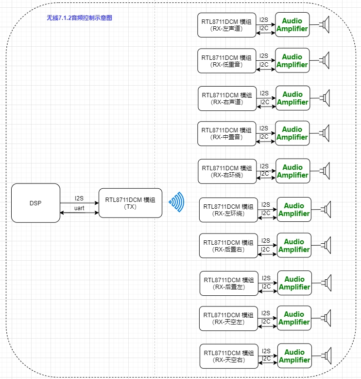
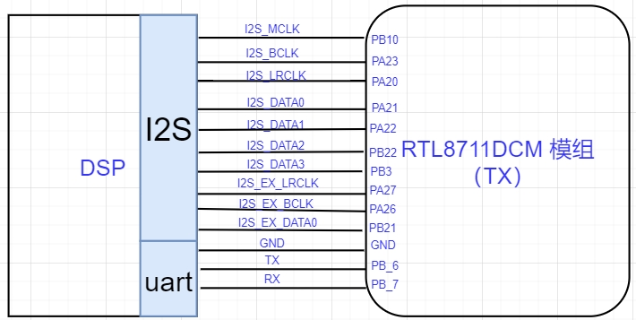
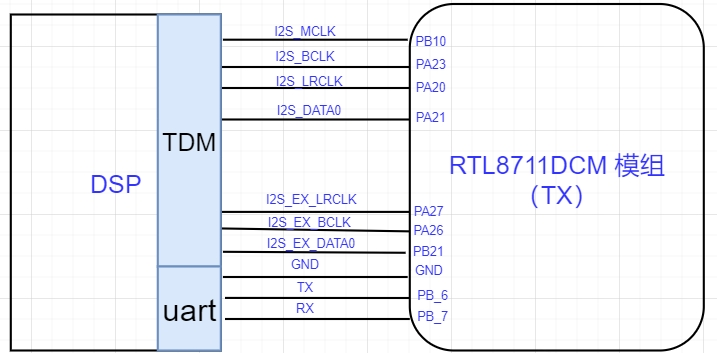
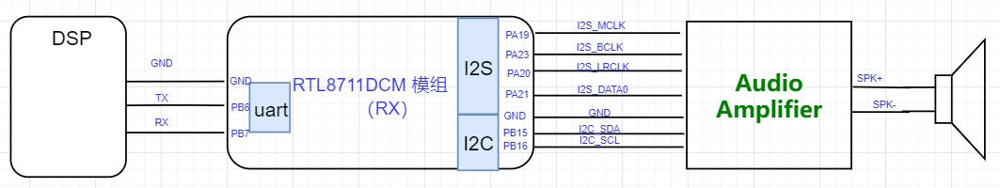

# RTL8711DCM 模组设计说明

### 1. 无线音频模组控制介绍
(1)  无线2.1音频模组控制示意图

（2）无线5.1音频模组控制示意图

（3）无线7.1.2音频模组控制示意图


### 2. RTL8711DCM 模组PIN 脚图


### 3. RTL8711DCM 模组硬件线路控制示意图

#### (1) RTL8711DCM 模组（TX）**I2S 硬件控制图**

##### 1）DSP 与 RTL8711DCM 模组（TX） 声道 I2S 接线说明
```note
   DSP 作为 Slave 时需要的I2S 信号线: 
   
   I2S_BCLK 、 I2S_LRCLK、 I2S_DATA0、 I2S_DATA1、 GND 
```
```note
  DSP 作为 Master 时需要的I2S 信号线: 
  
  I2S_MCLK、  I2S_BCLK 、 I2S_LRCLK 、I2S_DATA0、 I2S_DATA1 、GND 
```


##### 2）DSP 与 RTL8711DCM 模组（TX） 5.1 声道 I2S 接线说明

```note
  DSP 作为 Slave 时需要的I2S 信号线: 
 
  I2S_BCLK 、 I2S_LRCLK、 I2S_DATA0、 I2S_DATA1、I2S_DATA2、 GND 
```

```note
 DSP 作为 Master 时需要的I2S 信号线: 

 I2S_MCLK、  I2S_BCLK 、 I2S_LRCLK 、I2S_DATA0、 I2S_DATA1 、I2S_DATA2、GND 
```


##### 3）DSP 与 无线音频 RTL8711DCM 模组（TX）7.1.2 声道 I2S 接线说明

```note
 DSP 作为 Slave 时需要的I2S 信号线: 

 I2S_BCLK 、 I2S_LRCLK、 I2S_DATA0、 I2S_DATA1、I2S_DATA2、I2S_DATA3、
 I2S_EX_LRCLK、I2S_EX_BCLK、I2S_EX_DATA0、 GND 
```
```note
 DSP 作为 Master 时需要的I2S 信号线: 

 I2S_MCLK、  I2S_BCLK 、 I2S_LRCLK 、I2S_DATA0、 I2S_DATA1 、I2S_DATA2、I2S_DATA3、
 I2S_EX_LRCLK、I2S_EX_BCLK、I2S_EX_DATA0、 GND 
```


#### (2) RTL8711DCM 模组（TX）硬件 **TDM 控制图**

##### 1）DSP 与 RTL8711DCM 模组（TX） 声道 I2S 接线说明
```note
   DSP 作为 Slave 时需要的I2S 信号线: 
   
   I2S_BCLK 、 I2S_LRCLK、 I2S_DATA0、 GND 
```
```note
  DSP 作为 Master 时需要的I2S 信号线: 
  
  I2S_MCLK、  I2S_BCLK 、 I2S_LRCLK 、I2S_DATA0 、GND 
```


##### 2）DSP 与 RTL8711DCM 模组（TX） 5.1 声道 I2S 接线说明

```note
  DSP 作为 Slave 时需要的I2S 信号线: 
 
  I2S_BCLK 、 I2S_LRCLK、 I2S_DATA0、 GND 
```

```note
 DSP 作为 Master 时需要的I2S 信号线: 

 I2S_MCLK、  I2S_BCLK 、 I2S_LRCLK 、I2S_DATA0、 GND 
```


##### 3）DSP 与 无线音频 RTL8711DCM 模组（TX）7.1.2 声道 I2S 接线说明

```note
 DSP 作为 Slave 时需要的I2S 信号线: 

 I2S_BCLK 、 I2S_LRCLK、 I2S_DATA0、 I2S_EX_LRCLK、
 I2S_EX_BCLK、I2S_EX_DATA0、 GND 
```
```note
 DSP 作为 Master 时需要的I2S 信号线: 

 I2S_MCLK、  I2S_BCLK 、 I2S_LRCLK 、I2S_DATA0、
 I2S_EX_LRCLK、I2S_EX_BCLK、I2S_EX_DATA0、 GND 
```
#### (3) RTL8711DCM 模组（TX）硬件 **uart 控制图**


#### (4) RTL8711DCM 模组（RX）硬件控制图


