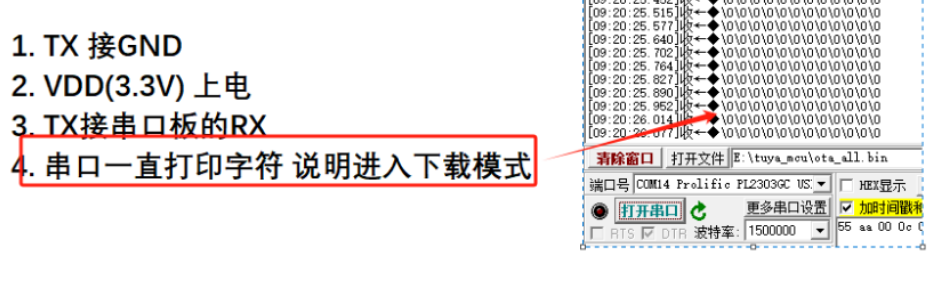
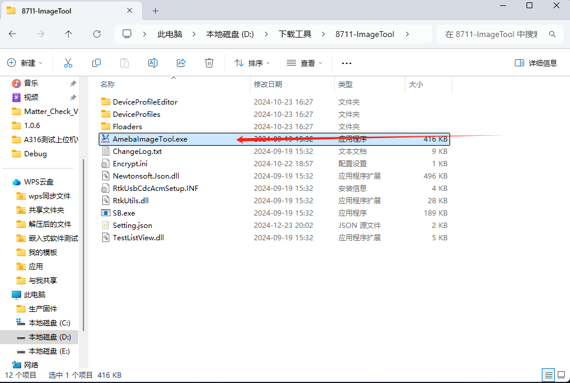
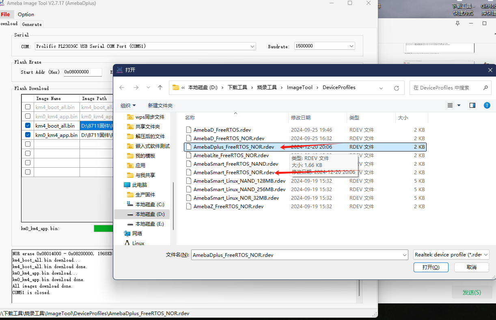
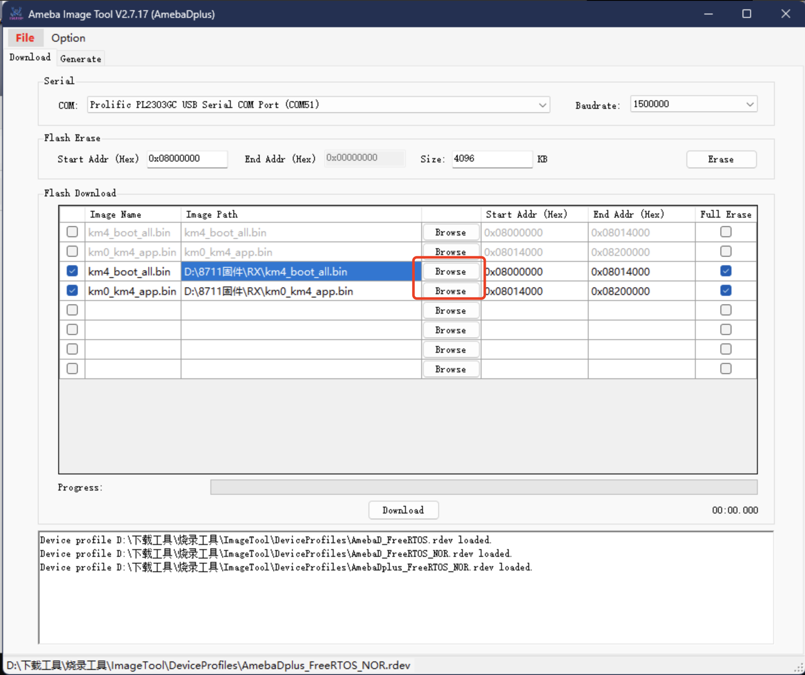
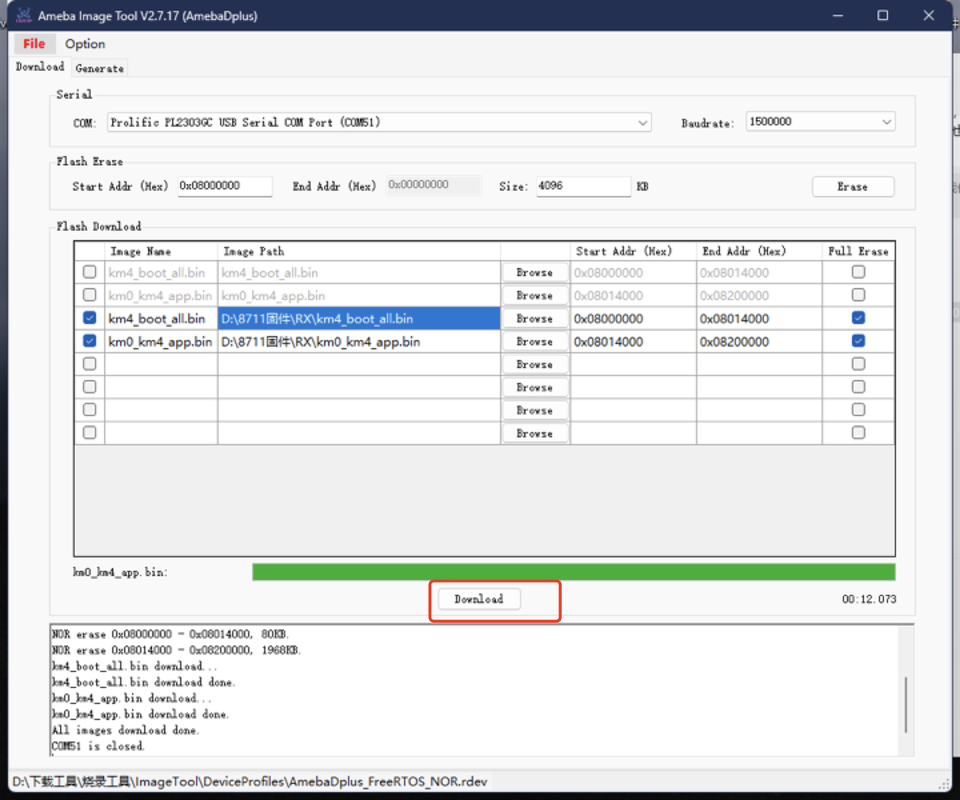

# 8711 模组烧录工具说明

### 准备工作：

烧录工具：[下载链接](../../assets/download/A316/ImageTool.zip)

进入烧录模式：

### 一、开始使用，下载好工具后，找到如图所示文件，双击打开

### 二、打开软件后，点击“File” ，再点击“Open”  选取文件

### 三、选取文件“AmebaDplus FreeRTOS NOR.rdev” 为第三个，是烧录 8711 的固件
第 6 个是烧录 8730 的固件按需求选用

### 四、选择好配置文件，再选择需要烧录的固件，要保证名称一致

### 五、按照图上所示，选择串口、波特率等信息（正常会自动选择），核对后， 点击下方的“Dowload”开始烧录

### 六、烧录之后，无异常。查看串口设备打印，打印 log 正常 表示烧录成功
