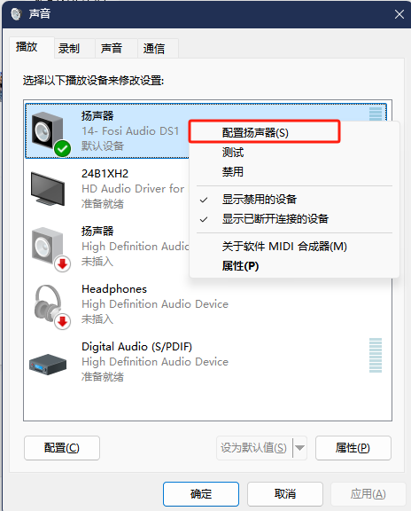

### 使用说明
#### 1）当接好线之后，把其它 rx 端接入音响设备，把 tx 端的 dome 板接入电脑或手机

正常来说通电时，tx端会和 rx 端自动配对

是电脑的话，可能需要有所配置 打开运行（Win+R），输入【control】命令，按【确定或回车】，在控制面板中选择【声音】点击进入

#### 2）配置输出采样率与位深度
在【声音】设置中 选择【播放】下的扬声器，鼠标右击，点击【属性】 再选择高级

#### 3）配置扬声器
同样在鼠标右击扬声器，点击【配置扬声器】

#### 4）选择需要的声道, 请根据实际需要的音响环境选择

#### 5）所有线材电源连接成功后，可将RTL8711DCM PCB 上的复位键，全部按一次

