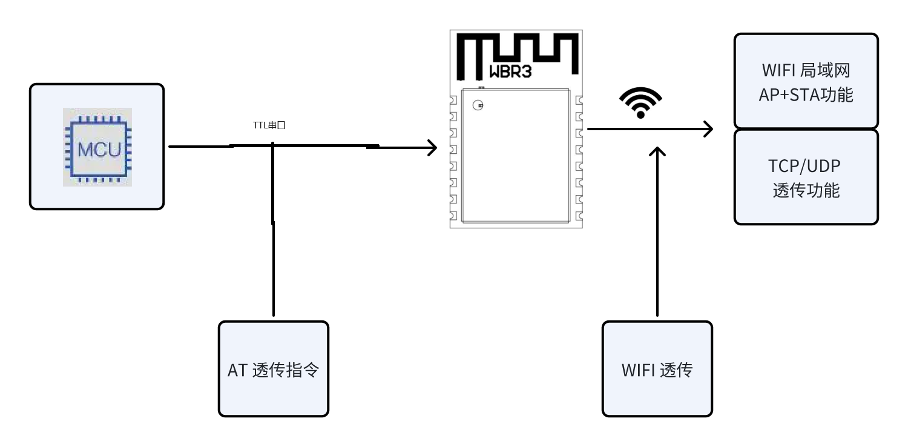

# RTL8720CF的透传应用方案

本方案的产品是 **WBR3DU-C模组** 

它是基于RTL8720CF AT指令集的WIFI透传解决方案；是一种利用AT指令集通过WIFI网络实现数据透明传输的技术。这种方案广泛应用于物联网（IoT）设备，如智能家电、传感器网络等，它允许设备通过WIFI网络与其他设备或服务器进行通信，无需用户干预。

## 1 方案概述
RTL8720CF 嵌入式 Wi-Fi 提供了一种将用户的物理设备连接到Wi-Fi无线网络上，并提供UART串口传输数据的解决方案。该模块硬件上集成了MAC，基频芯片，射频收发单元；AT透传固件支持Wi-Fi协议及配置。WBR2模块是一款一体化的801.11 b/g/n Wi-Fi的低功耗解决方案，通过透传协议，传统的低端串口设备或MCU控制的设备均可以很方便的接入Wi-Fi无线网络，从而实现物联网络控制与管理。

## 2 方案特点

- 不会丢数据
- 数据双向传输
- WIFI 透传的数据包没有协议封装，自己可以控制数据包的大小
- 用户无需了解复杂的WIFI底层协议，只要简单几步设置就可以实现WIFI透传

## 3 方案优势

- 简单易用：AT指令集标准化，易于学习和使用。
- 灵活性高：支持自定义AT指令，可以根据需求灵活扩展功能。
- 成本效益：适用于低成本的嵌入式系统。
- 兼容性好：大多数WIFI模块都支持AT指令集。
- 丰富功能：支持WIFI STA 和 AP，静态IP功能、支持TCP/UDP 透传功能

## 4 功能框图

## 5 实现步骤
1. 初始化WIFI模块：发送特定的AT指令初始化WIFI模块。
2. 连接网络：通过AT指令连接到指定的WIFI网络。
3. 数据透传：使用AT指令将数据从MCU透传到网络或从网络透传到MCU。

## 6 功能介绍

1.AP关联应用 

2.WIFI STA + AP功能应用 

3.TCP/UDP 透传应用 

## 7 产品介绍
[点击查看 WBR3DU-C模组介绍](../../products/8720cf/index.md)