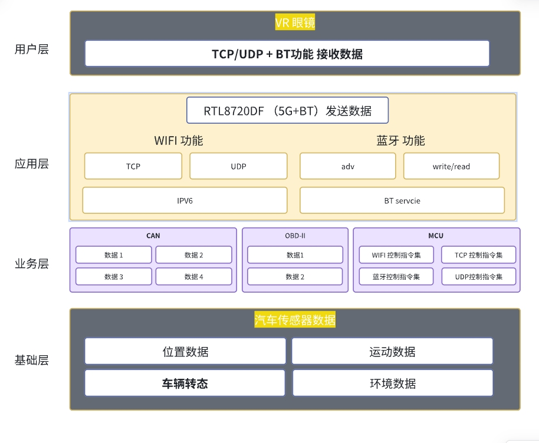
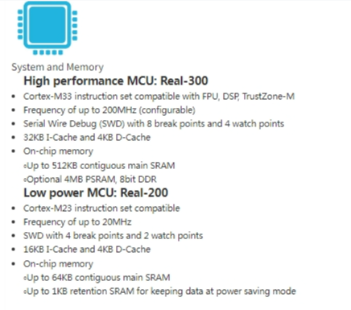
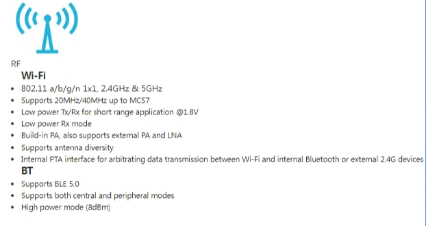
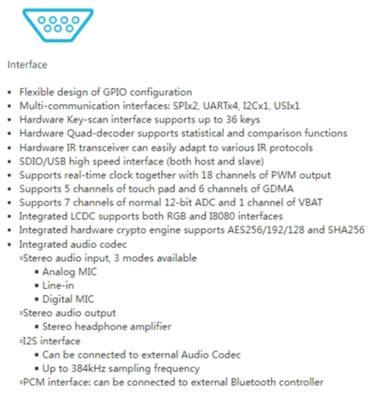
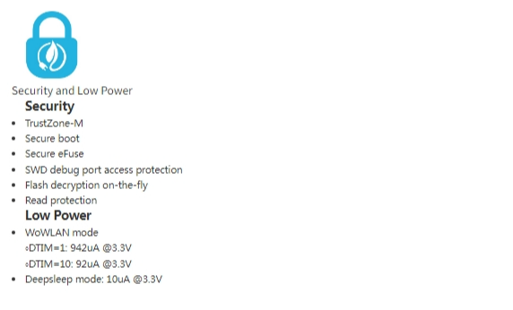

# 汽车VR眼镜-防眩晕解决方案

## 一、概览
### 1 行业痛点

在汽车行业中，将虚拟现实（VR）技术应用于车载娱乐系统面临着一些挑战。其中，晕动症（motion sickness）是最主要的问题之一。晕动症通常发生在用户在虚拟环境中体验到的运动与他们在物理世界中感受到的运动不一致时。此外，VR内容与汽车实际运动之间的不同步也可能导致用户体验不佳。

### 2 行业困难解决

解决晕动症的问题需要精确地同步VR内容与汽车的物理运动。
这涉及到实时数据处理和<strong>低延迟的传输技术</strong>。此外，汽车制造商需要与VR内容开发者合作，以确保内容能够适应汽车的运动。目前，行业内面临的困难包括：

1. **技术整合**：将VR技术与汽车系统集成，需要高度的技术整合能力
2. **内容开发**：开发能够适应汽车运动的VR内容是一个挑战，需要新的开发工具和规范
3. **用户体验**：确保所有乘客都能享受到舒适且不会引起晕动症的VR体验
4. **安全问题**：在汽车中使用VR时，需要确保不会分散驾驶员的注意力，同时保证乘客的安全

## 二、方案架构
### 1 VR眼镜与汽车交互

为了实现VR内容与汽车运动的同步，汽车需要传输以下数据给VR系统：

1. **位置数据**：通过GNSS（全球导航卫星系统）提供车辆的位置信息。
2. **运动数据**：包括加速度、方向、速度变化等，通常由IMU（惯性测量单元）提供。
3. **车辆状态**：如转向、刹车、加速等，由车辆的电子稳定控制系统（ESC）提供。
4. **环境数据**：如车速、油量、引擎状态等，这些数据对于创建更加沉浸式的体验是有帮助的。

### 2 方案应用架构图

## 三、方案优势

本方案基于RTL8720DF模块；RTL872xD是双频Wi-Fi(2.4G+5G)和BLE5.0 的Soc 芯片。具有超低功耗、完整的加密策略和丰富的外设资源，相比与传统的2.4G 通讯具有低延迟，高传输速度，完全可以满足VR眼镜实时数据处理和低延迟的传输的要求。

|  特点介绍  |    |
| --- | --- |
|  |  |
|  |  |

## 四、应用前景

 汽车VR眼镜的防眩晕应用具有广阔的前景：

- **增强用户体验**：通过提供与汽车运动同步的沉浸式体验，可以显著提升乘客的舒适度和满意度。
- **新的娱乐形式**：随着自动驾驶技术的发展，乘客将有更多的时间享受娱乐，VR提供了新的娱乐形式
- **教育和培训**：VR可以用于驾驶员培训，通过模拟各种驾驶情况提供安全的学习环境
- **商业机会**：随着技术的进步和成本的降低，VR眼镜有望成为汽车的标配，为汽车制造商提供新的收入来源

## 五、产品介绍
[点击查看W5B03A-1720DFV1模组介绍](../../products/8720df/index.md)

