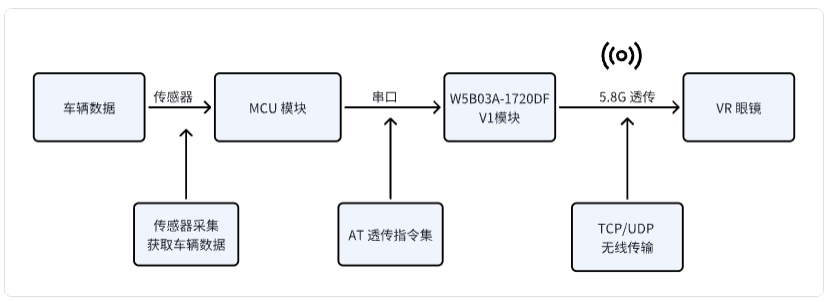

# 汽车VR眼镜-5.8G 透传应用解决方案

## 1 行业需求
  1. 汽车头戴VR眼镜通过获取汽车传感器的数据，精确的同步VR内容与汽车的物理运动，来防止眩晕
  2. 获取汽车传感器的数据有：位置数据、 运动数据、车辆状态、  环境等数据
  3. 获取汽车传感器的数据需要通过有线方式或者无线方式传给VR眼镜
## 2 市场现有方案
   1. 有线方式：有线方式传输车辆传感器的数据限制了头戴VR眼镜移动的灵活性和便捷性能
   2. 无线方式：无线 Wifi 2.4G 传输方式，延时高，数据丢包、连接不稳定等缺点
## 3 RTL 8720DF 5.8G 透传方案
基于 RTL8720DF 5.8G 无线透传应用方案有如下特点：
1. 低延时：TCP/UDP 数据传输 <15ms
2. 连接稳定：基于TCP/IP 的错误检测和重传机制
3. 数据丢包率低：基于5.8G 高速率传输，保证数据的稳定性

### 3.1 方案优势：
本方案基于RTL8720DF模块；RTL872xD是双频Wi-Fi(2.4G+5G)和BLE5.0 的Soc 芯片。具有超低功耗、完整的加密策略和丰富的外设资源，相比与传统的2.4G 通讯具有低延迟，高传输速度，完全可以满足VR眼镜实时数据处理和低延迟的传输的要求。

1. MCU 模块通过 传感器采集车辆数据
2. 采集的车辆数据，通过串口AT指令控制RTL8720DF建立TCP/UDP 连接，通过5.8G 透传，将数据传输到VR眼镜
3. VR眼镜接收传输的车辆数据，精准的调整位置适配车辆运动

## 4 产品介绍
[点击查看 W5B03A-1720DFV1模组 规格书](../../products/8720df/index.md)

