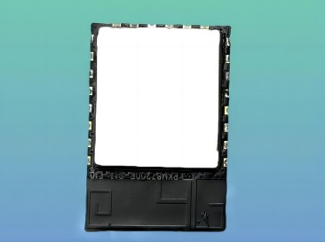

# RTL8720DF Wi-Fi 5.8G 数据透传汽车VR方案

## 特点：

- 低延时： TCP/UDP 数据传输速度快，延时 < 15ms。
- 连接稳定： 基于TCP/IP的错误检测和重传机制，确保连接稳定性。
- 低数据丢包率： 通过5.8G高速传输，保证数据稳定性。
## 优势：

- 基于RTL8720DF，支持双频Wi-Fi(2.4G+5G)和BLE5.0，具有超低功耗、完整的加密策略和丰富的外设资源。
- 与传统2.4G通讯相比，具有低延迟、高传输速度，完全满足VR眼镜实时数据处理和低延迟传输需求。
## 产品应用：

- MCU模块采集车辆数据，通过串口AT指令控制模块建立TCP/UDP连接，通过5.8G透传，将数据传输到VR眼镜。
- VR眼镜接收传输的车辆数据，精准调整位置以适配车辆运动。
这个方案适用于需要快速、稳定传输车辆数据的汽车VR产品。

## 适用本方案的产品

[点击查看 W5B03A-1720DFV1模组介绍](../../products/8720df/W5B03A-1720DFV1.md)