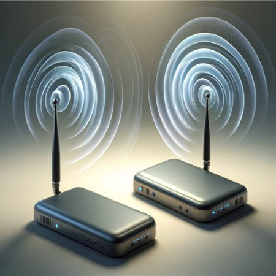
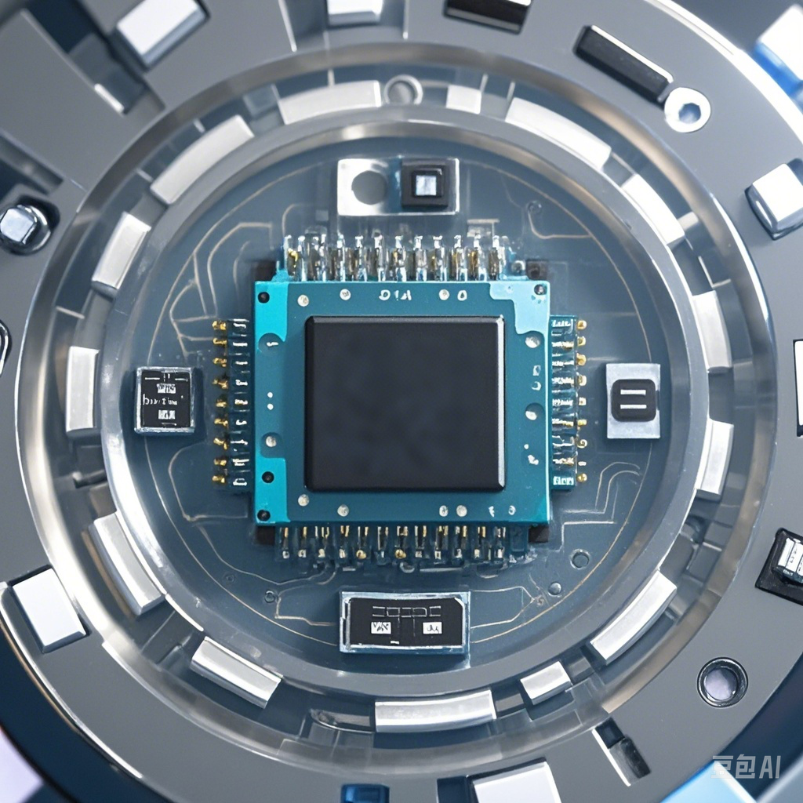

## 飞腾云科技|Wi-Fi IOT模组|Wi-Fi IOT方案|Wi-Fi Matter方案
<!-- 
<!DOCTYPE html>
<html lang="en">
<head>
<meta charset="UTF-8">
<meta name="viewport" content="width=device-width, initial-scale=1.0">
<title>Grid Template</title>
<link rel="stylesheet" href="styles.css">
</head>
<body>
    

         第一页格子 
        

            
            <h2>RTL 8720DF 5.8G 汽车VR数据透传 </h2>
            
本方案基于RTL8720DF 是双频Wi-Fi(2.4G+5G)和BLE5.0 的Soc 芯片。具有超低功耗、完整的加密策略和丰富的外设资源，相比与传统的2.4G 通讯具有低延迟，高传输速度，完全可以满足VR眼镜实时数据处理和低延迟的传输的要求。

        

        

            
            <h2>RTL8720CF 通用透传应用</h2>
            
利用AT指令集通过WIFI网络实现数据透明传输的技术。这种方案广泛应用于物联网（IoT）设备，如智能家电、传感器网络等，它允许设备通过WIFI网络与其他设备或服务器进行通信，无需用户干预。

        

        

            
            <h2>Matter 1-5路 插座</h2>
            
可定制、有Matter认证证书、互联互通homekit、Alexa、GoogleHome

        

        

            
            <h2>Matter 5路 球灯泡</h2>
            
可定制、有Matter认证证书、互联互通homekit、Alexa、GoogleHome

        

        

            
            <h2>8720DF Matter 1-5路 插座</h2>
            
可定制、有Matter认证证书、互联互通homekit、Alexa、GoogleHome

        

        

            
            <h2>8720DF Matter 5路 球灯泡</h2>
            
可定制、有Matter认证证书、互联互通homekit、Alexa、GoogleHome

        

        

            
            <h2>Tasmota 电量计量插座</h2>
            
便捷省事： 无需在官方购买拆卸、费时搞定硬件配置、定制化需求、提供预置固件 、完善的Tasmota功能支持

        

        

            
            <h2>Tasmota-Matter 计量插座</h2>
            
可定制、有Matter认证证书、互联互通homekit、Alexa、GoogleHome

        

        

            
            <h2>Tasmota-Matter 5路灯</h2>
            
可定制、有Matter认证证书、互联互通homekit、Alexa、GoogleHome

        

         其他格子根据需要添加 
    

    

        
         
        <a href="#">3</a> 
        根据需要添加更多页码
    

     
</body>
</html>  -->

-   

    **ESP-AT透传固件方案**

    它打破了技术壁垒，让开发者无需深陷底层硬件与通信协议的繁琐泥潭，即可快速搭建具备强大联网功能的物联网设备，极大缩短产品上市周期，助力抢占市场先机。

    [点击查看详情](../solutions/iot_passthrough/esp-AT.md)

-   

    **Wi-Fi 5.8G 7.1.2无线音响方案**

    WIFI 5.8G无线7.1.2音响应用方案凭借其卓越的性能和灵活的应用场景，必将为用户带来前所未有的音频体验。无论是音乐爱好者还是影音发烧友，都能在此方案中找到理想的解决方案。

    [点击查看详情](../solutions/speaker/index.md)

-   

    **RTL 8720DF 5.8G 汽车VR数据透传**

    本方案基于RTL8720DF 是双频Wi-Fi(2.4G+5G)和BLE5.0 的Soc 芯片。具有超低功耗、完整的加密策略和丰富的外设资源，相比与传统的2.4G 通讯具有低延迟，高传输速度，完全可以满足VR眼镜实时数据处理和低延迟的传输的要求。

    [点击查看详情](../solutions/8720df/vr_glasses_solution.md)

-   

    **RTL8720CF 通用透传应用**

    利用AT指令集通过WIFI网络实现数据透明传输的技术。这种方案广泛应用于物联网（IoT）设备，如智能家电、传感器网络等，它允许设备通过WIFI网络与其他设备或服务器进行通信，无需用户干预。

    [点击查看详情](../solutions/8720cf/rtl8720cf_solution.md)

-    
    **Matter 1-4路 插座**

    可定制、有Matter认证证书、互联互通homekit、Alexa、GoogleHome

    [点击查看详情](../solutions/matter/socket1_5.md)

-   

    **Matter 通断器**

    可定制、有Matter认证证书、互联互通homekit、Alexa、GoogleHome

    [点击查看详情](../solutions/matter/circuit_breaker.md)

-   

    **Matter 5路 球灯泡**

    可定制、有Matter认证证书、互联互通homekit、Alexa、GoogleHome

    [点击查看详情](../solutions/matter/rgbcw_light.md)

-   

    **8720DF Matter 1-5路 插座**

    可定制、有Matter认证证书、互联互通homekit、Alexa、GoogleHome

    [点击查看详情](../solutions/matter/8720df_matter_socket.md)

-   

    **8720DF Matter 5路 球灯泡**

    可定制、有Matter认证证书、互联互通homekit、Alexa、GoogleHome

    [点击查看详情](../solutions/matter/8720df_matter_light.md)

-   
    
    **Tasmota 电量计量插座**

    便捷省事： 无需在官方购买拆卸、费时搞定硬件配置、定制化需求、提供预置固件 、完善的Tasmota功能支持

    [点击查看详情](../solutions/tasmota/socket.md)

-   
    
    **Tasmota-Matter 计量插座**

    可定制、有Matter认证证书、互联互通homekit、Alexa、GoogleHome

    [点击查看详情](../solutions/tasmota/tasmota-matter.md)

-   

    **Tasmota-Matter 5路灯**

    可定制、有Matter认证证书、互联互通homekit、Alexa、GoogleHome

    [点击查看详情](../solutions/tasmota/tasmota-matter-light.md)

## 更多方案敬请期待🤩