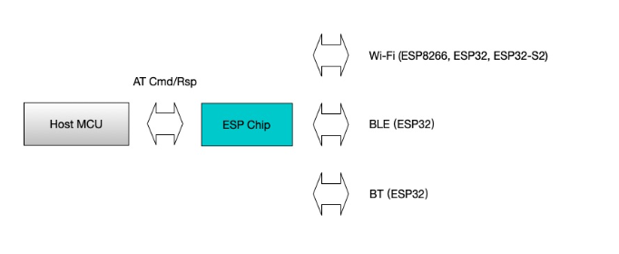

# 飞腾云 ESP-AT 透传固件方案

在当今物联网蓬勃发展的时代，ESP - AT 固件凭借其独特优势，在众多智能设备连接与数据交互场景中大放异彩。而飞腾云作为专业领域的佼佼者，专注于 ESP - AT 固件模组制作代工，以出色的综合实力，为广大客户呈上优质之选。

## 一、ESP - AT 固件：智能物联的 “便捷桥梁”

ESP - AT 固件以其标准化的 AT 命令接口独树一帜，通过串口通信，用简洁易懂的文本命令，就能轻松掌控设备复杂的网络连接与数据传输操作。无论是智能家居里智能灯具、温控系统精准入网，按指令回传状态数据；还是工业自动化场景下传感器、控制器稳定与云端交互，ESP - AT 固件都游刃有余。它打破了技术壁垒，让开发者无需深陷底层硬件与通信协议的繁琐泥潭，即可快速搭建具备强大联网功能的物联网设备，极大缩短产品上市周期，助力抢占市场先机。

## 二、飞腾云代工优势：价格与服务 “双优” 出击
### （一）价格竞争力，成本 “减负”

在商业运营中，成本把控至关重要。飞腾云深谙此道，依托规模化生产流程、高效供应链管理以及优化的资源配置，能为客户提供极具吸引力的价格优势。相较于同行，我们在 ESP - AT 固件模组制作代工上，可为您削减可观的成本开支，在不牺牲品质前提下，让您的预算分配更合理，资金利用更高效，把更多资源投入到产品创新、市场推广等关键环节，提升整体竞争力。

### （二）专业技术服务，全程 “护航”

深度技术沉淀：飞腾云团队汇聚了一批资深嵌入式开发工程师、通信专家，他们对 ESP - AT 固件技术细节了如指掌，从模组硬件适配、固件定制优化到故障排查，都具备丰富实战经验，能应对各类复杂技术挑战。例如，面对特殊场景下的低功耗需求、高并发数据传输稳定性难题，我们能精准施策，量身定制解决方案。
贴心售后支持：我们的服务不止于产品交付。当您在使用 ESP - AT 固件模组过程中遭遇疑问或故障，专业售后团队随时待命，通过多种便捷渠道快速响应。

[//]: # (依托https://docs.espressif.com/projects/esp-at/zh_CN/latest/esp32/Get_Started/What_is_ESP-AT.html丰富技术文档资源，为您提供详尽技术解读、操作指导，协助您迅速解决问题，保障设备持续稳定运行，让您无后顾之忧。)

## 三、合作流程便捷，品质严格把控

与飞腾云开启 ESP - AT 固件模组代工合作轻松高效。前期，我们专业商务团队深入沟通您的项目需求、预期规格与应用场景，为您精准匹配方案；生产环节，遵循严格质量管控体系，从原材料筛选到成品组装测试，多道工序严把关，确保每一个模组性能卓越、品质可靠；交付阶段，按时按质将产品送达您手中，并持续跟进使用反馈，不断优化服务。

在物联网浪潮中，选择飞腾云制作代工 ESP - AT 固件模组，就是选择高性价比、专业技术保障与无忧合作体验。让我们携手共进，以卓越的产品与服务，为您的物联网创新项目注入澎湃动力，驰骋智能物联广阔赛道。即刻联系飞腾云，开启高效、优质的合作之旅吧！

## 四、适用本方案的产品
[WB02A-8684H2V1](https://phateniot.github.io/zh/products/matter/socket1_5/)

[WB03A-8684H2V1](https://phateniot.github.io/zh/products/matter/WB03A-8684H2V1/)

[WB02B-8684H2V1](https://phateniot.github.io/zh/products/matter/WB02B-8684H2V1/)

[WB02A-8685H4V1](https://phateniot.github.io/zh/products/tasmota/tasmota-matter/)

包括 ESP-C2、C3 系列