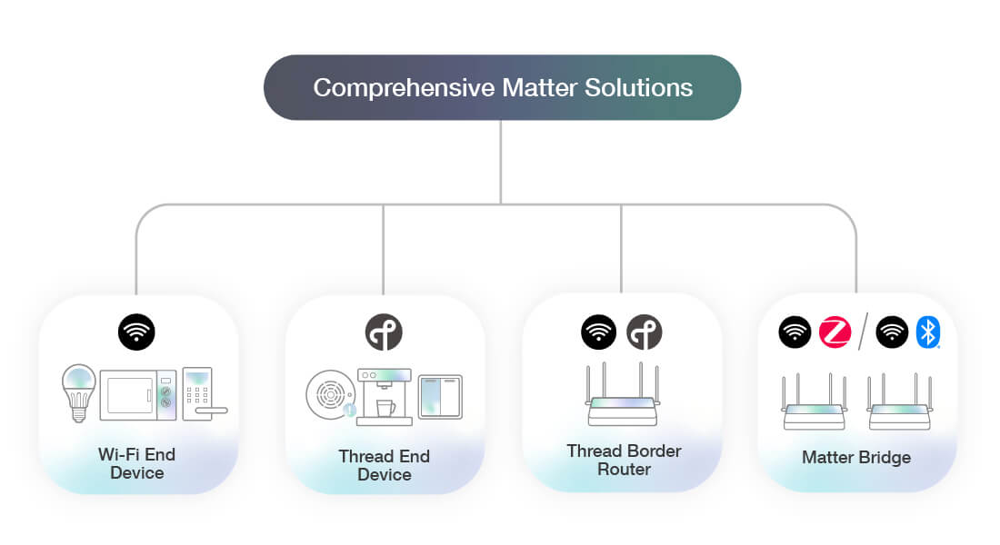
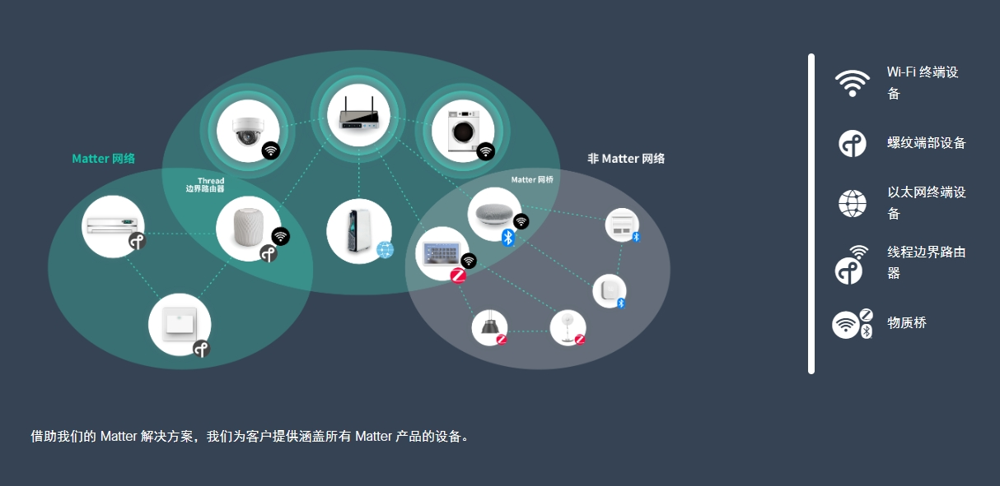

# Matter 方案

## 1 概述
Matter 是一个行业统一标准，可为智能家居设备提供可靠和安全的连接。它是一种基于 IP 的连接协议，适用于 Wi-Fi、以太网和 Thread（超过 802.15.4 无线电）传输，并使用蓝牙 LE 进行调试。Matter 标准由连接标准联盟与所有行业领导者共同定义。

飞腾云作为连接标准联盟的成员，是 Matter 协议开发的积极贡献者。可以给我们的客户能够轻松构建各种类型的 Matter 智能家居设备。飞腾云为 Matter 提供最全面的解决方案，包括对 Wi-Fi 或 Thread 端点设备、Thread 边界路由器和 Matter 网关参考设计的支持。

## 2 实现开箱即用的 Matter 连接

让您的设备与 ESP-ZeroCode 模块兼容，只需将这些模块添加到您的设备中即可。无需花时间在固件开发、手机应用程序、云连接和维护、认证或制造复杂性等事情上。ESP-ZeroCode 模组为构建常见的智能家居设备（如 LED 灯、插座、开关、调光器、继电器和风扇）提供了现成的即插即用解决方案。ESP-ZeroCode 模组基于 ESP32-C3 （ESP8685）、ESP32-C2 （ESP8684） 和 ESP32-H2，所有这些模块都预装了针对所需设备类型的固件。

## 3 Matter 预配置服务
乐鑫的 Matter 预配置服务允许客户从乐鑫订购模块，这些模块使用每个 Matter 设备都必须的凭据进行安全预编程。其中包括唯一的 DAC 证书以及与二维码相关的信息。
