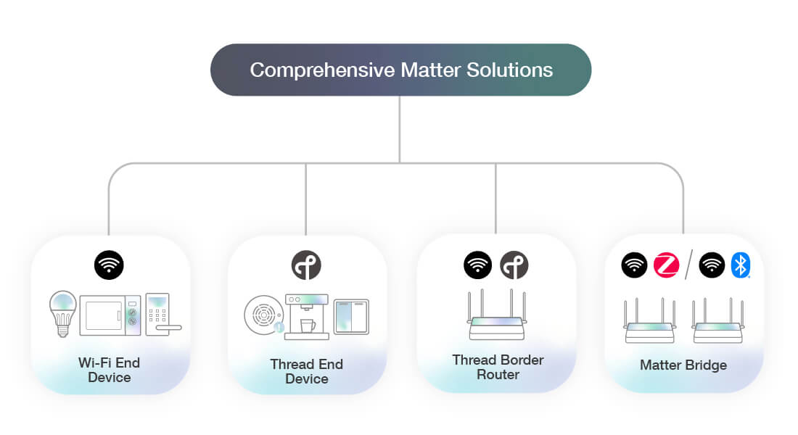
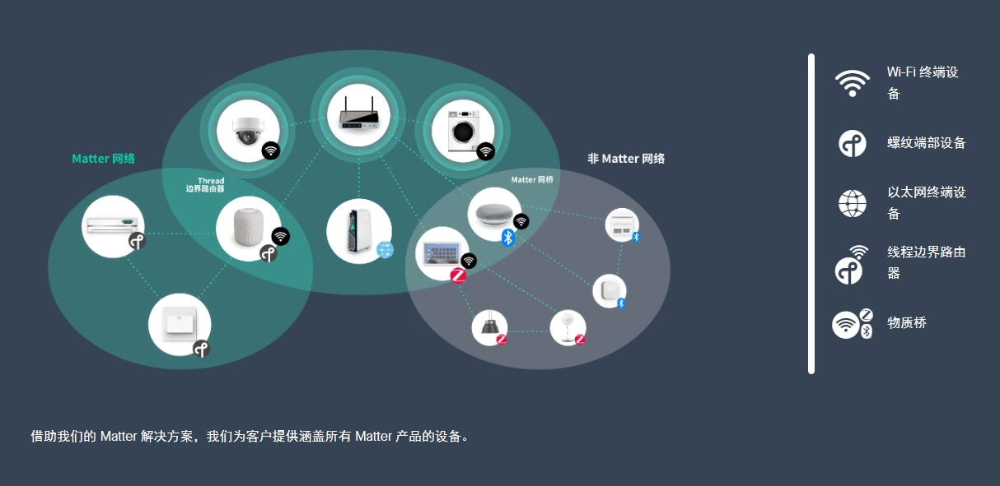

# Matter1-5路插座解决方案

## 1 概述
Matter 是一个行业统一标准，可为智能家居设备提供可靠和安全的连接。它是一种基于 IP 的连接协议，适用于 Wi-Fi、以太网和 Thread（超过 802.15.4 无线电）传输，并使用蓝牙 LE 进行调试。Matter 标准由连接标准联盟与所有行业领导者共同定义。

<!-- 

 -->

## 2 Matter1-5路插座

飞腾云完成了Matter1-5路插座方案的建立，为客户提供一个可行的智能插座模组。通过我们的模组，轻松实现让您自己的底板模块兼容，只需将这些模块添加到您的设备中即可。同时支持认证证书的服务，无需花时间在固件开发、手机应用程序、云连接和维护、认证或制造复杂性等事情上。

### 除了链接Apple、Alexa、Google三大平台实现智能控制，Matter1-5路插座支持以下可配功能：

- 复位时间
- 插座总控开关
- 继电器指示灯
- 设备重置的时间或者方式
- 网络指示灯是否复用继电器指示灯
- 默认IO配置
- 1到5位插孔自定义选择

## 3 定制需求

我们会根据客户具体的要求，同时我们要获取客户定义的IO配置以及规格书等等需求文件。满足不同需求人群以及成品的购买顾客。

当正式需求确定，我们将在1周左右，送样到客户。

## 4 Matter模组介绍

[点击进入 Matter1-5路插座模组 介绍页面](../../products/matter/socket1_5.md) 
