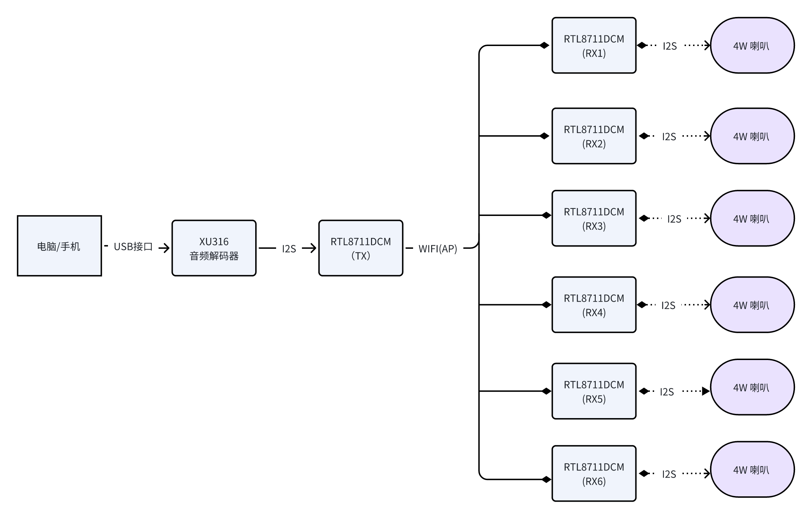

# Wi-Fi 5.8G 5.1无线音响方案

视频介绍：
[Wi-Fi 5.8G 5.1无线音响方案](../../assets/images/speaker/XU316-中文.mp4)

## 一. 控制概述
本方案基于先进的WIFI 5.8G技术，结合瑞昱 RTL8711DCM 主控芯片与XMOS XU316 USB音频解码芯片，旨在提供卓越的5.1声道无线音响体验。该方案的工作流程如下：

1. **音频源连接**：用户可以通过USB接口将电脑或手机连接到XMOS XU316 USB音频解码器。该解码器能够处理高质量的5.1声道音乐，确保音频信号的高保真传输。
2. **音频信号输出**：XMOS XU316将音频信号转换为I2S格式，并通过I2S音频接口与RTL8711DCM(TX)模块进行连接。这一过程保证了音频信号在传输过程中的稳定性和清晰度。

3. **无线连接**：RTL8711DCM(TX)模块通过AP热点与RTL8711DCM(RX)模块建立无线连接，实现5.1声道音频的无缝传输。这种无线连接方式不仅简化了布线，还提升了系统的灵活性。

4. **音频传输**：通过WIFI 5.8G技术，RTL8711DCM模块能够实现稳定且低延迟的无线5.1声道音频传输，使用户在观看电影或聆听音乐时，能够享受到身临其境的音效体验。

## 二. 功能特点

本WIFI 5.8G无线5.1音响方案具备以下显著优势：

1. **高频率，干扰更少**：5.8GHz频段相比于传统的2.4GHz频段，具有更少的干扰。这一特性使得音频传输更加清晰、稳定，用户可以尽情享受高质量的音频效果。

2. **高速数据传输**：5.8GHz频段能够提供更高的数据传输速率，尤其适合高分辨率音频流的传输。这一优势确保了音质的清晰度，满足了音响爱好者对音频质量的高要求。

3. **支持高分辨率音频**：本方案支持高分辨率音频传输，能够处理192KHz/24bit的音频文件。这对于追求高保真音质的用户而言，提供了显著的竞争优势，确保音乐的每一个细节都能被完美呈现。

4. **强抗干扰能力**：采用直接序列扩频技术的5.8GHz系统，拥有较多的信道和较高的频率，从而增强了抗干扰能力。这确保了在复杂环境中，音频传输依然能够保持稳定。

5. **易于安装和使用**：无线5.1音响系统大大减少了布线的需求，使得安装过程变得更加简便，同时也提升了整体美观度。用户可以轻松设置音响系统，享受高品质的音频体验。

6. **适用多种环境**：5.8GHz无线技术适用于城市和郊区，能够在家庭、办公室、公共场所等多种环境中稳定运行。无论是家庭影院、会议室还是娱乐场所，本方案都能满足用户的需求。

本WIFI 5.8G无线5.1音响应用方案凭借其卓越的性能和灵活的应用场景，必将为用户带来前所未有的音频体验。无论是音乐爱好者还是影音发烧友，都能在此方案中找到理想的解决方案。

<video width="640" height="480" controls>
  <source src="../../assets/images/speaker/XU316-中文.mp4" type="video/mp4">
  Your browser does not support the video tag.
</video>