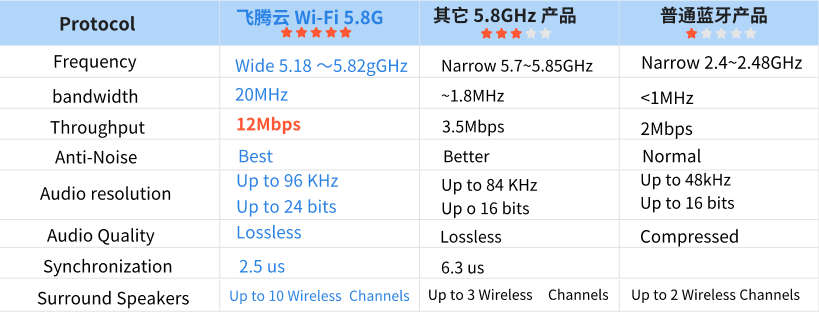

# Wi-Fi 7.1.2家庭影院无线连接方案

## 一. 背景介绍

随着科技进步，传统音频设备已无法满足现代家庭对影院级视听体验的需求，消费者渴望便捷、无缝的音频解决方案。为此，轻巧的Soundbar和无线音响系统应运而生，提供高品质的沉浸式音效。

## 二. 方案简介

飞腾云科技为家庭影院系统提供多芯片解决方案。通过经典蓝牙/LE Audio连接，Soundbar主系统可与手机或电视接收音源。

Soundbar与外置子音箱通过无线收发模组（Tx/Rx module）相连。采用Wi-Fi 5.8G协议，实现Soundbar与两个后置环绕音箱及低音炮的无线连接，最高支持10个声道音频数据传输。本方案兼容5.1、3.1、2.1等场景，为用户带来前所未有的音频体验，满足音乐爱好者和影音发烧友的需求。

[//]: # (### 2.1 / 3.1声道无线传输方案)

[//]: # ()
[//]: # (以单芯片方案，Soundbar通过Wi-Fi 5.8G协议实现与手机/电视及低音炮的无线连接。)

[//]: # ()
[//]: # (### 5.1声道无线传输方案)

[//]: # ()
[//]: # (在2.1、3.1主声道基础上新增两个后置环绕音箱，仍使用Wi-Fi 5.8G协议无线连接，摆脱“线长”困扰，随心所欲！)

[//]: # ()
[//]: # (### 7.1.2声道无线传输方案)

[//]: # ()
[//]: # ()
[//]: # (7.1.2方案支持多达10个声道，提供沉浸式环绕音效体验。支持LC3 plus Hi-Rate高品质音频，延迟最低至16ms。通过硬件升级和FEC纠错机制，显著提高抗干扰能力，确保音频传输稳定。)

## 三. 协议对比

## 四. 功能特点

本Wi-Fi 5.8G无线7.1.2音响方案具备以下优势：

1. **高频率，干扰更少**：5.8GHz频段干扰更少，音频传输更清晰稳定。
2. **高速数据传输**：支持高分辨率音频流，确保音质清晰，满足音响爱好者需求。
3. **支持高分辨率音频**：可处理192KHz/24bit音频文件，完美呈现音乐细节。
4. **强抗干扰能力**：采用直接序列扩频技术，增强抗干扰能力，确保稳定传输。
5. **易于安装和使用**：无线设计减少布线需求，简化安装过程，提升美观度。
6. **适用多种环境**：5.8GHz无线技术在家庭、办公室、公共场所等环境中稳定运行，满足多种需求。

## [了解更多](../../blog/2024/12/04/wi-fi-712家庭影院无线连接方案向下兼容/)

下方视频为 5.1 声道 演示：
<video width="640" height="480" controls>
  <source src="../../assets/images/speaker/XU316-中文.mp4" type="video/mp4">
  Your browser does not support the video tag.
</video>